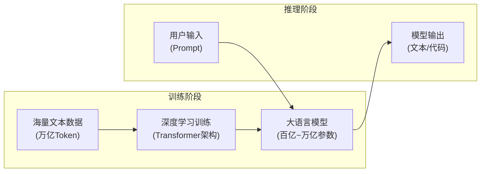
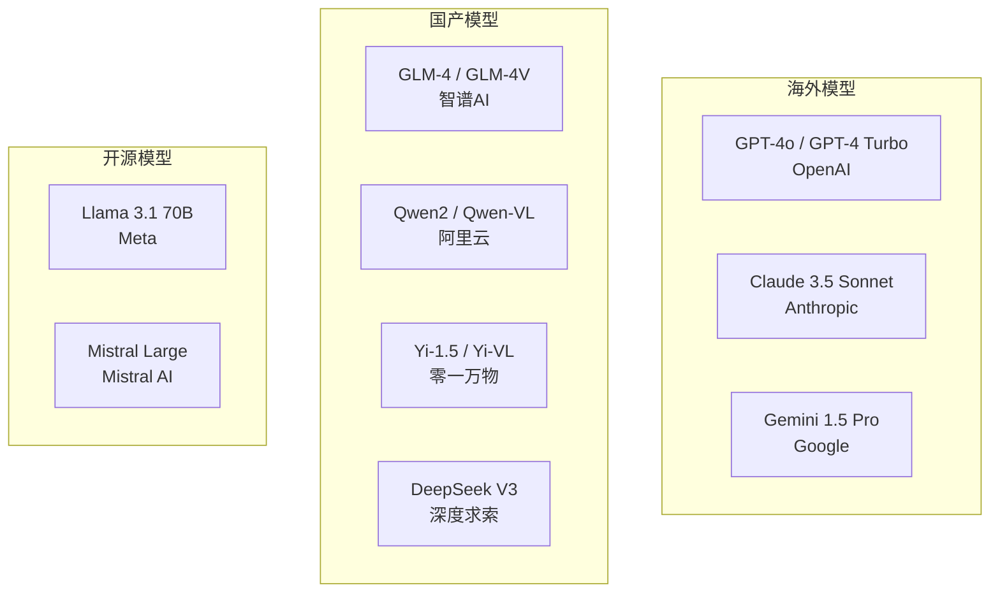
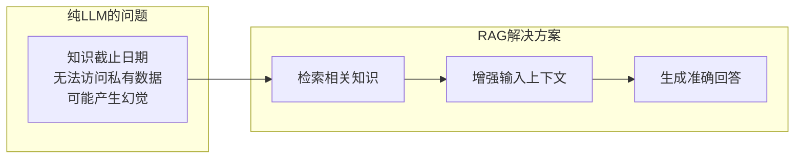
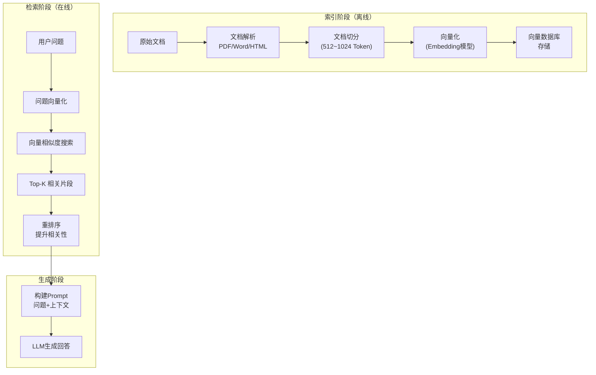
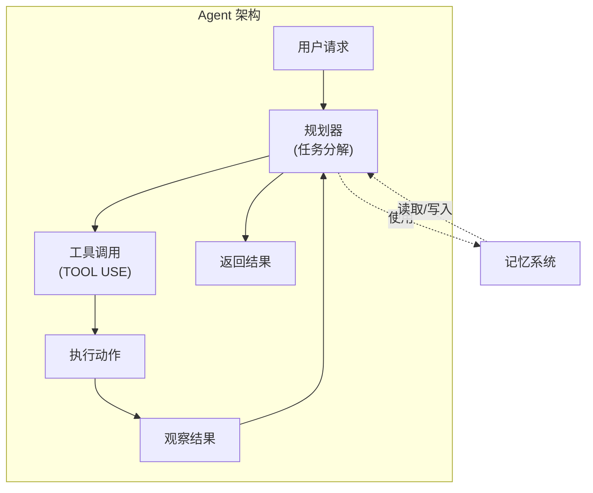
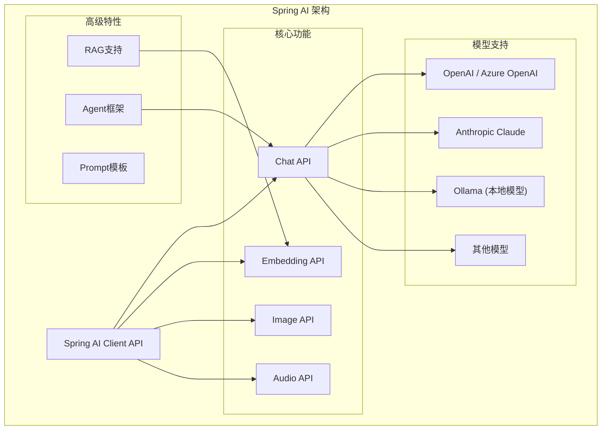
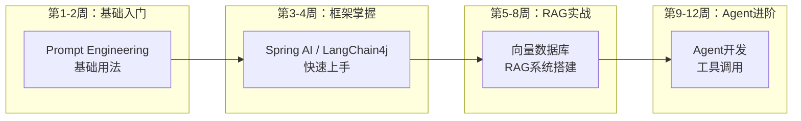

# 2026/4/1 应用开发者AI基础知识必知必会

## 前言

作为企业应用软件开发人员（Java技术栈），面对这波AI浪潮，很多人对AI有种"既熟悉又陌生"的感觉——日常使用ChatGPT、Copilot，却对背后的原理一知半解。

本文目标：**让应用开发者系统掌握AI核心概念，能够在业务中有效运用AI能力**。

不追求"从零实现Transformer"，而是聚焦于**Know-What和Know-How**——知道AI能做什么、怎么做。

---

## 一、大语言模型（LLM）核心概念

### 1.1 什么是大语言模型

大语言模型（Large Language Model，LLM）是基于海量文本数据训练、能理解和生成自然语言（及代码）的深度学习模型。



**关键认知**：
- LLM是**预测下一个词**的概率分布，而不是"理解"后再回答
- 能力来源于**见过的数据**和**模型规模**
- 输出具有**概率性**，同一输入可能产生不同输出

### 1.2 Token：LLM的计量单位

Token是LLM处理文本的基本单位。

```markdown
## Token 估算规则

英文：1 Token ≈ 0.75个单词 ≈ 4个字符
中文：1 Token ≈ 1-2个汉字

常见换算：
- 1个中文字 ≈ 1.5 Token
- 1段代码 ≈ 1.25 Token
- 1个API调用费用 = 输入Token数 + 输出Token数
```

**为什么重要**：
- API费用按Token计费
- Context Window（上下文窗口）有限（GPT-4o支持128K Token）
- 输入内容过长会影响响应质量和延迟

### 1.3 温度（Temperature）与随机性

温度控制输出的随机性：

| 温度值 | 效果 | 适用场景 |
|--------|------|----------|
| 0.0-0.3 | 确定性强，一致性高 | 代码生成、数据提取 |
| 0.5-0.7 | 平衡随机性与质量 | 日常对话、内容创作 |
| 0.8-1.0+ | 高随机性，多样性强 | 头脑风暴、创意生成 |

```java
// Spring AI中配置温度
ChatOptions chatOptions = ChatOptions.builder()
    .withTemperature(0.7)  // 设置温度
    .withTopP(0.9)         // 核采样参数
    .build();
```

### 1.4 主流LLM与选型



**选型建议**：

| 场景 | 推荐模型 | 理由 |
|------|---------|------|
| 代码生成/Review | GPT-4o / Claude 3.5 | 代码能力强 |
| 中文对话/文案 | GLM-4 / Qwen2 | 中文优化好 |
| 成本敏感 | DeepSeek / Llama3 | 开源便宜 |
| 国内合规 | GLM-4 / Qwen2 | 国产模型 |
| 多模态（图片） | GPT-4o / GLM-4V | 支持图文理解 |

---

## 二、Prompt Engineering（提示词工程）

### 2.1 核心原则

**原则一：清晰、具体的指令**

```markdown
# ❌ 模糊的Prompt
写一段代码

# ✅ 清晰的Prompt
用Java写一个方法，接收用户ID列表，返回这些用户的信息。
要求：使用Spring Boot、返回JSON格式、包含异常处理。
```

**原则二：结构化输出**

```markdown
# 使用清晰的结构
请按以下格式回答：
1. 问题分析：（不超过50字）
2. 解决方案：（分点说明）
3. 代码示例：（Java）

问题：如何实现线程安全的单例模式？
```

**原则三：Few-shot示例**

```markdown
# 提供示例
将以下Java代码翻译成Python：

示例1：
Java: System.out.println("Hello");
Python: print("Hello")

示例2：
Java: for(int i=0; i<10; i++) { System.out.println(i); }
Python: for i in range(10): print(i)

翻译：
Java: String s = new String("test");
Python:
```

### 2.2 常用Prompt模式

```java
// 常用Prompt模板
public class PromptTemplates {
    
    // 1. 角色设定模板
    public static final String ROLE_TEMPLATE = 
        "你是一个%s，专注于%s领域。\n" +
        "请用专业但易懂的方式回答问题。";
    
    // 2. 上下文增强模板
    public static final String CONTEXT_TEMPLATE = 
        "背景信息：\n%s\n\n" +
        "请根据以上信息回答：\n%s";
    
    // 3. 结构化输出模板
    public static final String STRUCTURED_TEMPLATE = 
        "请按以下JSON格式输出：\n%s\n" +
        "不要添加额外的解释。";
    
    // 4. 链式思考模板
    public static final String COT_TEMPLATE = 
        "请逐步思考：\n" +
        "1. 首先分析问题的关键点\n" +
        "2. 然后考虑可能的解决方案\n" +
        "3. 最后给出具体答案\n\n" +
        "问题：%s";
}
```

### 2.3 常见陷阱与规避

| 陷阱 | 问题 | 规避方法 |
|------|------|----------|
| 幻觉 | 模型生成虚假信息 | 增加上下文约束、结果验证 |
| 上下文溢出 | 输入超过窗口限制 | 内容摘要、关键信息提取 |
| 指令忽略 | 模型忽略部分要求 | 明确优先级、使用分隔符 |
| 角色漂移 | 输出风格偏离 | 强调角色设定、示例引导 |

---

## 三、检索增强生成（RAG）

### 3.1 为什么需要RAG



**RAG核心价值**：
- 让LLM"知道"私域知识
- 减少幻觉，提高准确性
- 可追溯、可审计

### 3.2 RAG工作流程



### 3.3 关键技术与选型

```markdown
## RAG关键技术栈

| 组件 | 推荐方案 | 说明 |
|------|---------|------|
| 向量数据库 | Milvus / Pinecone / Qdrant | ANN检索 |
| Embedding | text-embedding-3 / BGE | 文本向量化 |
| 文档解析 | Apache Tika / PDFBox | 多格式解析 |
| 切分策略 | 递归字符切分 | 保持语义完整 |
| 重排序 | Cohere Rerank | 多路召回后精排 |
```

### 3.4 RAG常见问题与优化

```markdown
## RAG优化策略

### 问题1：检索质量差
优化方向：
- 优化切分策略（保持段落完整）
- 增加元数据过滤
- 使用混合检索（向量+关键词）

### 问题2：上下文遗漏
优化方向：
- 父子文档检索
- 窗口滑动检索
- 增加检索数量后重排

### 问题3：生成不准确
优化方向：
- Prompt中强调"仅根据上下文回答"
- 增加答案验证环节
- 使用更优质的LLM
```

---

## 四、AI Agent（智能体）

### 4.1 什么是Agent

Agent = LLM + 规划 + 记忆 + 工具



**与普通LLM的区别**：
- 普通LLM：一次输入，一次输出
- Agent：多轮交互、工具调用、自主决策

### 4.2 核心组件

```java
// Agent核心组件示意
public class AIAgent {
    
    // 1. 规划器 - 任务分解与执行计划
    private Planner planner;
    
    // 2. 记忆系统 - 存储历史上下文
    private Memory memory;
    
    // 3. 工具集 - LLM可调用的外部能力
    private List<Tool> tools;
    
    // 4. 执行器 - 协调各组件工作
    public Response execute(String userRequest) {
        // 理解意图
        Intent intent = planner.parseIntent(userRequest);
        
        // 制定计划
        Plan plan = planner.createPlan(intent);
        
        // 执行计划
        for (Step step : plan.getSteps()) {
            if (step.needsTool()) {
                Object result = tools.execute(step.getToolName(), step.getParams());
                memory.addObservation(step.getToolName(), result);
            }
        }
        
        // 生成回复
        return responseGenerator.generate(userRequest, memory.getHistory());
    }
}
```

### 4.3 常用工具定义模式

```java
// Spring AI中的Tool定义
@Tool(name = "查询订单", description = "根据订单ID查询订单详情")
public class OrderQueryTool {
    
    @ToolParam(name = "orderId", description = "订单ID", required = true)
    public Order getOrder(String orderId) {
        return orderService.findById(orderId);
    }
}

@Tool(name = "发送邮件", description = "向指定邮箱发送邮件")
public class EmailTool {
    
    @ToolParam(name = "to", description = "收件人邮箱")
    public void sendEmail(String to, String subject, String body) {
        emailService.send(to, subject, body);
    }
}
```

### 4.4 主流Agent框架

```markdown
## Java技术栈Agent框架

| 框架 | 特点 | 适用场景 |
|------|------|----------|
| LangChain4j | Java原生，API简洁 | 快速开发RAG/Agent |
| Spring AI | Spring生态集成 | Spring项目 |
| AutoGen | 多Agent协作 | 复杂对话场景 |
| CrewAI | 角色扮演Agent | 业务流程自动化 |

## Spring AI Agent示例
```java
@Service
public class CustomerServiceAgent {
    
    private final ChatModel chatModel;
    
    public String chat(String userMessage) {
        // 构建包含工具描述的Prompt
        String systemPrompt = """
            你是一个客服助手，可以帮助用户查询订单、解答问题。
            如果需要查询订单，请使用queryOrder工具。
            """;
        
        // 使用ChatClient（Spring AI 1.0+）
        return ChatClient.create(chatModel)
            .prompt()
            .system(systemPrompt)
            .user(userMessage)
            .tools(new OrderQueryTool(), new EmailTool())
            .call()
            .content();
    }
}
```

---

## 五、Java技术栈AI框架实践

### 5.1 Spring AI全景



### 5.2 快速上手Spring AI

```xml
<!-- Maven依赖 -->
<dependency>
    <groupId>org.springframework.ai</groupId>
    <artifactId>spring-ai-openai-spring-boot-starter</artifactId>
</dependency>
```

```yaml
# application.yml
spring:
  ai:
    openai:
      api-key: ${OPENAI_API_KEY}
      chat:
        options:
          model: gpt-4o
          temperature: 0.7
```

```java
// 简单对话
@Service
public class SimpleChatService {
    
    private final ChatClient chatClient;
    
    public SimpleChatService(ChatModel chatModel) {
        this.chatClient = ChatClient.create(chatModel);
    }
    
    public String chat(String userMessage) {
        return chatClient.prompt()
            .user(userMessage)
            .call()
            .content();
    }
}
```

### 5.3 RAG完整示例

```java
// RAG检索增强服务
@Service
public class RagService {
    
    private final VectorStore vectorStore;
    private final ChatModel chatModel;
    
    public RagService(VectorStore vectorStore, ChatModel chatModel) {
        this.vectorStore = vectorStore;
        this.chatModel = chatModel;
    }
    
    // 1. 文档导入
    public void importDocument(String content, String metadata) {
        Document document = new Document(content);
        document.getMetadata().put("source", metadata);
        vectorStore.add(List.of(document));
    }
    
    // 2. 检索问答
    public String answer(String question) {
        // 相似度检索
        List<Document> relevantDocs = vectorStore.similaritySearch(question);
        
        // 构建上下文
        String context = relevantDocs.stream()
            .map(Document::getContent)
            .collect(Collectors.joining("\n"));
        
        // 构建Prompt
        String prompt = String.format("""
            根据以下上下文回答问题。如果上下文中没有相关信息，请说明。
            
            上下文：
            %s
            
            问题：%s
            """, context, question);
        
        // 生成回答
        return chatClient.prompt()
            .user(prompt)
            .call()
            .content();
    }
}
```

---

## 六、实践计划

### 6.1 学习路径总览



### 6.2 详细周计划

```markdown
## 12周实践计划

### 第1周：Prompt Engineering
**目标**：掌握Prompt编写技巧

- [ ] 学习Prompt基本原则（清晰、具体、结构化）
- [ ] 掌握Few-shot、Chain-of-Thought技巧
- [ ] 建立个人Prompt模板库（20+模板）
- [ ] 实战：用Prompt优化一个现有业务功能

**交付物**：个人Prompt最佳实践文档

---

### 第2周：Spring AI入门
**目标**：搭建开发环境，完成首次LLM调用

- [ ] 创建Spring Boot项目，集成Spring AI
- [ ] 配置OpenAI API Key（或使用国内模型）
- [ ] 完成首次LLM对话调用
- [ ] 理解ChatOptions配置（温度、Token限制等）

**交付物**：可运行的Hello World项目

---

### 第3周：对话接口开发
**目标**：开发完整的对话服务

- [ ] 实现多轮对话上下文管理
- [ ] 实现流式输出（SSE）
- [ ] 添加对话历史存储（Redis）
- [ ] 实现基础对话日志

**交付物**：带上下文的对话API服务

---

### 第4周：Embedding与向量搜索
**目标**：理解Embedding，掌握向量检索

- [ ] 学习Embedding原理（不需要数学）
- [ ] 集成向量数据库（Milvus/Pinecone/Qdrant）
- [ ] 实现文本向量化存储
- [ ] 实现向量相似度搜索

**交付物**：向量检索Demo

---

### 第5周：RAG系统搭建
**目标**：完成完整RAG流程

- [ ] 文档解析（PDF/Word）
- [ ] 文档切分策略
- [ ] 实现RAG检索+生成流程
- [ ] 评估RAG效果（相关性、准确率）

**交付物**：可用的RAG问答系统

---

### 第6周：RAG优化
**目标**：提升RAG效果

- [ ] 混合检索（向量+关键词）
- [ ] 重排序（Reranker）
- [ ] Prompt优化
- [ ] 结果缓存

**交付物**：优化后的RAG系统

---

### 第7周：Agent基础
**目标**：理解Agent核心概念

- [ ] 学习Agent设计模式（ReAct等）
- [ ] 实现简单的Agent
- [ ] 理解工具调用原理
- [ ] 定义第一个业务工具

**交付物**：带工具调用的Agent

---

### 第8周：Agent工具开发
**目标**：开发完整的Agent应用

- [ ] 定义多个业务工具（订单、库存、客服）
- [ ] 实现工具注册与调用
- [ ] 实现Agent执行循环
- [ ] 添加异常处理与降级

**交付物**：企业客服Agent

---

### 第9周：多Agent协作
**目标**：理解复杂Agent场景

- [ ] 学习多Agent协作模式
- [ ] 实现简单多Agent对话
- [ ] 设计Agent分工流程
- [ ] 评估协作效果

**交付物**：多Agent协作Demo

---

### 第10周：生产级特性
**目标**：让AI应用达到生产标准

- [ ] 实现限流与熔断
- [ ] 添加可观测性（日志、监控）
- [ ] 实现多租户隔离
- [ ] 安全与合规检查

**交付物**：生产就绪的AI服务

---

### 第11周：成本优化
**目标**：降低AI使用成本

- [ ] 实现Token计费
- [ ] 实现请求缓存
- [ ] 模型选型优化
- [ ] 使用本地模型（可选）

**交付物**：成本优化方案

---

### 第12周：总结与进阶
**目标**：形成方法论

- [ ] 整理最佳实践
- [ ] 制定团队AI开发规范
- [ ] 规划AI应用路线图
- [ ] 学习进阶主题（微调等）

**交付物**：AI开发规范文档 + 下一步计划
```

### 6.3 环境准备清单

```markdown
## 开发环境准备

### 必需
- [ ] Java 17+
- [ ] IDE (IntelliJ IDEA)
- [ ] Spring Boot 3.2+
- [ ] OpenAI API Key 或 国内模型API

### 向量数据库（选一个）
- [ ] Qdrant (本地Docker)
- [ ] Milvus (本地/云)
- [ ] Pinecone (云端)

### 可选
- [ ] Docker / Docker Desktop
- [ ] Redis (对话历史存储)
- [ ] Elasticsearch (混合检索)
```

### 6.4 实践项目推荐

```markdown
## 练手项目（按难度排序）

### Level 1：智能客服基础
- 对接FAQ知识库
- 基于RAG的产品问答
- 代码审查助手

### Level 2：业务智能化
- 订单智能助手（查询订单、改地址）
- 会议纪要生成
- 报表智能解读

### Level 3：复杂Agent
- 跨系统数据同步Agent
- 智能工单处理
- 业务流程自动化

### 开源参考项目
- LangChain4j Examples
- Spring AI Samples
- Qdrant Demo Collections
```

---

## 七、常见问题

### Q1：需要学习深度学习理论吗？

**A**：不需要。对于应用开发者，理解以下即可：
- LLM是"预测下一个词"的概率模型
- Attention机制让模型"关注"相关上下文
- 能力来自"见过的数据"和"模型参数规模"

不需要手推公式，不需要理解反向传播。

---

### Q2：国内用什么模型？

**A**：推荐：

| 场景 | 推荐 | 说明 |
|------|------|------|
| 对话质量优先 | 智谱GLM-4 | 中文好，效果接近GPT-4 |
| 性价比优先 | 阿里Qwen2 | 开源可私有部署 |
| 代码场景 | DeepSeek Coder | 代码能力强 |
| 成熟生态 | 百度文心4 | 企业集成方便 |

---

### Q3：向量数据库怎么选？

| 场景 | 推荐 | 说明 |
|------|------|------|
| 快速原型 | Qdrant | 本地Docker即可 |
| 大规模生产 | Milvus | 功能完善 |
| 云原生 | Pinecone | 免运维 |
| 已有ES集群 | ES Vector Search | 复用现有ES |

---

### Q4：RAG效果不好怎么办？

```markdown
## RAG排查清单

1. 检索层面
   - [ ] 切分是否合理？（保持语义完整）
   - [ ] Embedding模型是否匹配？（中英文场景）
   - [ ] 向量检索参数是否合适？（Top-K、相似度阈值）

2. 生成层面
   - [ ] Prompt是否强调"仅根据上下文"？
   - [ ] 上下文是否过长？（超过窗口限制）
   - [ ] 模型选择是否合适？

3. 优化方向
   - [ ] 混合检索（+BM25关键词检索）
   - [ ] 重排序（提升Top-K相关性）
   - [ ] 查询改写（扩展同义词）
```

---

## 八、总结

作为应用开发者，掌握AI不需要成为AI研究员。关键是：

```markdown
## 核心能力矩阵

### 理解层面
- [ ] LLM工作原理（预测下一个词）
- [ ] Token与成本概念
- [ ] Prompt Engineering
- [ ] RAG与Agent核心概念

### 实践层面
- [ ] Spring AI / LangChain4j
- [ ] 向量数据库使用
- [ ] RAG系统搭建
- [ ] Agent工具开发

### 工程层面
- [ ] 可观测性
- [ ] 限流与降级
- [ ] 安全与合规
- [ ] 成本控制
```

**记住**：AI是工具，我们的价值在于把它用好。

---

*参考资料：Spring AI官方文档、LangChain4j文档、RAGSurvey论文、各大模型官方API文档*

---

*最后更新：2026/4/1*
