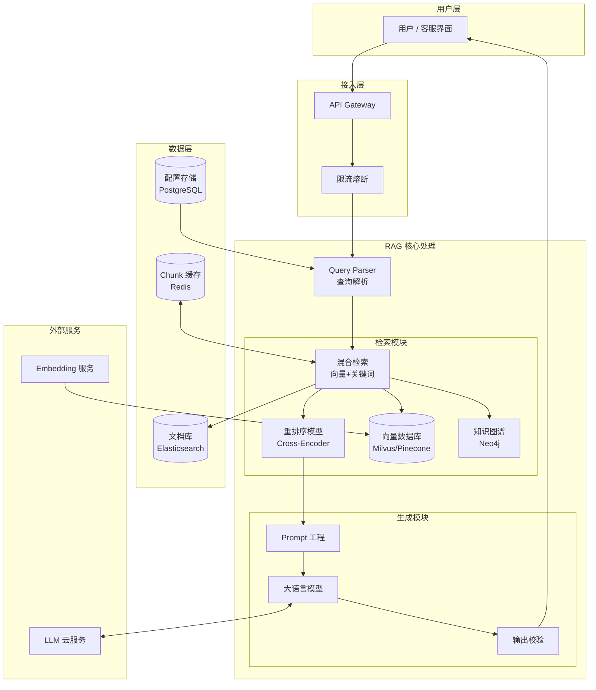
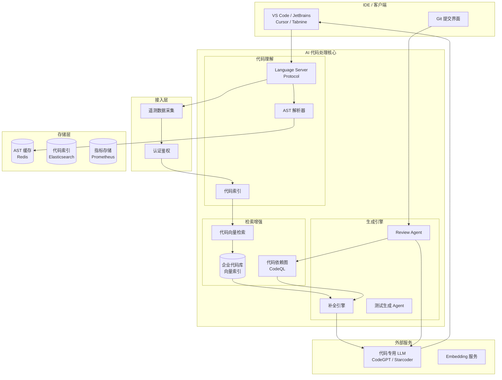
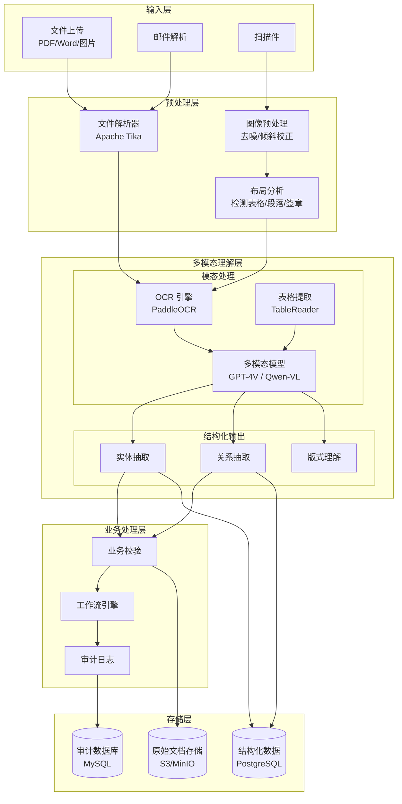
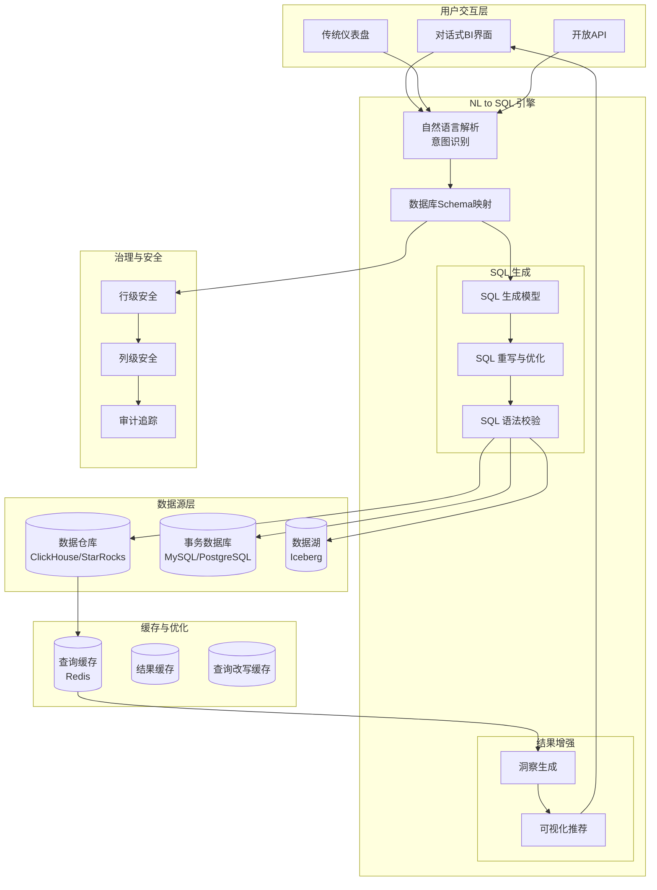
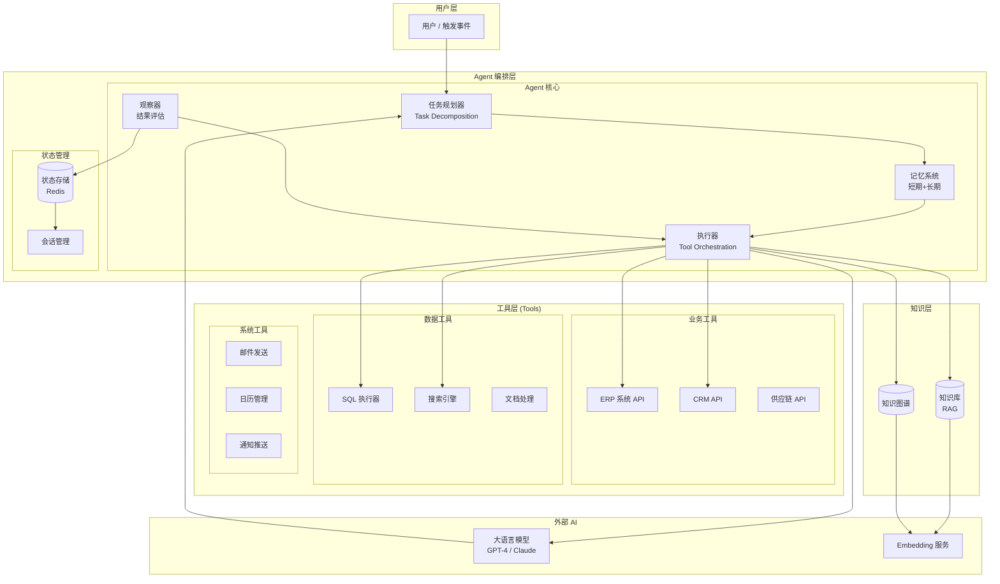
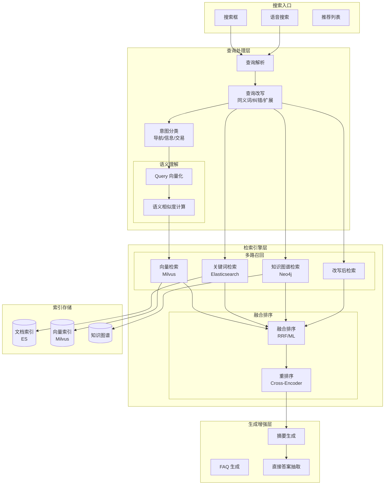
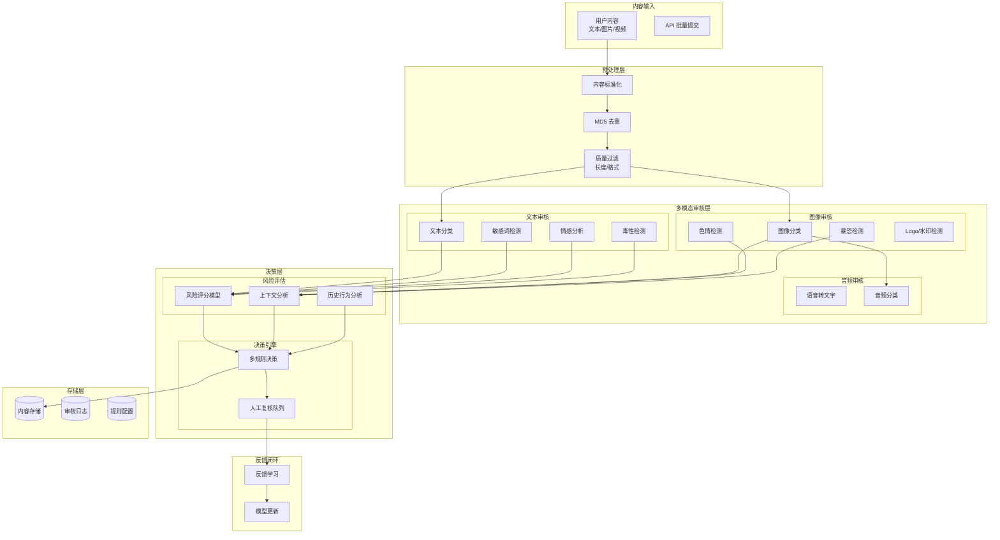
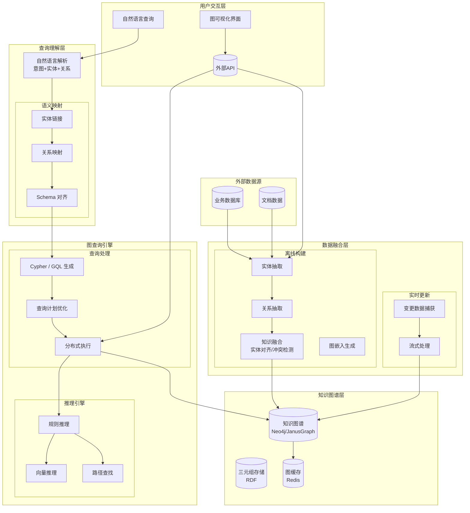

# 2026/4/5 基于大模型的后端应用场景架构

## 前言

大模型（LLM）正在深刻改变后端应用的架构模式。从传统的规则驱动到智能驱动，后端工程师需要掌握在业务系统中融入AI能力的设计方法。

本文梳理八种主流的大模型后端应用场景，每个场景包含：业务背景、核心架构、技术选型、关键设计点、业界实践。适合正在转型AI架构的后端工程师参考。

---

## 场景一：智能问答与知识库系统（RAG）

### 业务背景

企业积累了大量的内部文档（产品手册、API文档、内部知识库），传统搜索无法理解语义，用户体验差。RAG（Retrieval-Augmented Generation）通过检索增强生成，结合向量搜索与LLM推理，提供精准的智能问答能力。

### 核心架构



### 关键技术点

| 环节 | 技术选型 | 说明 |
|------|---------|------|
| 向量数据库 | Milvus/Pinecone | 存储文档向量，支持ANN检索 |
| 检索策略 | Hybrid Search | 向量检索+BM25关键词检索融合 |
| 重排序 | Cohere Rerank | 提升检索相关性 |
| Prompt | LangChain4j PromptTemplate | 结构化提示词管理 |
| 缓存 | Redis | 热门Query结果缓存，降低延迟 |

### 业界实践

```java
// 典型RAG服务核心代码
@Service
public class RagQueryService {
    
    private final VectorStore vectorStore;
    private final ChatModel chatModel;
    private final DocumentLoader documentLoader;
    
    public String answer(String question, String userId) {
        // 1. 查询解析与扩展
        Query expandedQuery = queryExpander.expand(question);
        
        // 2. 混合检索
        List<Document> retrieved = hybridSearch.search(
            expandedQuery.getText(),
            expandedQuery.getFilters(),
            topK = 10
        );
        
        // 3. 重排序
        List<Document> reranked = reranker.rerank(retrieved, question, topK = 5);
        
        // 4. Context 构建
        String context = buildContext(reranked);
        
        // 5. Prompt 构建
        Prompt prompt = buildPrompt(question, context);
        
        // 6. LLM 生成
        String answer = chatModel.call(prompt);
        
        // 7. 输出校验
        return outputValidator.validateAndSanitize(answer);
    }
}
```

**业界标杆**：
- Notion AI：基于RAG的文档智能问答
- GitHub Copilot：代码语义检索+生成
- Claude Enterprise：企业知识库问答

---

## 场景二：AI 代码助手

### 业务背景

开发者每天花费大量时间在重复性代码编写上。AI代码助手通过理解代码上下文，自动补全代码、生成单元测试、解释代码逻辑、协助Code Review，显著提升开发效率。

### 核心架构



### 关键技术点

| 模块 | 技术选型 | 说明 |
|------|---------|------|
| 代码索引 | Elasticsearch + 自研索引 | 支持语义代码搜索 |
| 代码理解 | Tree-sitter / CodeQL | AST解析与查询 |
| 补全模型 | Starcoder / CodeGPT | 代码专用模型 |
| 上下文窗口 | Cursor上下文策略 | 智能选择相关代码片段 |
| 延迟优化 | 流式输出 + 增量渲染 | <100ms 首次输出 |

### 业界实践

```yaml
# 代码补全服务配置示例
code-completion:
  model:
    name: "gpt-4-turbo"
    max_tokens: 200
    temperature: 0.2
    
  context:
    max_files: 10
    max_lines_per_file: 500
    priority:
      - recently_modified
      - same_package
      - imports
      
  filtering:
    remove_generated: true
    remove_tests: false
    min_relevance_score: 0.7
```

**业界标杆**：
- GitHub Copilot：全球最流行的AI代码补全
- Cursor：首个AI原生IDE，支持多文件编辑
- JetBrains AI Assistant：深度集成IDE
- Amazon CodeWhisperer：支持安全扫描

---

## 场景三：智能文档处理

### 业务背景

企业每天处理大量文档（合同、发票、报表、邮件），传统OCR+规则处理无法应对复杂版式和理解需求。基于多模态大模型的文档处理系统，可以理解文档语义，实现智能抽取、分类、比对。

### 核心架构



### 关键技术点

| 模块 | 技术选型 | 说明 |
|------|---------|------|
| 多模态模型 | GPT-4V / Qwen-VL | 文档理解，支持图片输入 |
| OCR | PaddleOCR / EasyOCR | 高精度文字识别 |
| 表格提取 | TableReader | 复杂表格结构化 |
| 文件解析 | Apache Tika | 支持200+文件格式 |
| 版式分析 | 自研 LayoutModel | 区域检测与分类 |

### 业界实践

```java
// 合同智能抽取服务
@Service
public class ContractProcessingService {
    
    public Contract extract(String documentId) {
        // 1. 文档解析
        Document doc = documentParser.parse(documentId);
        
        // 2. 多模态理解
        MultimodalResult result = multimodalModel.analyze(doc);
        
        // 3. 实体抽取
        List<ContractParty> parties = entityExtractor.extractParties(result);
        List<ContractTerm> terms = entityExtractor.extractTerms(result);
        Money amount = entityExtractor.extractAmount(result);
        LocalDate startDate = entityExtractor.extractStartDate(result);
        LocalDate endDate = entityExtractor.extractEndDate(result);
        
        // 4. 业务校验
        ValidationResult validation = validator.validate(parties, terms, amount);
        if (!validation.isPassed()) {
            // 触发人工复核流程
            workflowService.createReviewTask(documentId, validation.getIssues());
        }
        
        // 5. 构建结果
        return Contract.builder()
            .parties(parties)
            .terms(terms)
            .amount(amount)
            .startDate(startDate)
            .endDate(endDate)
            .status(Status.EXTRACTED)
            .build();
    }
}
```

**业界标杆**：
- AWS Textract：AWS文档处理服务
- Google Document AI：企业级文档处理
- 阿里云智能文档：国内文档处理领先
- Harvey AI：法律文档AI分析

---

## 场景四：智能数据分析与BI

### 业务背景

传统BI需要业务人员编写SQL或等待数据分析师出报告。智能BI通过自然语言查询（NL to SQL），让任何人都能用自然语言获取数据洞察，大幅降低数据分析门槛。

### 核心架构



### 关键技术点

| 模块 | 技术选型 | 说明 |
|------|---------|------|
| NL转SQL | GPT-4 + Few-shot | 基于示例学习表结构 |
| 数据库Schema映射 | 自研Schema Index | 智能映射自然语言到表字段 |
| SQL优化 | Apache Calcite | SQL解析与优化改写 |
| 结果缓存 | Redis + 语义缓存 | 相似Query复用结果 |
| 实时数据 | ClickHouse / StarRocks | 高性能OLAP引擎 |

### 业界实践

```java
// 自然语言查询服务
@Service
public class NLQueryService {
    
    private final SchemaManager schemaManager;
    private final SqlGenerator sqlGenerator;
    private final QueryExecutor queryExecutor;
    private final InsightGenerator insightGenerator;
    
    public QueryResult query(String naturalLanguage, String userId) {
        // 1. 意图识别与Schema映射
        QueryContext context = schemaManager.buildContext(naturalLanguage);
        
        // 2. 生成候选SQL
        List<String> candidateSqls = sqlGenerator.generate(context);
        
        // 3. SQL校验与优化
        String validatedSql = sqlValidator.validateAndOptimize(
            candidateSqls, 
            context.getDatabaseSchema()
        );
        
        // 4. 执行查询（带缓存）
        QueryResult result = queryExecutor.executeWithCache(
            validatedSql, 
            userId
        );
        
        // 5. 生成洞察
        if (result.hasData()) {
            String insight = insightGenerator.generate(result);
            result.setInsight(insight);
        }
        
        return result;
    }
}
```

**业界标杆**：
- Tableau AI：智能问答式BI
- Power BI Copilot：微软出品，集成GPT
- ThoughtSpot：AI驱动的分析平台
- Stripe Sigma：业务智能查询

---

## 场景五：AI Agent 自动化

### 业务背景

单一LLM对话能力有限。AI Agent通过规划、记忆、工具调用，实现复杂的自动化任务。从简单的问答到复杂的跨系统操作，Agent正在重新定义自动化边界。

### 核心架构



### 关键技术点

| 模块 | 技术选型 | 说明 |
|------|---------|------|
| Agent框架 | LangChain Agents / AutoGen | Agent编排 |
| 规划策略 | ReAct / Plan-and-Execute | 任务分解与执行 |
| 记忆系统 | Redis + 向量存储 | 短期会话+长期经验 |
| 工具定义 | OpenAPI / MCP | 标准化工具描述 |
| 多Agent协作 | CrewAI / AutoGen | 角色分工与协作 |

### 业界实践

```java
// 订单处理Agent示例
@Agent(name = "OrderAgent", description = "处理客户订单请求")
public class OrderAgent {
    
    @Tool("查询库存")
    public Inventory queryInventory(@Param("productId") String productId) {
        return inventoryService.checkStock(productId);
    }
    
    @Tool("创建订单")
    public Order createOrder(@Param("customerId") String customerId, 
                            @Param("items") List<OrderItem> items) {
        return orderService.create(customerId, items);
    }
    
    @Tool("发送邮件通知")
    public void sendNotification(@Param("to") String to, 
                                @Param("content") String content) {
        emailService.send(to, content);
    }
    
    @Memory
    public List<Conversation> conversationHistory;
    
    public AgentResult execute(String userRequest) {
        // 1. 理解用户意图
        Intent intent = intentRecognizer.recognize(userRequest);
        
        // 2. 规划执行步骤
        Plan plan = planner.createPlan(intent);
        
        // 3. 顺序执行工具
        ExecutionResult result = executor.execute(plan);
        
        // 4. 生成响应
        String response = responseGenerator.generate(intent, result);
        
        // 5. 更新记忆
        memory.add(userRequest, response);
        
        return AgentResult.builder()
            .response(response)
            .actionsTaken(plan.getSteps())
            .build();
    }
}
```

**业界标杆**：
- AutoGPT：自主任务执行Agent
- Claude Agent：深度推理与工具使用
- Microsoft Copilot Studio：企业级Agent平台
- Zapier Copilot：工作流自动化

---

## 场景六：智能搜索

### 业务背景

传统关键词搜索无法理解语义，用户经常找不到真正想要的内容。语义搜索通过理解查询意图和文档语义，提供更精准的搜索结果，结合LLM还能生成搜索摘要。

### 核心架构



### 关键技术点

| 模块 | 技术选型 | 说明 |
|------|---------|------|
| 向量检索 | Milvus / Qdrant | 高性能ANN检索 |
| 关键词检索 | Elasticsearch | BM25排序 |
| 知识图谱 | Neo4j | 实体关系检索 |
| 重排序 | Cohere / BGE | 精排提升相关性 |
| 查询改写 | GPT-4 / 同义词词典 | Query理解增强 |

### 业界实践

```java
// 语义搜索服务
@Service
public class SemanticSearchService {
    
    public SearchResult search(String query, SearchRequest request) {
        // 1. 查询意图识别
        SearchIntent intent = intentClassifier.classify(query);
        
        // 2. 查询改写
        QueryRewriteResult rewritten = queryRewriter.rewrite(query);
        
        // 3. 多路召回
        CompletableFuture<List<SearchHit>> vecFuture = 
            vectorSearch.search(rewritten.getRewrittenQuery(), request.getLimit());
        CompletableFuture<List<SearchHit>> bm25Future = 
            bm25Search.search(rewritten.getRewrittenQuery(), request.getLimit());
        CompletableFuture<List<SearchHit>> kgFuture = 
            knowledgeGraph.search(rewritten.getEntities(), request.getLimit());
        
        // 4. 融合排序
        List<SearchHit> fused = fusionService.fuse(
            vecFuture.join(), 
            bm25Future.join(), 
            kgFuture.join(),
            fusionMethod = "rrf"
        );
        
        // 5. 重排序
        List<SearchHit> reranked = reranker.rerank(query, fused, topK = 20);
        
        // 6. 生成增强（Snippet/Direct Answer）
        SearchEnhancement enhancement = generateEnhancement(query, reranked);
        
        return SearchResult.builder()
            .hits(reranked)
            .intent(intent)
            .rewrittenQuery(rewritten.getRewrittenQuery())
            .enhancement(enhancement)
            .build();
    }
}
```

**业界标杆**：
- Google Search：全球最大语义搜索
- Elasticsearch Learned Rank：ES官方语义搜索
- Weaviate：开源向量搜索引擎
- Pinecone：托管向量数据库

---

## 场景七：内容审核与安全

### 业务背景

用户生成内容（UGC）需要实时审核，识别违规内容（涉黄、涉政、涉暴、垃圾广告）。传统规则+小模型准确率有限，大模型结合多层级审核体系，可大幅提升审核效率和准确性。

### 核心架构



### 关键技术点

| 模块 | 技术选型 | 说明 |
|------|---------|------|
| 文本审核 | GPT-4 Moderation / 自研 | 多维度风险识别 |
| 图像审核 | 图像分类+特定检测模型 | 多标签分类 |
| 风险评分 | 多模型融合 | 多维度权重打分 |
| 决策引擎 | 规则引擎+AI | 高中低风险分流 |
| 反馈闭环 | 在线学习 | 快速迭代模型 |

### 业界实践

```java
// 内容审核服务
@Service
public class ContentModerationService {
    
    public ModerationResult moderate(Content content) {
        // 1. 基础检测
        ModerationContext ctx = ModerationContext.builder()
            .contentId(content.getId())
            .contentType(content.getType())
            .userId(content.getUserId())
            .build();
        
        // 2. 并行多维度检测
        CompletableFuture<TextCheckResult> textFuture = 
            textModerator.check(content.getText());
        CompletableFuture<ImageCheckResult> imageFuture = 
            imageModerator.check(content.getImages());
        
        // 3. 风险评分计算
        RiskScore score = riskScorer.calculate(
            textFuture.join(),
            imageFuture.join(),
            ctx
        );
        
        // 4. 决策
        ModerationDecision decision;
        if (score.getLevel() == RiskLevel.HIGH) {
            decision = ModerationDecision.REJECT;
        } else if (score.getLevel() == RiskLevel.MEDIUM) {
            // 中风险进入人工复核
            decision = ModerationDecision.ESCALATE;
            escalationService.submit(content, score);
        } else {
            decision = ModerationDecision.APPROVE;
        }
        
        // 5. 记录审核日志
        auditService.log(content, decision, score);
        
        return ModerationResult.builder()
            .decision(decision)
            .riskScore(score)
            .details(score.getDetails())
            .build();
    }
}
```

**业界标杆**：
- OpenAI Moderation API：文本内容审核
- AWS Rekognition：图像视频审核
- 阿里云内容安全：国内领先
- 网易易盾：内容安全服务

---

## 场景八：知识图谱与推理

### 业务背景

企业数据分散在各个系统中，关系复杂。知识图谱将数据构建为实体-关系网络，支持复杂推理查询。结合LLM可实现自然语言到图查询的转换，以及基于知识图谱的智能推理。

### 核心架构



### 关键技术点

| 模块 | 技术选型 | 说明 |
|------|---------|------|
| 图数据库 | Neo4j / JanusGraph | 关系存储与查询 |
| 图查询语言 | Cypher / GQL | 图遍历与聚合 |
| NL转GQL | GPT-4 + 意图识别 | 自然语言查询图谱 |
| 图嵌入 | GraphSAGE / GCN | 节点向量化表示 |
| 推理引擎 | 规则+向量混合 | 复杂推理支持 |

### 业界实践

```java
// 知识图谱问答服务
@Service
public class KGQueryService {
    
    public QueryResult answer(String question) {
        // 1. 自然语言解析
        ParsedQuery parsed = nlParser.parse(question);
        
        // 2. 实体链接
        List<Entity> linkedEntities = entityLinker.link(
            parsed.getEntities(),
            knowledgeGraph.getSchema()
        );
        
        // 3. 关系路径映射
        List<RelationPath> possiblePaths = relationMapper.map(
            linkedEntities,
            parsed.getIntent()
        );
        
        // 4. 生成Cypher查询
        String cypher = cypherGenerator.generate(linkedEntities, possiblePaths);
        
        // 5. 执行查询
        GraphResult graphResult = graphExecutor.execute(cypher);
        
        // 6. 推理增强（如需要）
        if (parsed.requiresReasoning()) {
            graphResult = reasoningEngine.enhance(graphResult);
        }
        
        // 7. 生成自然语言回答
        String answer = responseGenerator.generate(question, graphResult);
        
        return QueryResult.builder()
            .answer(answer)
            .cypher(cypher)
            .evidence(graphResult.getEvidence())
            .confidence(graphResult.getConfidence())
            .build();
    }
}
```

**业界标杆**：
- Google Knowledge Graph：全球最大知识图谱
- Amazon Neptune：AWS图数据库服务
- 微软Graph：微软全家桶知识图谱
- 智谱ChatGLM：中文知识图谱应用

---

## 架构总结

### 场景与技术选型对照

| 场景 | 核心能力 | 推荐LLM | 推荐向量库 | 关键框架 |
|------|---------|---------|-----------|---------|
| 智能问答 | RAG | GPT-4 / Claude | Milvus | LangChain4j |
| 代码助手 | 代码生成/补全 | Starcoder / CodeGPT | Elasticsearch | Tree-sitter |
| 文档处理 | 多模态理解 | GPT-4V / Qwen-VL | - | PaddleOCR |
| 智能BI | NL to SQL | GPT-4 / Claude | - | Calcite |
| Agent自动化 | 规划+工具调用 | GPT-4 / Claude | Redis | LangChain/AutoGen |
| 智能搜索 | 语义检索 | BGE / E5 | Milvus | Elasticsearch |
| 内容审核 | 多模态分类 | GPT-4 Moderation | - | 自研 |
| 知识图谱 | 图推理 | GPT-4 | Neo4j | Neo4j OGML |

### 架构共性模式

```
┌─────────────────────────────────────────────────────────────┐
│                        用户交互层                            │
│         (Web / App / IDE / API / 对话界面)                  │
└─────────────────────────┬───────────────────────────────────┘
                          │
┌─────────────────────────▼───────────────────────────────────┐
│                      接入层                                  │
│              (API Gateway / 限流 / 鉴权)                     │
└─────────────────────────┬───────────────────────────────────┘
                          │
┌─────────────────────────▼───────────────────────────────────┐
│                    AI 能力层                                 │
│  ┌─────────────┐  ┌─────────────┐  ┌─────────────┐        │
│  │  LLM 调用   │  │  检索增强   │  │  工具调用   │        │
│  │  (抽象层)   │  │  (RAG)      │  │  (Function) │        │
│  └─────────────┘  └─────────────┘  └─────────────┘        │
└─────────────────────────┬───────────────────────────────────┘
                          │
┌─────────────────────────▼───────────────────────────────────┐
│                    业务逻辑层                                │
│  ┌─────────────┐  ┌─────────────┐  ┌─────────────┐        │
│  │  领域服务   │  │  工作流     │  │  规则引擎   │        │
│  └─────────────┘  └─────────────┘  └─────────────┘        │
└─────────────────────────┬───────────────────────────────────┘
                          │
┌─────────────────────────▼───────────────────────────────────┐
│                      数据层                                  │
│  ┌─────────────┐  ┌─────────────┐  ┌─────────────┐        │
│  │  向量存储   │  │  关系存储   │  │  缓存/消息  │        │
│  └─────────────┘  └─────────────┘  └─────────────┘        │
└─────────────────────────────────────────────────────────────┘
```

### 后端工程师AI能力要求

```markdown
## AI时代后端工程师技能矩阵

### L0 基础能力（必须掌握）
- [ ] 调用 LLM API（OpenAI / Claude / 国产模型）
- [ ] Prompt Engineering 基础
- [ ] 向量数据库基本使用
- [ ] RAG 概念与实现

### L1 工程能力（建议掌握）
- [ ] LangChain4j / Spring AI 使用
- [ ] Agent 开发基础
- [ ] 多模态模型调用（图像/音频）
- [ ] LLM 输出校验与后处理

### L2 架构能力（进阶）
- [ ] AI 应用架构设计
- [ ] LLM 系统性能优化
- [ ] AI 应用可观测性建设
- [ ] AI 安全与合规设计

### L3 专家能力（专家级）
- [ ] 训练数据工程
- [ ] 模型微调（Fintune）
- [ ] 自研模型部署
- [ ] AI 系统稳定性保障
```

---

## 结语

大模型正在重新定义后端应用的可能性边界。从RAG知识库到AI Agent自动化，八大场景覆盖了当前业界最主流的AI应用方向。

作为后端工程师，关键不是成为AI研究员，而是理解AI能力的边界，掌握将AI能力融入业务系统的工程方法。

本文梳理的场景和架构模式，希望能为你的AI应用实践提供参考。

---

*参考资料：LangChain官方文档、Spring AI文档、业iaz界开源项目（AutoGPT/CrewAI/Kubeflow）、AWS/Azure/GCP AI服务白皮书*

---

*最后更新：2026/4/5*
