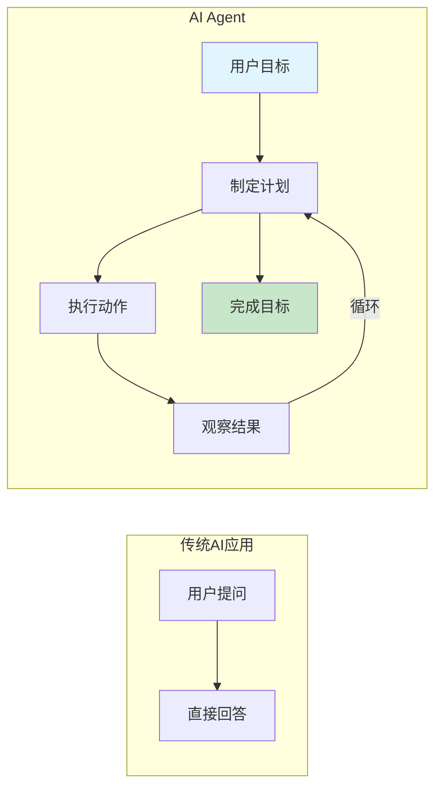
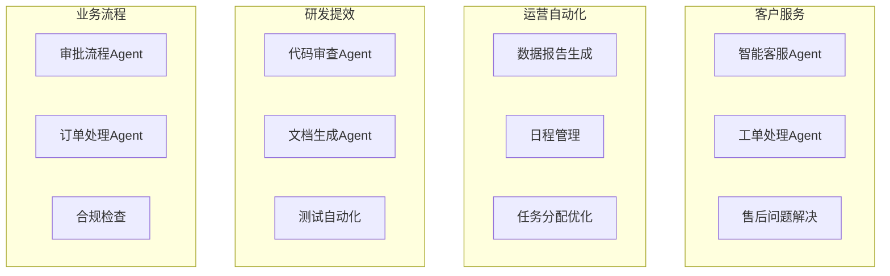
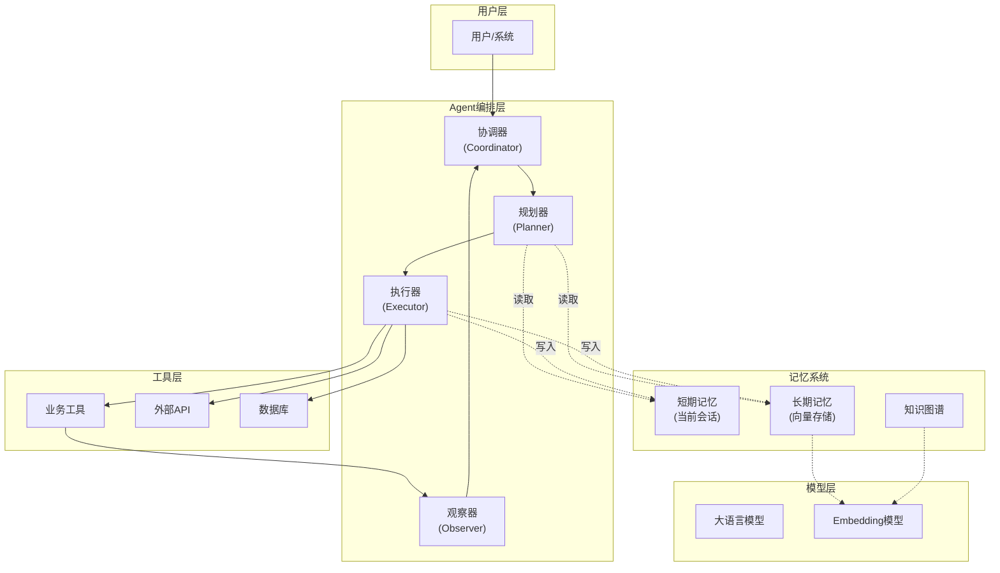
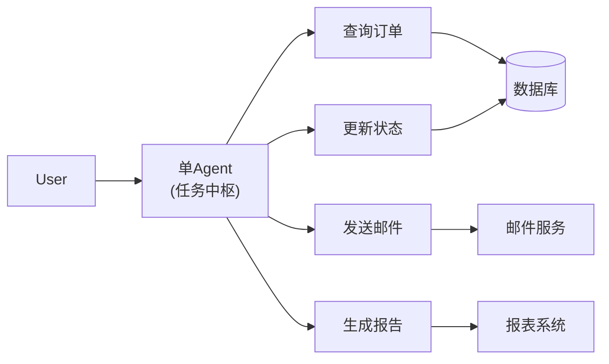
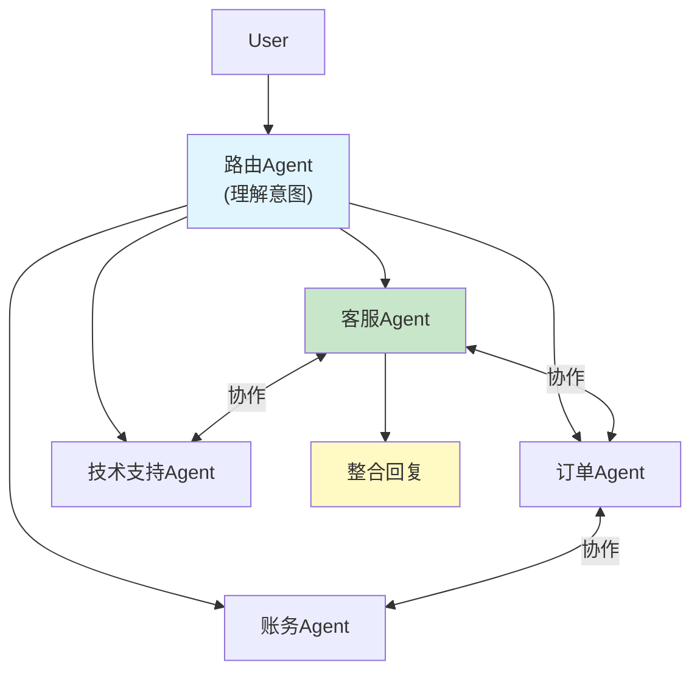
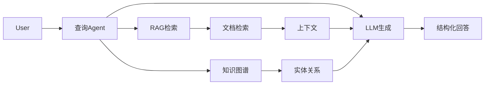
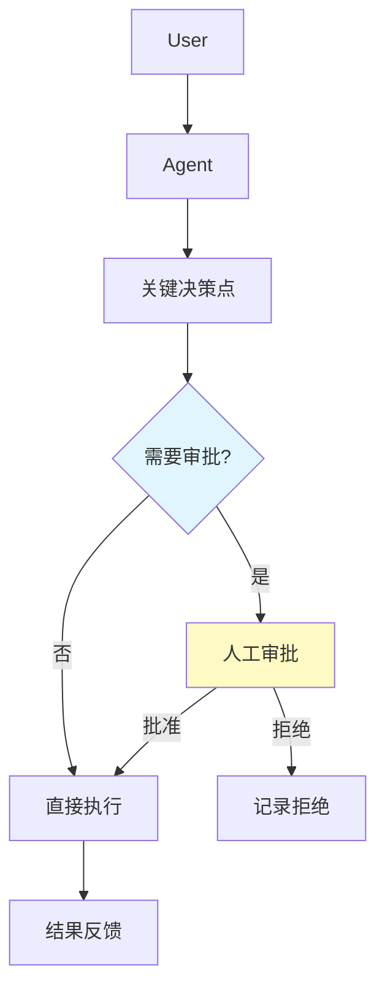
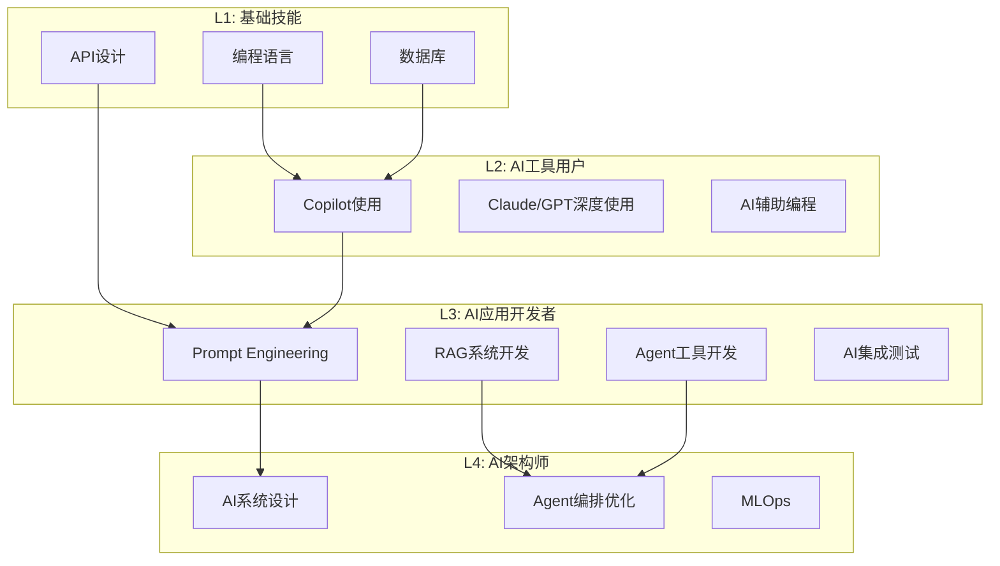
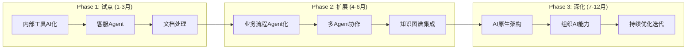

# 2026/4/6 AI Agent在企业软件中的落地范式

## 前言

2024-2025年，AI Agent从概念走向落地。从早期的单Agent对话，到如今多Agent协作、自主规划执行，Agent正在深刻改变企业软件的形态。

本文探讨：**AI Agent在企业软件开发中的落地范式，以及对程序员的技能新要求**。

---

## 一、为什么企业需要AI Agent

### 1.1 从"助手"到"员工"的转变

传统AI应用（如RAG问答）本质上是"高级助手"——你问，它答。而Agent是"数字员工"——你给它目标，它自主完成。



**企业价值对比**：

| 维度 | 传统AI助手 | AI Agent |
|------|-----------|----------|
| 交互方式 | 问答 | 目标驱动 |
| 执行能力 | 无 | 可调用工具 |
| 自主性 | 低 | 高 |
| 适用场景 | 信息查询 | 任务完成 |
| 人工介入 | 高 | 可选 |

### 1.2 企业Agent落地场景矩阵



---

## 二、AI Agent核心架构

### 2.1 标准Agent架构



### 2.2 核心组件详解

#### 2.2.1 规划器（Planner）

负责任务分解与执行计划生成。

```java
// 规划器核心接口
public interface Planner {
    
    // 将复杂任务分解为可执行步骤
    Plan decompose(String goal);
    
    // 重规划（执行失败时）
    Plan replan(Context context, Exception error);
}

// 计划表示
public class Plan {
    private List<Step> steps;
    private int currentStepIndex;
    
    public Step nextStep() {
        return steps.get(currentStepIndex++);
    }
    
    public boolean hasNext() {
        return currentStepIndex < steps.size();
    }
}

public class Step {
    private String description;
    private String toolName;
    private Map<String, Object> parameters;
    private StepStatus status;
}
```

#### 2.2.2 执行器（Executor）

负责调用工具并收集结果。

```java
public interface Executor {
    
    // 执行单个步骤
    ExecutionResult execute(Step step, Context context);
    
    // 批量执行
    List<ExecutionResult> executeAll(List<Step> steps);
}

// 执行结果
public class ExecutionResult {
    private boolean success;
    private Object output;
    private String error;
    private Map<String, Object> metadata;
}
```

#### 2.2.3 记忆系统

```java
public class MemorySystem {
    
    // 短期记忆：当前会话上下文
    private List<Message> shortTermMemory;
    
    // 长期记忆：向量化的经验知识
    private VectorStore longTermMemory;
    
    // 知识图谱：实体关系
    private KnowledgeGraph knowledgeGraph;
    
    // 写入记忆
    public void remember(String content, MemoryType type) {
        switch (type) {
            case SHORT_TERM:
                shortTermMemory.add(new Message(content));
                break;
            case LONG_TERM:
                vectorizeAndStore(content);
                break;
            case EPISODIC:
                storeEpisode(content);
                break;
        }
    }
    
    // 检索记忆
    public List<String> recall(String query, int limit) {
        // 1. 查询短期记忆
        List<String> shortTerm = searchShortTerm(query);
        
        // 2. 向量检索长期记忆
        List<String> longTerm = vectorSearch(query, limit);
        
        // 3. 合并去重
        return mergeResults(shortTerm, longTerm);
    }
}
```

---

## 三、企业Agent落地范式

### 3.1 范式一：单Agent+多工具

适用场景：结构化业务流程、明确的任务边界



**典型案例：订单处理Agent**

```java
@Agent(name = "OrderAgent", description = "处理订单相关请求")
public class OrderProcessingAgent {
    
    @Tool("查询订单状态")
    public Order queryOrder(@Param("orderId") String orderId) {
        return orderRepository.findById(orderId);
    }
    
    @Tool("取消订单")
    public CancelResult cancelOrder(
            @Param("orderId") String orderId,
            @Param("reason") String reason) {
        // 业务逻辑
        Order order = orderRepository.findById(orderId);
        if (order.canCancel()) {
            order.cancel(reason);
            orderRepository.save(order);
            return new CancelResult(true, "取消成功");
        }
        return new CancelResult(false, "订单不可取消");
    }
    
    @Tool("发送订单通知")
    public void sendNotification(
            @Param("orderId") String orderId,
            @Param("type") String type) {
        // 发送邮件/短信
    }
    
    @Tool("获取物流信息")
    public LogisticsInfo getLogistics(@Param("orderId") String orderId) {
        return logisticsService.query(orderId);
    }
    
    public String handle(String userRequest) {
        // Agent主循环
        Plan plan = planner.decompose(userRequest);
        Context ctx = new Context();
        
        while (plan.hasNext()) {
            Step step = plan.nextStep();
            ExecutionResult result = executor.execute(step, ctx);
            ctx.addResult(step.getDescription(), result);
        }
        
        return responseGenerator.generate(ctx);
    }
}
```

### 3.2 范式二：多Agent协作

适用场景：复杂业务流程、需要专业分工



**多Agent协作框架**

```java
public class MultiAgentCollaboration {
    
    private Map<String, Agent> agents;
    private Coordinator coordinator;
    
    public String process(String userRequest) {
        // 1. 意图识别与路由
        Intent intent = coordinator.recognizeIntent(userRequest);
        
        // 2. 确定参与Agent
        List<String> participantIds = coordinator.route(intent);
        
        // 3. 并行执行子任务
        List<CompletableFuture<AgentResult>> futures = 
            participantIds.stream()
                .map(id -> executeAgentAsync(id, intent))
                .collect(Collectors.toList());
        
        // 4. 收集结果
        List<AgentResult> results = futures.stream()
            .map(CompletableFuture::join)
            .collect(Collectors.toList());
        
        // 5. 整合输出
        return coordinator.integrate(results);
    }
    
    // Agent间通信
    public void sendMessage(String fromAgent, String toAgent, 
                          String message, MessageType type) {
        // 支持：请求、响应、信息同步
        agentMessageBus.send(fromAgent, toAgent, message, type);
    }
}
```

### 3.3 范式三：Agent + RAG

适用场景：需要专业知识库支持的场景



**RAG增强Agent示例**

```java
@Agent(name = "KnowledgeAgent")
public class KnowledgeableOrderAgent {
    
    private VectorStore knowledgeBase;
    private KnowledgeGraph knowledgeGraph;
    private ChatModel chatModel;
    
    @Tool("检索知识库")
    public List<Document> searchKnowledge(
            @Param("query") String query,
            @Param("topK") int topK) {
        return knowledgeBase.similaritySearch(query, topK);
    }
    
    @Tool("查询知识图谱")
    public List<EntityRelation> queryKnowledgeGraph(
            @Param("entity") String entity) {
        return knowledgeGraph.query(entity);
    }
    
    public String answer(String question) {
        // 1. 检索相关知识
        List<Document> docs = searchKnowledge(question, 5);
        List<EntityRelation> kgData = queryKnowledgeGraph(extractEntity(question));
        
        // 2. 构建增强上下文
        String context = buildContext(docs, kgData);
        
        // 3. 生成回答
        String prompt = String.format("""
            基于以下知识回答用户问题。
            如果知识不足以回答，请说明。
            
            知识：
            %s
            
            问题：%s
            """, context, question);
        
        return chatModel.call(prompt);
    }
}
```

### 3.4 范式四：Human-in-the-Loop Agent

适用场景：高风险操作、合规要求、复杂决策



**审批Agent实现**

```java
@Agent(name = "ApprovalAgent")
public class ApprovalAgent {
    
    private static final double HIGH_RISK_THRESHOLD = 0.8;
    
    @Tool("执行高风险操作")
    public OperationResult executeHighRisk(
            @Param("operation") String operation,
            @Param("params") Map<String, Object> params) {
        // 1. 提交审批
        ApprovalRequest request = ApprovalRequest.builder()
            .operation(operation)
            .params(params)
            .riskLevel(assessRisk(operation, params))
            .requester(getCurrentUser())
            .build();
        
        // 2. 等待审批
        ApprovalResult approval = approvalService.submitAndWait(request);
        
        if (approval.isApproved()) {
            return executeOperation(operation, params);
        } else {
            return new OperationResult(false, "审批被拒绝: " + approval.getReason());
        }
    }
    
    @Tool("执行低风险操作")
    public OperationResult executeLowRisk(
            @Param("operation") String operation,
            @Param("params") Map<String, Object> params) {
        // 低风险操作直接执行
        return executeOperation(operation, params);
    }
    
    private double assessRisk(String operation, Map<String, Object> params) {
        // 风险评估逻辑
        // 返回0-1的风险分数
    }
}
```

---

## 四、Agent开发工程实践

### 4.1 工具定义规范

```java
// 良好的工具定义示例
public class GoodToolExamples {
    
    // ✅ 好的工具定义
    @Tool(
        name = "cancelOrder",
        description = """
            取消用户订单。如果订单当前状态为'已支付'且未发货，可以取消。
            如果订单已发货或已完成，需要用户确认会有额外手续费。
            """
    )
    public CancelOrderResult cancelOrder(
        @ToolParam(
            name = "orderId",
            description = "订单ID，格式：ORD-XXXXXX",
            required = true
        ) String orderId,
        
        @ToolParam(
            name = "cancelReason",
            description = "取消原因",
            required = true,
            allowedValues = {"USER_REQUEST", "ITEM_NOT_AVAILABLE", "OTHER"}
        ) String cancelReason
    ) {
        // 实现
    }
    
    // ❌ 差的工具定义
    @Tool(name = "cancel", description = "取消订单")
    public void cancel(String orderId) {
        // 参数没有描述，LLM难以理解何时调用
    }
}
```

### 4.2 Agent日志与可观测性

```java
public class AgentObservability {
    
    // 1. 追踪Agent决策链路
    public void logDecision(String agentId, String step, 
                           String reasoning, Object context) {
        Tracing tracing = Tracing.getCurrent();
        tracing.logSpan("agent.decision", span -> {
            span.setTag("agent.id", agentId);
            span.setTag("step", step);
            span.setTag("reasoning", reasoning);
            span.setTag("context", serialize(context));
        });
    }
    
    // 2. 记录工具调用
    public void logToolCall(String toolName, Object input, 
                           Object output, long durationMs) {
        Metrics metrics = Metrics.getCurrent();
        metrics.increment("agent.tool.calls", 
            Tags.of("tool", toolName));
        metrics.record("agent.tool.duration", durationMs,
            Tags.of("tool", toolName));
    }
    
    // 3. Agent执行指标
    public void recordMetrics(AgentMetrics metrics) {
        // 任务完成率
        // 平均执行时间
        // 工具调用成功率
        // 人工介入率
    }
}
```

### 4.3 错误处理与降级

```java
public class AgentErrorHandler {
    
    // 工具执行失败处理
    public ExecutionResult handleToolFailure(ToolExecutionException e, 
                                           Step failedStep) {
        // 1. 记录错误
        log.error("Tool execution failed: {}", e.getMessage());
        
        // 2. 判断是否可重试
        if (e.isRetryable() && failedStep.getRetryCount() < 3) {
            // 重试逻辑
            return retry(failedStep);
        }
        
        // 3. 降级策略
        return fallback(failedStep, e);
    }
    
    // 降级方案
    private ExecutionResult fallback(Step step, Exception e) {
        switch (step.getCriticality()) {
            case HIGH:
                // 高关键性：返回需要人工处理
                return new ExecutionResult(false, null, 
                    "需要人工处理: " + e.getMessage());
                
            case MEDIUM:
                // 中关键性：跳过该步骤继续
                return new ExecutionResult(true, null, 
                    "步骤已跳过: " + step.getDescription());
                
            case LOW:
                // 低关键性：使用默认值
                return new ExecutionResult(true, 
                    step.getDefaultValue(), "使用默认值");
        }
    }
}
```

### 4.4 安全与权限控制

```java
public class AgentSecurity {
    
    // 1. Agent权限边界
    public boolean hasPermission(String agentId, String action, 
                                Object target) {
        AgentPermissions permissions = permissionService.get(agentId);
        return permissions.canExecute(action, target);
    }
    
    // 2. 敏感操作审批
    @Tool(name = "deleteCustomer", description = "删除客户")
    public DeleteResult deleteCustomer(
        @ToolParam(name = "customerId") String customerId) {
        
        // 检查权限
        if (!hasPermission(getCurrentAgentId(), "DELETE", "CUSTOMER")) {
            throw new SecurityException("权限不足");
        }
        
        // 需要额外审批
        if (requiresExtraApproval(customerId)) {
            submitForApproval(getCurrentAgentId(), 
                new ApprovalRequest("DELETE_CUSTOMER", customerId));
            return new DeleteResult(false, "需要额外审批");
        }
        
        return doDelete(customerId);
    }
    
    // 3. 操作审计
    @Aspect
    public class AgentAuditAspect {
        @Around("@annotation(Audited)")
        public Object audit(ProceedingJoinPoint pjp) {
            AgentAction action = /* 解析操作 */;
            String agentId = getCurrentAgentId();
            
            auditLogger.log(agentId, action, 
                LocalDateTime.now(), "START");
            
            try {
                Object result = pjp.proceed();
                auditLogger.log(agentId, action, 
                    LocalDateTime.now(), "SUCCESS");
                return result;
            } catch (Exception e) {
                auditLogger.log(agentId, action, 
                    LocalDateTime.now(), "FAILED", e.getMessage());
                throw e;
            }
        }
    }
}
```

---

## 五、程序员技能新要求

### 5.1 技能金字塔



### 5.2 核心技能详解

#### 5.2.1 Prompt Engineering（必须掌握）

```markdown
## Prompt编写黄金法则

### 1. 角色设定
❌ 错误：帮我写一段代码
✅ 正确：作为Java后端工程师，请帮我编写一个用户注册接口

### 2. 任务明确
❌ 错误：分析这个数据
✅ 正确：分析过去30天日活用户数据，找出：
   - 增长趋势
   - 异常峰值
   - 与竞品对比

### 3. 输出格式指定
❌ 错误：给个报告
✅ 正确：请按以下格式输出分析报告：
   1. 摘要（100字内）
   2. 关键发现（3-5条）
   3. 建议（按优先级排序）

### 4. 约束条件
❌ 错误：优化这个SQL
✅ 正确：优化以下SQL，要求：
   - 不能改变查询结果
   - 必须有索引优化
   - 解释每一步优化原因
```

#### 5.2.2 Agent工具开发（进阶必备）

```java
// Agent工具开发检查清单
public class ToolDevelopmentChecklist {
    
    // 1. 工具命名清晰
    // ✅ getOrderDetails - 清晰表达获取订单详情
    // ❌ getData - 太模糊
    
    // 2. 描述详细完整
    String description = """
        工具描述必须包含：
        - 工具用途
        - 输入参数说明
        - 返回值说明
        - 适用场景
        - 注意事项
        """;
    
    // 3. 参数校验
    public void validateParams(Map<String, Object> params) {
        // 必填参数检查
        // 参数格式校验
        // 业务规则校验
    }
    
    // 4. 异常处理
    // - 明确错误信息
    // - 区分可恢复/不可恢复错误
    // - 记录日志
}
```

#### 5.2.3 AI集成测试（质量保障）

```java
// AI特性测试策略
public class AITestStrategy {
    
    // 1. 功能正确性测试
    @Test
    public void testOrderAgent_correctInput() {
        OrderAgent agent = new OrderAgent();
        String result = agent.handle("查询订单ORD-123456的状态");
        
        assertNotNull(result);
        assertTrue(result.contains("已发货"));
    }
    
    // 2. 边界情况测试
    @Test
    public void testOrderAgent_invalidOrderId() {
        OrderAgent agent = new OrderAgent();
        String result = agent.handle("查询订单ORD-INVALID的状态");
        
        // 应该优雅处理，而非崩溃
        assertFalse(result.contains("系统错误"));
    }
    
    // 3. 安全测试
    @Test
    public void testOrderAgent_sqlInjection() {
        OrderAgent agent = new OrderAgent();
        String maliciousInput = "'; DROP TABLE orders; --";
        String result = agent.handle("查询订单" + maliciousInput + "的状态");
        
        // 应该被过滤或转义
        assertFalse(result.contains("SQL"));
    }
    
    // 4. 一致性测试（多次相同输入应输出一致）
    @Test
    public void testConsistency() {
        // 当temperature=0时，多次调用应输出一致
    }
}
```

### 5.3 新技能学习路径

```markdown
## 12周技能转型计划

### 第1-2周：Prompt精通
- [ ] 掌握Few-shot、Chain-of-Thought
- [ ] 建立个人Prompt模板库
- [ ] 实践：优化3个现有功能的Prompt

### 第3-4周：AI工具深度使用
- [ ] 熟练使用Copilot/Claude辅助编程
- [ ] 掌握Cursor IDE高级用法
- [ ] 实践：用AI辅助完成一个小功能

### 第5-6周：RAG开发
- [ ] 理解向量数据库原理
- [ ] 完成一个RAG应用开发
- [ ] 掌握RAG评估与优化

### 第7-8周：Agent基础
- [ ] 理解Agent核心概念
- [ ] 开发一个简单的单Agent应用
- [ ] 掌握工具定义规范

### 第9-10周：Agent进阶
- [ ] 开发多Agent协作系统
- [ ] 实现Human-in-the-Loop
- [ ] 掌握Agent可观测性建设

### 第11-12周：生产实践
- [ ] AI应用安全加固
- [ ] 成本控制与优化
- [ ] 制定团队AI开发规范
```

---

## 六、企业落地路线图

### 6.1 三阶段实施路径



### 6.2 关键成功因素

```markdown
## Agent落地成功要素

### 技术层面
- [ ] 选择合适的落地场景（非所有场景都适合Agent）
- [ ] 构建高质量的工具集
- [ ] 建立完善的可观测性
- [ ] 设计合理的容错机制

### 组织层面
- [ ] 获得管理层支持
- [ ] 培养AI种子团队
- [ ] 建立人机协作文化
- [ ] 制定AI使用规范

### 流程层面
- [ ] 建立AI应用评审流程
- [ ] 设计Human-in-the-Loop机制
- [ ] 定期评估与优化
- [ ] 持续收集用户反馈
```

---

## 七、总结

### 7.1 核心观点

```markdown
## 关键认知

1. **Agent是AI落地企业的重要形态**
   - 从"助手"到"员工"的转变
   - 目标驱动而非问答驱动

2. **单Agent+多工具是最快落地路径**
   - 适合结构化业务流程
   - 快速验证，快速迭代

3. **多Agent协作是复杂场景的未来**
   - 专业分工与协作
   - 需要完善的编排框架

4. **Human-in-the-Loop不可或缺**
   - 高风险操作必须人工审批
   - 人机协作是长期模式

5. **程序员技能需要升级**
   - Prompt Engineering是基础
   - 工具开发能力是关键
   - AI集成测试能力是保障
```

### 7.2 行动建议

```markdown
## 立即行动清单

### 本周
- [ ] 在工作中找一个适合Agent化的场景
- [ ] 完成一个简单Agent的原型开发
- [ ] 评估现有系统的AI集成可行性

### 本月
- [ ] 建立团队AI学习小组
- [ ] 制定AI工具开发规范
- [ ] 完成第一个生产级Agent应用

### 本季度
- [ ] 形成企业Agent最佳实践
- [ ] 建立AI应用评估体系
- [ ] 规划下一步AI落地路线图
```

---

## 八、参考资料

- LangChain4j官方文档
- Spring AI官方文档
- Anthropic Claude Agent最佳实践
- OpenAI Function Calling指南
- AWS Bedrock Agent文档
- Multi-Agent Systems综述

---

*最后更新：2026/4/6*
