# 2026/4/6 AI时代的软件开发新范式

## 前言

2024-2025年，以OpenCode（OpenAI）、Claude Code（Anthropic）、Cursor为代表的AI编程工具深刻改变了软件开发的面貌。从"人写代码"到"人指挥AI写代码"，这场变革远比技术革命更深刻——它正在重塑软件工程的每一个环节。

本文以业界主流AI编程工具为案例，探讨：**AI时代软件开发范式的根本性转变**。

---

## 一、传统开发范式 vs AI开发范式

### 1.1 核心差异

```mermaid
flowchart TD
    subgraph "传统开发范式"
        T1["需求分析"] --> T2["架构设计"]
        T2 --> T3["详细设计"]
        T3 --> T4["编码实现"]
        T4 --> T5["单元测试"]
        T5 --> T6["集成测试"]
        T6 --> T7["部署运维"]
        T7 --> T8["持续迭代"]
    end
    
    subgraph "AI开发范式"
        A1["需求描述"] --> A2["AI辅助架构"]
        A2 --> A3["代码生成"]
        A3 --> A4["AI Review"]
        A4 --> A5["自动测试生成"]
        A5 --> A6["智能部署"]
        A6 --> A7["AI监控分析"]
        A7 --> A8["持续优化"]
    end
    
    style A1 fill:#e1f5fe
    style A3 fill:#c8e6c9
    style A5 fill:#fff9c4
```

### 1.2 开发模式对比

| 维度 | 传统模式 | AI模式 |
|------|---------|--------|
| **代码来源** | 人工编写 | AI生成 + 人工审核 |
| **开发效率** | 人力密集 | 10x效率提升 |
| **错误类型** | 语法错误、逻辑错误 | AI幻觉、上下文遗漏 |
| **测试方式** | 人工编写测试用例 | AI自动生成 + 边界覆盖 |
| **运维响应** | 被动响应告警 | AI主动预测分析 |
| **知识传承** | 文档、Wiki | 代码即文档 |

---

## 二、需求分析阶段的变革

### 2.1 传统需求分析

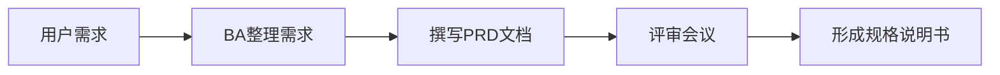

### 2.2 AI辅助需求分析

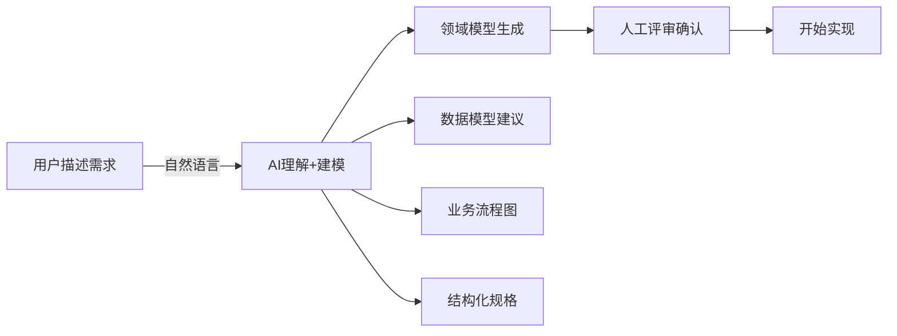

### 2.3 AI工具的实际能力

**Claude Code / OpenCode 需求分析示例**：

```
用户输入：
"帮我设计一个用户积分系统，用户可以通过下单获取积分，
推荐新用户获得积分，积分可以兑换商品或抵扣订单金额。"

AI输出：
1. 领域模型
   - User { id, name, points, level }
   - Order { id, userId, amount, pointsEarned }
   - Reward { id, name, pointsRequired }
   - PointsTransaction { id, userId, type, amount, createdAt }

2. 业务流程
   - 获取积分：下单 → 计算积分 → 更新用户积分 → 记录交易
   - 使用积分：兑换商品/抵扣 → 验证积分 → 扣减积分 → 记录交易

3. 业务规则
   - 积分获取：每消费1元 = 1积分
   - 推荐奖励：被推荐人首单，推荐人获得100积分
   - 积分上限：单次订单积分不超过订单金额的50%
   - 积分过期：每年12月31日清零上一年获取积分的30%

4. API设计建议
   - POST /api/orders - 创建订单（自动计算积分）
   - GET /api/users/{id}/points - 查询用户积分
   - POST /api/points/redeem - 积分兑换
   - GET /api/users/{id}/points/transactions - 积分明细
```

### 2.4 新范式要点

```markdown
## 需求分析AI化要点

### 有效的需求描述
❌ 模糊："做一个积分功能"
✅ 具体："用户下单后获得积分，1元=1积分，推荐新用户获得100积分"

### AI辅助产出
- [ ] 领域模型（实体、关系）
- [ ] 数据模型（表结构建议）
- [ ] 业务流程（状态机/流程图）
- [ ] API设计（RESTful建议）
- [ ] 业务规则（可执行规则）
- [ ] 边界情况（异常场景）

### 关键转变
- 从"人工编写详细规格"到"AI快速生成 + 人工审核"
- 规格文档从"一次性产出"变为"持续迭代"
```

---

## 三、架构设计阶段的变革

### 3.1 传统架构设计

架构师根据需求设计系统架构，产出架构设计文档，技术选型、模块划分、接口设计都需要人工完成。

### 3.2 AI辅助架构设计

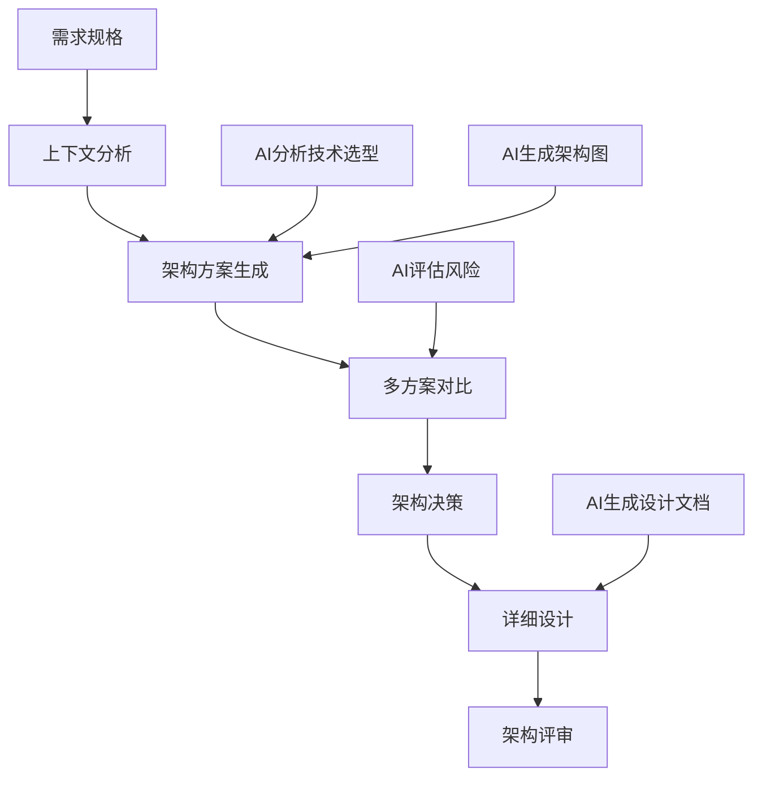

### 3.3 AI架构辅助示例

**AI辅助技术选型**：

```
问：帮我设计一个日活100万的社区产品后端架构，要求支持帖子、评论、点赞功能，
    需要高并发、低延迟，成本控制在月均10万以内。

AI输出：
1. 技术选型建议
   - 计算层：K8s + 弹性扩缩容
   - 缓存层：Redis Cluster（热数据）
   - 存储层：PostgreSQL（主库）+ ClickHouse（分析）
   - 消息队列：Kafka（异步处理）
   - CDN：静态资源加速

2. 架构图（Mermaid）
   [用户] → [CDN] → [API Gateway] → [K8s Pods]
                                   ↓
                            [Redis Cache]
                                   ↓
                            [PostgreSQL]
                                   ↓
                            [ClickHouse]

3. 成本估算
   - 云服务器：3万/月（4台8核16G）
   - Redis：2万/月（集群版）
   - 数据库：2万/月
   - Kafka + 其他：1万/月
   - CDN：2万/月
   总计：约10万/月 ✅

4. 风险评估
   - 单点风险：需要多AZ部署
   - 缓存穿透：布隆过滤器 + 缓存空值
   - 数据库瓶颈：读写分离 + 分库分表（后期）
```

### 3.4 新范式要点

```markdown
## 架构设计AI化要点

### AI辅助场景
- [ ] 技术选型分析（ Pros/Cons 对比）
- [ ] 架构图生成（自动绘制架构图）
- [ ] 成本估算（基于云厂商定价）
- [ ] 风险评估（识别单点、瓶颈）
- [ ] 设计文档生成（架构决策记录）

### 关键转变
- 从"架构师主导设计"到"AI提供选项 + 架构师决策"
- 架构图从"手工绘制"到"AI自动生成 + 人工微调"
- 架构评审从"会议讨论"到"AI预审 + 重点讨论"
```

---

## 四、编码实现阶段的变革

### 4.1 传统编码模式

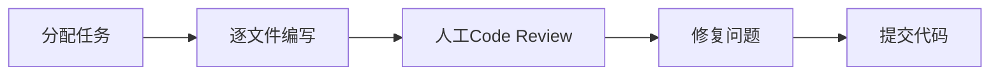

### 4.2 AI编程模式

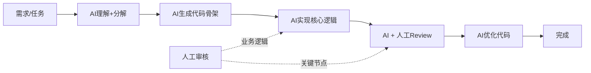

### 4.3 主流AI编程工具对比

```markdown
## AI编程工具全景

| 工具 | 厂商 | 核心能力 | 特点 |
|------|------|---------|------|
| **OpenCode** | OpenAI | 全流程AI编程 | 端到端，代码生成+执行 |
| **Claude Code** | Anthropic | 高质量代码生成 | 推理能力强，适合复杂逻辑 |
| **Cursor** | Cursor | AI IDE集成 | 深度IDE集成，代码补全强 |
| **GitHub Copilot** | Microsoft | 代码补全 | 轻量级，即插即用 |
| **JetBrains AI** | JetBrains | 智能补全 | 深度IDE集成 |

### OpenCode vs Claude Code 对比

OpenCode（OpenAI）：
- 优势：执行能力强，能运行命令、调试
- 适合：需要完整项目构建、命令执行
- 场景：端到端任务、DevOps自动化

Claude Code（Anthropic）：
- 优势：代码质量高，逻辑清晰
- 适合：复杂业务逻辑、高质量代码
- 场景：核心模块开发、代码重构
```

### 4.4 AI编程工作流

```java
// 传统开发 vs AI开发工作流对比

// ====== 传统开发工作流 ======
public class TraditionalWorkflow {
    
    public void developFeature(String feature) {
        // 1. 阅读现有代码 (2-4小时)
        understandExistingCode();
        
        // 2. 手动编写代码 (1-2天)
        writeCodeManually();
        
        // 3. 人工Review (30分钟-1小时)
        codeReview();
        
        // 4. 修复Review问题 (1-2小时)
        fixReviewIssues();
        
        // 5. 编写测试 (2-4小时)
        writeTests();
    }
}

// ====== AI开发工作流 ======
public class AIWorkflow {
    
    public void developFeature(String feature) {
        // 1. AI理解需求 (5分钟)
        String context = ai.readAndUnderstand(feature);
        
        // 2. AI生成代码 (5-15分钟)
        String code = ai.generateCode(context);
        
        // 3. 人工快速审核 (15-30分钟)
        human.quickReview(code); // 聚焦关键逻辑
        
        // 4. AI修复问题 (5分钟)
        String fixedCode = ai.fixIssues(code, human.feedback);
        
        // 5. AI生成测试 (10分钟)
        String tests = ai.generateTests(fixedCode);
    }
}
```

### 4.5 AI编程核心场景

#### 4.5.1 代码生成

```markdown
## 代码生成场景

### 简单CRUD生成
// 输入：帮我生成一个UserController，包含CRUD接口
// 输出：完整的REST Controller代码

### 复杂业务逻辑
// 输入：帮我实现一个分布式锁，使用Redisson
// 要求：可重入、过期自动续期、支持公平锁
// 输出：完整的实现代码+单元测试

### 算法实现
// 输入：用Java实现一个LRU缓存，支持O(1)get和put
// 输出：完整的实现代码+复杂度分析
```

#### 4.5.2 代码重构

```markdown
## AI辅助重构

### 典型重构场景
1. 长方法拆分 → AI识别并拆分
2. 重复代码提取 → AI识别模式并抽象
3. 命名规范优化 → AI批量重命名
4. 设计模式应用 → AI建议并实现

### 重构流程
1. AI分析代码质量
2. AI提出重构建议
3. 人工确认优先级
4. AI执行重构
5. 人工审核结果
6. 运行测试验证
```

#### 4.5.3 代码转换

```markdown
## 跨语言/框架转换

### 场景示例
- Java 8 → Java 17 新特性迁移
- Spring MVC → Spring Boot 3.x 迁移
- MyBatis → JPA 迁移
- 单体 → 微服务拆分

### AI辅助迁移
1. AI分析源码结构
2. AI生成目标语言/框架代码
3. AI识别并处理差异点
4. 人工审核转换结果
5. 运行测试验证
```

### 4.6 Prompt Engineering for Code

```java
// 有效的代码生成Prompt示例

public class CodePromptExamples {
    
    // ❌ 低效Prompt
    public static final String BAD_PROMPT = 
        "写一个用户服务";
    
    // ✅ 高效Prompt（包含上下文+约束+格式）
    public static final String GOOD_PROMPT = """
        作为一个Java后端工程师，帮我写一个用户服务类。
        
        上下文：
        - 框架：Spring Boot 3.2 + MyBatis Plus
        - 包名：com.example.service
        - 已有的User实体包含：id, name, email, createdAt字段
        
        要求：
        1. 包含CRUD方法，使用MyBatis Plus的IService封装
        2. 实现分页查询方法，响应分页结果
        3. 包含事务注解的方法示例
        4. 方法需要合理的参数校验和异常处理
        5. 使用lombok简化代码
        
        输出格式：
        1. Java代码，遵循阿里Java规范
        2. 代码添加必要的注释
        3. 每个方法附上简短的JavaDoc
        """;
    
    // 复杂业务Prompt模板
    public static final String COMPLEX_PROMPT = """
        角色：资深Java后端工程师
        任务：实现{功能描述}
        
        业务规则：
        {规则1}
        {规则2}
        
        技术约束：
        - 框架：{框架版本}
        - 数据库：{数据库类型}
        - 缓存：{缓存方案}
        
        质量要求：
        - 代码完整可运行
        - 包含异常处理
        - 包含单元测试
        - 遵循现有代码风格
        
        输出顺序：
        1. 接口定义
        2. 实现类
        3. 测试类
        """;
}
```

---

## 五、代码Review阶段的变革

### 5.1 传统Code Review

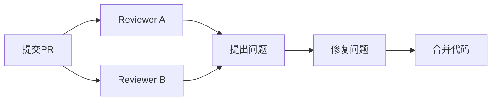

### 5.2 AI增强Code Review

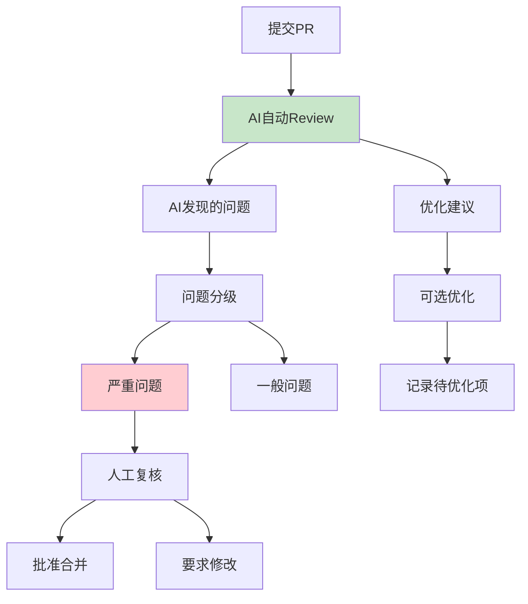

### 5.3 AI Review检查清单

```markdown
## AI Code Review清单

### 代码正确性
- [ ] 逻辑错误检测
- [ ] 空指针风险识别
- [ ] 并发安全问题检测
- [ ] 边界条件覆盖

### 代码质量
- [ ] 重复代码检测
- [ ] 方法过长警告
- [ ] 命名规范检查
- [ ] 代码复杂度评估

### 安全问题
- [ ] SQL注入风险
- [ ] XSS漏洞检测
- [ ] 敏感信息暴露
- [ ] 权限校验缺失

### 性能问题
- [ ] N+1查询检测
- [ ] 循环内数据库操作
- [ ] 缺少索引提示
- [ ] 缓存使用建议

### 最佳实践
- [ ] 异常处理规范
- [ ] 日志记录规范
- [ ] 配置外部化
- [ ] API设计规范
```

### 5.4 AI Review集成实践

```yaml
# GitHub Actions AI Review配置示例
name: AI Code Review

on:
  pull_request:
    types: [opened, synchronize]

jobs:
  ai-review:
    runs-on: ubuntu-latest
    steps:
      - uses: actions/checkout@v3
        with:
          fetch-depth: 0
      
      - name: Run AI Review
        env:
          OPENAI_API_KEY: ${{ secrets.OPENAI_API_KEY }}
        run: |
          # AI Review脚本
          ai-review --pr=${{ github.event.pull_request.number }} \
                   --repo=${{ github.repository }} \
                   --token=${{ secrets.GITHUB_TOKEN }}
      
      - name: Post Review Comment
        uses: actions/github-script@v6
        with:
          script: |
            // AI Review结果发布到PR评论
            github.rest.issues.createComment({
              issue_number: context.issue.number,
              owner: context.repo.owner,
              repo: context.repo.repo,
              body: process.env.AI_REVIEW_RESULT
            })
```

---

## 六、测试阶段的变革

### 6.1 传统测试模式

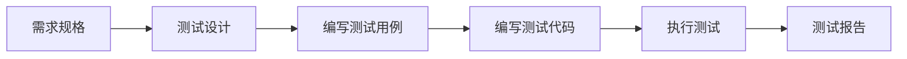

### 6.2 AI测试新模式

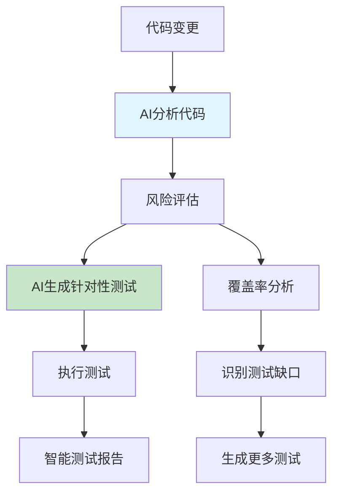

### 6.3 AI测试工具链

```markdown
## AI测试工具全景

| 工具 | 厂商 | 能力 | 场景 |
|------|------|------|------|
| **Diffblue** | Diffblue | AI生成单元测试 | Java单元测试 |
| **CodiumAI** | Codium | 代码完整性测试 | PR测试 |
| **Rovo** | Atlassian | AI测试生成 | Jira+代码 |
| **GitHub Copilot Test** | Microsoft | AI测试补全 | IDE内测试 |
| **ChatGPT** | OpenAI | 测试用例生成 | 全场景 |

### 测试类型AI化程度

| 测试类型 | AI化程度 | AI能力 |
|---------|---------|--------|
| 单元测试 | 高 | 自动生成覆盖 |
| 集成测试 | 中 | 生成框架+人工完善 |
| E2E测试 | 低 | 生成脚本骨架 |
| 性能测试 | 低 | 场景建议 |
```

### 6.4 AI测试生成示例

```java
// ====== 原始代码 ======
public class OrderService {
    
    private final OrderRepository orderRepository;
    private final PointsService pointsService;
    
    public Order createOrder(Long userId, List<Long> productIds) {
        if (userId == null) {
            throw new IllegalArgumentException("用户ID不能为空");
        }
        if (productIds == null || productIds.isEmpty()) {
            throw new IllegalArgumentException("商品列表不能为空");
        }
        
        Order order = new Order();
        order.setUserId(userId);
        order.setStatus(OrderStatus.PENDING);
        order.setCreatedAt(LocalDateTime.now());
        
        return orderRepository.save(order);
    }
    
    public void cancelOrder(Long orderId) {
        Order order = orderRepository.findById(orderId)
            .orElseThrow(() -> new OrderNotFoundException(orderId));
        
        if (order.getStatus() == OrderStatus.SHIPPED) {
            throw new IllegalStateException("已发货订单不能取消");
        }
        
        order.setStatus(OrderStatus.CANCELLED);
        orderRepository.save(order);
        
        // 退还积分
        pointsService.refund(order.getUserId(), order.getPointsUsed());
    }
}

// ====== AI生成的测试代码 ======
@ExtendWith(MockitoExtension.class)
class OrderServiceTest {
    
    @Mock
    private OrderRepository orderRepository;
    
    @Mock
    private PointsService pointsService;
    
    @InjectMocks
    private OrderService orderService;
    
    // ====== createOrder 测试 ======
    
    @Test
    void createOrder_withNullUserId_shouldThrowException() {
        // Given
        Long userId = null;
        List<Long> productIds = List.of(1L, 2L);
        
        // When & Then
        assertThrows(IllegalArgumentException.class, 
            () -> orderService.createOrder(userId, productIds));
    }
    
    @Test
    void createOrder_withEmptyProductIds_shouldThrowException() {
        // Given
        Long userId = 1L;
        List<Long> productIds = Collections.emptyList();
        
        // When & Then
        assertThrows(IllegalArgumentException.class,
            () -> orderService.createOrder(userId, productIds));
    }
    
    @Test
    void createOrder_withValidInput_shouldCreateOrder() {
        // Given
        Long userId = 1L;
        List<Long> productIds = List.of(1L, 2L);
        
        Order savedOrder = new Order();
        savedOrder.setId(100L);
        savedOrder.setUserId(userId);
        savedOrder.setStatus(OrderStatus.PENDING);
        
        when(orderRepository.save(any(Order.class))).thenReturn(savedOrder);
        
        // When
        Order result = orderService.createOrder(userId, productIds);
        
        // Then
        assertNotNull(result);
        assertEquals(100L, result.getId());
        assertEquals(userId, result.getUserId());
        assertEquals(OrderStatus.PENDING, result.getStatus());
        verify(orderRepository).save(any(Order.class));
    }
    
    // ====== cancelOrder 测试 ======
    
    @Test
    void cancelOrder_withNonExistentId_shouldThrowException() {
        // Given
        Long orderId = 999L;
        when(orderRepository.findById(orderId)).thenReturn(Optional.empty());
        
        // When & Then
        assertThrows(OrderNotFoundException.class,
            () -> orderService.cancelOrder(orderId));
    }
    
    @Test
    void cancelOrder_withShippedOrder_shouldThrowException() {
        // Given
        Long orderId = 1L;
        Order shippedOrder = new Order();
        shippedOrder.setId(orderId);
        shippedOrder.setStatus(OrderStatus.SHIPPED);
        shippedOrder.setUserId(1L);
        shippedOrder.setPointsUsed(100);
        
        when(orderRepository.findById(orderId)).thenReturn(Optional.of(shippedOrder));
        
        // When & Then
        assertThrows(IllegalStateException.class,
            () -> orderService.cancelOrder(orderId));
    }
    
    @Test
    void cancelOrder_withPendingOrder_shouldCancelAndRefundPoints() {
        // Given
        Long orderId = 1L;
        Order pendingOrder = new Order();
        pendingOrder.setId(orderId);
        pendingOrder.setStatus(OrderStatus.PENDING);
        pendingOrder.setUserId(1L);
        pendingOrder.setPointsUsed(100);
        
        when(orderRepository.findById(orderId)).thenReturn(Optional.of(pendingOrder));
        
        // When
        orderService.cancelOrder(orderId);
        
        // Then
        assertEquals(OrderStatus.CANCELLED, pendingOrder.getStatus());
        verify(orderRepository).save(pendingOrder);
        verify(pointsService).refund(1L, 100);
    }
}
```

### 6.5 新范式要点

```markdown
## AI测试新范式要点

### 测试生成策略
1. **边界测试优先**：AI自动识别边界条件
2. **异常路径覆盖**：AI生成异常场景测试
3. **回归测试智能**：AI基于变更分析需回归的测试

### 人工审核重点
- [ ] 测试逻辑是否正确
- [ ] 断言是否充分
- [ ] 是否覆盖关键业务规则
- [ ] 是否有遗漏的边界情况

### 关键转变
- 从"人工编写所有测试"到"AI生成基础覆盖 + 人工补充关键场景"
- 测试从"事后工作"变为"与开发并行"
```

---

## 七、部署运维阶段的变革

### 7.1 传统DevOps

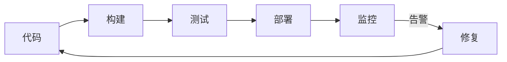

### 7.2 AI增强DevOps

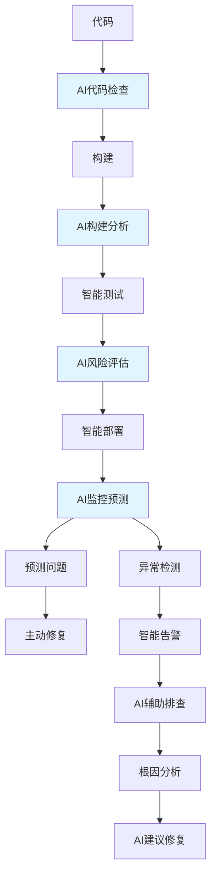

### 7.3 AI运维工具链

```markdown
## AI运维工具全景

| 工具 | 厂商 | 能力 | 场景 |
|------|------|------|------|
| **GitHub Copilot** | Microsoft | 代码补全、故障排查 | 开发+运维 |
| **Claude Code** | Anthropic | 复杂问题分析 | 故障诊断 |
| **Amazon Q Developer** | AWS | 全流程辅助 | AWS运维 |
| **Datadog AI** | Datadog | 智能监控 | 可观测性 |
| **PagerDuty AI** | PagerDuty | 告警聚合 | 事件管理 |

### AI运维场景

1. **智能告警聚合**
   - 减少告警噪音
   - AI识别关联告警
   - 自动优先级排序

2. **故障根因分析**
   - AI分析日志、Trace、Metrics
   - 自动定位可能原因
   - 给出修复建议

3. **智能容量规划**
   - 基于历史数据分析
   - 预测未来容量需求
   - 优化成本

4. **自动化修复**
   - AI识别问题模式
   - 触发预设修复动作
   - 人工确认执行
```

### 7.4 AI辅助故障排查示例

```bash
# ====== 传统故障排查 ======
$ kubectl get pods
NAME                    READY   STATUS    RESTARTS   AGE
api-server-7d9f8b-abc   1/1     Running   5          2h
api-server-7d9f8b-def   1/1     Running   0          2h

$ kubectl logs api-server-7d9f8b-abc --previous
# 大量日志，人工分析...

# ====== AI辅助故障排查 ======
$ ai-diagnose "api-server重启5次"
AI分析：
1. 根因分析
   - 检测到OOMKiller杀死进程
   - 内存使用从500MB快速增长到2GB
   - 发生在每天9:00-10:00高峰期
   
2. 可能原因
   - 缓存未设置上限
   - 内存泄漏（第三方SDK）
   - 连接池未释放
   
3. 建议操作
   - 添加JVM -Xmx限制
   - 检查是否有连接泄漏
   - 扩容或启用HPA

4. 相关文档
   - JVM内存配置指南
   - 应用OOM排查手册
```

### 7.5 新范式要点

```markdown
## AI运维新范式要点

### AI辅助场景
- [ ] 智能告警（减少噪音，识别根因）
- [ ] 故障排查（AI分析日志+Trace）
- [ ] 容量规划（预测+优化建议）
- [ ] 自动化修复（识别+执行）

### 关键转变
- 从"被动响应告警"到"AI主动预测问题"
- 从"人工排查故障"到"AI分析+人工决策"
- 从"手动扩缩容"到"AI自动弹性伸缩"

### 新技能要求
- 理解AI能力边界
- 学会与AI协作排查
- 审核AI建议的正确性
```

---

## 八、程序员技能新要求

### 8.1 技能模型演变

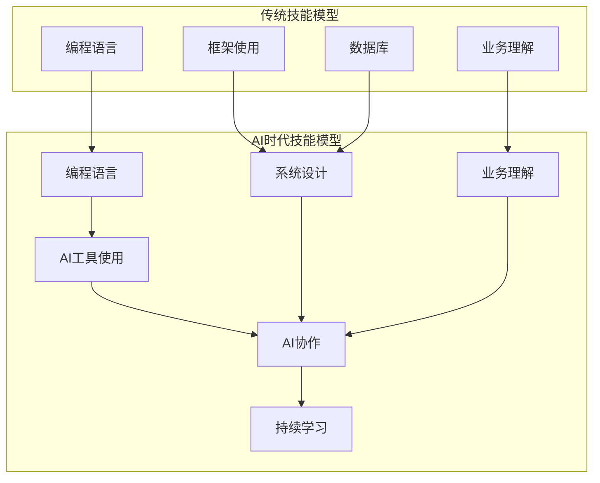

### 8.2 核心新技能

```markdown
## AI时代程序员核心技能

### L0: 基础能力（必须）
- [ ] 熟练使用AI编程工具（Cursor/Claude Code/GitHub Copilot）
- [ ] Prompt Engineering基础
- [ ] 代码审核能力（人工+AI）

### L1: 进阶能力（建议）
- [ ] AI工具深度使用（自定义规则、工作流）
- [ ] 测试AI化（AI生成测试+人工补充）
- [ ] 基础DevOps AI化

### L2: 高阶能力（加分）
- [ ] AI Agent开发
- [ ] AI系统集成
- [ ] AI效能评估优化

### L3: 专家能力
- [ ] AI辅助架构设计
- [ ] AI系统安全
- [ ] AI伦理与合规
```

### 8.3 Prompt Engineering for Development

```markdown
## 开发场景Prompt模板

### 代码生成模板
```
角色：{语言}资深工程师
任务：{功能描述}
约束：
- 框架：{框架版本}
- 代码风格：{规范}
- 性能要求：{如有}
输出：完整可运行代码 + 注释
```

### Bug排查模板
```
错误信息：{错误日志/异常}
相关代码：
```{语言}
{代码片段}
```
环境：{版本信息}
调用链路：{如有}
请分析可能原因，给出排查步骤。
```

### 代码Review模板
```
请Review以下{语言}代码：
代码：
```{语言}
{代码}
```
重点关注：{业务逻辑/性能/安全}
请按{规范}输出Review结果。
```

### 架构设计模板
```
场景：{系统描述}
需求：{功能需求}
约束：
- 规模：{用户量/并发}
- 技术栈：{现有技术}
- 成本：{预算限制}
请设计架构方案，包括：
1. 技术选型
2. 架构图
3. 核心组件
4. 风险评估
5. 成本估算
```
```

---

## 九、实践路线图

### 9.1 12周AI开发转型计划

```markdown
## 转型三阶段

### 第1-4周：AI工具熟练
- [ ] Week 1：安装配置AI IDE（Cursor/GitHub Copilot）
- [ ] Week 2：日常开发使用AI辅助编码
- [ ] Week 3：使用AI进行代码Review
- [ ] Week 4：使用AI辅助Bug排查

### 第5-8周：深度整合
- [ ] Week 5：建立团队AI使用规范
- [ ] Week 6：AI辅助测试生成实践
- [ ] Week 7：AI辅助架构设计实践
- [ ] Week 8：CI/CD集成AI Review

### 第9-12周：持续优化
- [ ] Week 9-10：AI开发流程优化
- [ ] Week 11：AI效能评估
- [ ] Week 12：总结+制定下一阶段计划

### 里程碑
- Week 4：能用AI完成50%的日常编码任务
- Week 8：团队形成AI开发规范
- Week 12：AI成为默认开发工具
```

### 9.2 团队AI实践 Checklist

```markdown
## 团队AI实践清单

### 基础设施
- [ ] 统一的AI IDE配置
- [ ] 代码规范同步到AI工具
- [ ] AI Review集成到CI/CD
- [ ] AI使用日志收集（匿名化）

### 流程规范
- [ ] AI生成代码必须人工Review
- [ ] 敏感代码禁止AI处理
- [ ] AI输出需要验证
- [ ] 定期回顾AI使用效果

### 培训支持
- [ ] Prompt Engineering培训
- [ ] AI工具最佳实践分享
- [ ] AI能力边界认知
- [ ] 安全与合规意识
```

---

## 十、总结

### 10.1 核心观点

```markdown
## 关键认知

1. **AI不会取代程序员，但会用AI的程序员会取代不会用的**
   - AI是工具，关键在于"人机协作"
   - 程序员的角色从"代码编写者"变为"代码审核者+设计者"

2. **软件开发从"人力密集"变为"智力密集"**
   - 效率提升10x不再是梦
   - 竞争从"谁写得多"变为"谁用得好"

3. **Prompt Engineering是新时代的基本技能**
   - 就像写SQL、写正则一样重要
   - 需要持续练习和总结

4. **人工审核仍然不可或缺**
   - AI会犯错（幻觉、上下文遗漏）
   - 关键业务逻辑必须人工确认
   - 安全问题需要人工把关

5. **持续学习能力比知识更重要**
   - AI工具快速迭代
   - 保持开放心态，拥抱变化
```

### 10.2 行动建议

```markdown
## 立即行动

### 今天
- [ ] 安装Cursor或启用GitHub Copilot
- [ ] 用AI重写一个工具类
- [ ] 体验AI代码Review

### 本周
- [ ] 用AI辅助完成一个小功能
- [ ] 建立个人Prompt模板库
- [ ] 在工作中找一个AI应用场景

### 本月
- [ ] 团队分享AI使用经验
- [ ] 制定团队AI使用规范
- [ ] 评估AI带来的效率提升

### 本季度
- [ ] 全面拥抱AI辅助开发
- [ ] 优化团队开发流程
- [ ] 持续迭代AI使用最佳实践
```

---

## 参考资料

- OpenAI OpenCode官方文档
- Anthropic Claude Code最佳实践
- Cursor IDE官方教程
- GitHub Copilot企业实践指南
- Martin Fowler - AI-Assisted Software Development

---

*最后更新：2026/4/6*
