# 2026/4/8 MCP 协议详解与最佳应用架构

## 前言

MCP（Model Context Protocol，模型上下文协议）是由 Anthropic 于 2024 年底开源的协议，旨在为 AI 模型与外部工具、数据源之间建立标准化的通信桥梁。

本文深入解析 MCP 协议的设计原理、核心概念，并通过业界最佳实践展示多种应用场景的架构设计。

---

## 一、MCP 协议核心解析

### 1.1 为什么需要 MCP？

在 MCP 出现之前，AI 应用与外部工具的集成面临诸多困境：

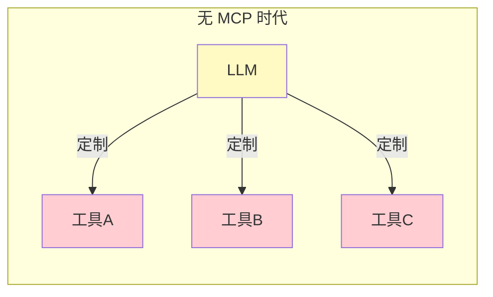

每个工具都需要独立的适配器，导致：
- **碎片化**：每个 AI 应用与每个工具都需要单独集成
- **不可复用**：一个工具的适配器无法被另一个应用使用
- **维护成本高**：协议变更需要更新所有适配器

### 1.2 MCP 的设计理念

MCP 的核心思想是 **"一次构建，处处运行"**：

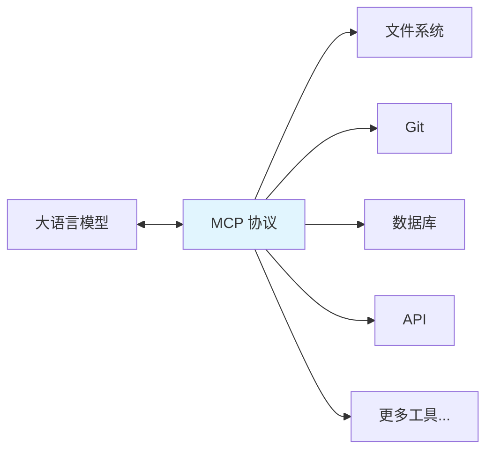

### 1.3 MCP 协议架构

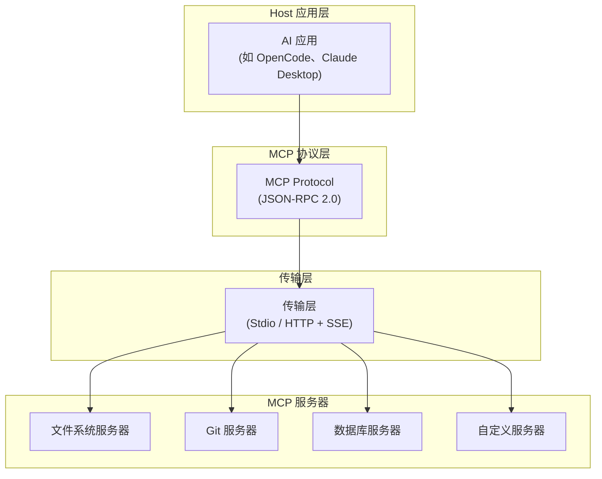

---

## 二、MCP 核心概念

### 2.1 三大核心组件

| 组件 | 作用 |
|------|------|
| **Host** | AI 应用的宿主进程，负责管理会话和协调 |
| **Client** | 存在于 Host 端，与 Server 维持 1:1 连接 |
| **Server** | 独立的进程，通过标准协议暴露工具和资源 |

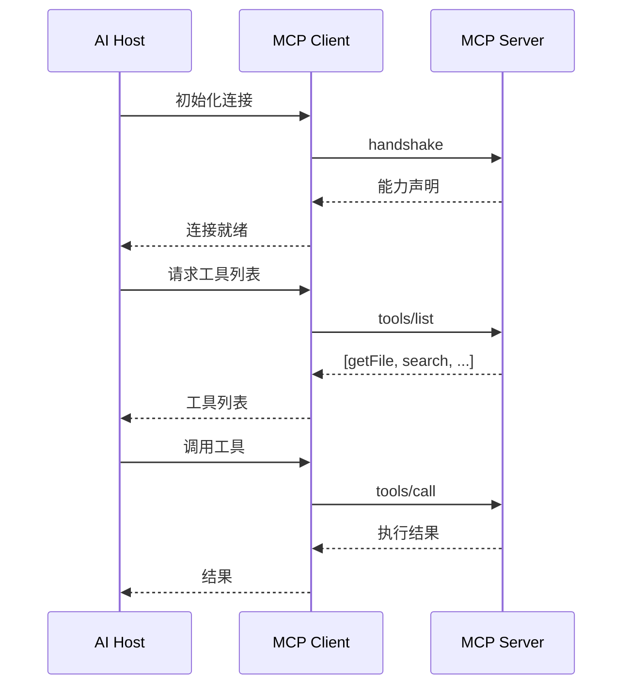

### 2.2 工具（Tools）

工具是 MCP 服务器暴露的可执行操作：

```json
{
  "name": "filesystem_read_file",
  "description": "读取文件内容",
  "inputSchema": {
    "type": "object",
    "properties": {
      "path": {
        "type": "string",
        "description": "文件路径"
      }
    },
    "required": ["path"]
  }
}
```

### 2.3 资源（Resources）

资源是 MCP 服务器暴露的只读数据：

```json
{
  "uri": "file:///project/package.json",
  "name": "package.json",
  "mimeType": "application/json"
}
```

### 2.4 提示词（Prompts）

预定义的提示模板：

```json
{
  "name": "code-review",
  "description": "代码审查模板",
  "arguments": [
    {
      "name": "language",
      "description": "编程语言",
      "required": true
    }
  ]
}
```

---

## 三、应用场景架构设计

### 场景一：AI 代码助手（开发环境集成）

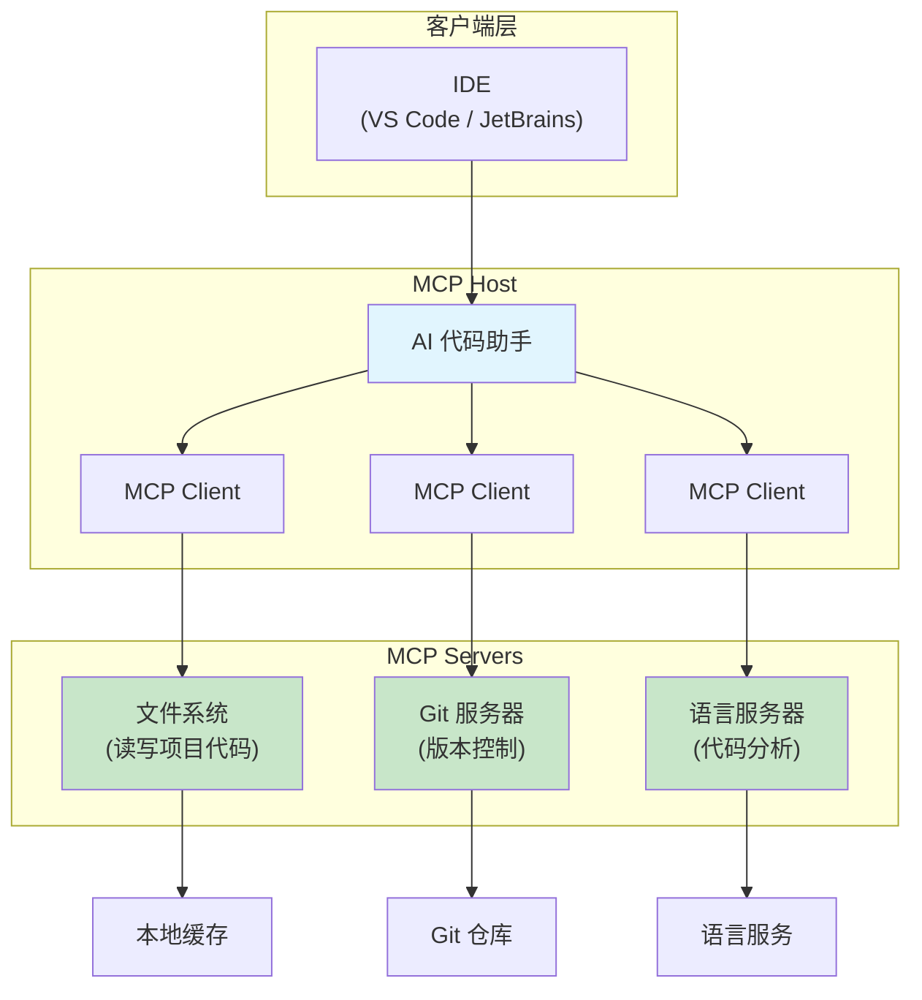

**特点**：
- 文件系统服务器提供代码读写能力
- Git 服务器支持版本控制操作
- LSP 服务器提供代码补全和诊断

### 场景二：企业知识库问答（RAG 增强）

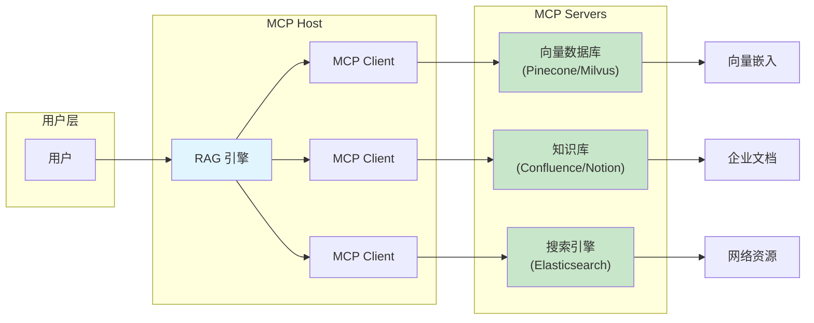

**特点**：
- 多数据源并行检索
- 向量数据库提供语义搜索
- 结构化知识库提供精确信息

### 场景三：数据分析与可视化

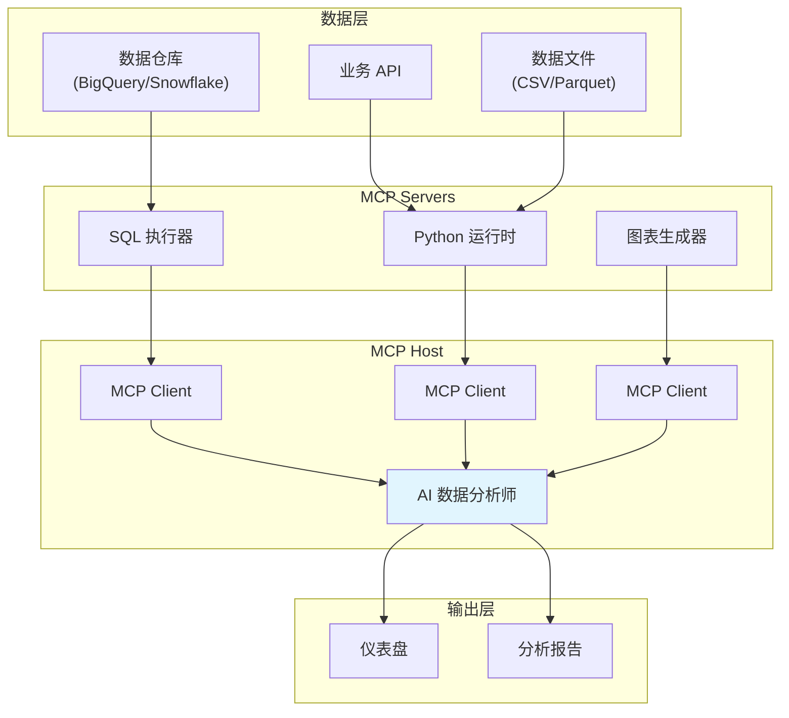

### 场景四：DevOps 与 CI/CD 自动化

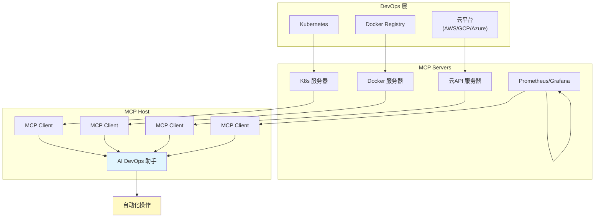

### 场景五：多 Agent 协作系统

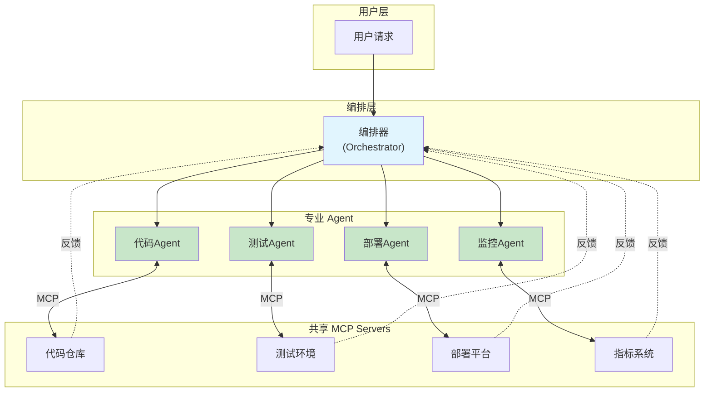

---

## 四、自定义 MCP 服务器开发

### 4.1 Python SDK 实现

```python
from mcp.server.fastmcp import FastMCP

mcp = FastMCP("我的工具服务器")

@mcp.tool()
def calculate(operation: str, a: float, b: float) -> dict:
    """执行数学运算
    
    Args:
        operation: 运算类型 (add/subtract/multiply/divide)
        a: 第一个数
        b: 第二个数
    """
    operations = {
        "add": a + b,
        "subtract": a - b,
        "multiply": a * b,
        "divide": a / b if b != 0 else "Error: division by zero"
    }
    return {"result": operations.get(operation, "Unknown operation")}

@mcp.resource("user://{user_id}/profile")
def get_user_profile(user_id: str) -> dict:
    """获取用户资料"""
    return {
        "id": user_id,
        "name": "张三",
        "email": "zhangsan@example.com"
    }

if __name__ == "__main__":
    mcp.run()
```

### 4.2 TypeScript SDK 实现

```typescript
import { McpServer } from "@modelcontextprotocol/sdk/server";
import { StdioServerTransport } from "@modelcontextprotocol/sdk/server/stdio";

const server = new McpServer({
  name: "my-tool-server",
  version: "1.0.0"
});

server.tool(
  "query_database",
  "执行 SQL 查询",
  {
    sql: { type: "string", description: "SQL 查询语句" },
    params: { type: "array", description: "查询参数" }
  },
  async ({ sql, params }) => {
    const result = await db.query(sql, params);
    return { content: [{ type: "text", text: JSON.stringify(result) }] };
  }
);

const transport = new StdioServerTransport();
server.run(transport);
```

---

## 五、MCP 协议通信流程

### 5.1 连接握手

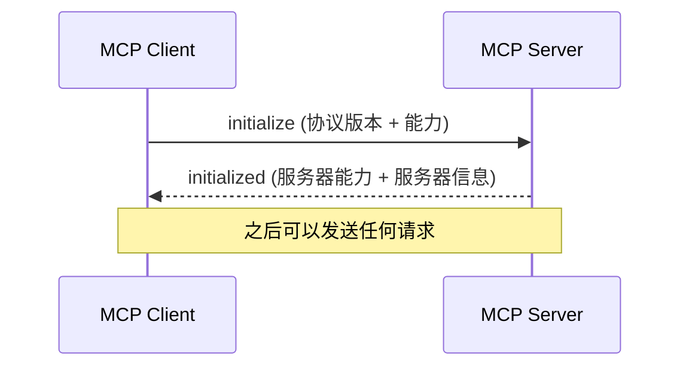

### 5.2 工具调用流程

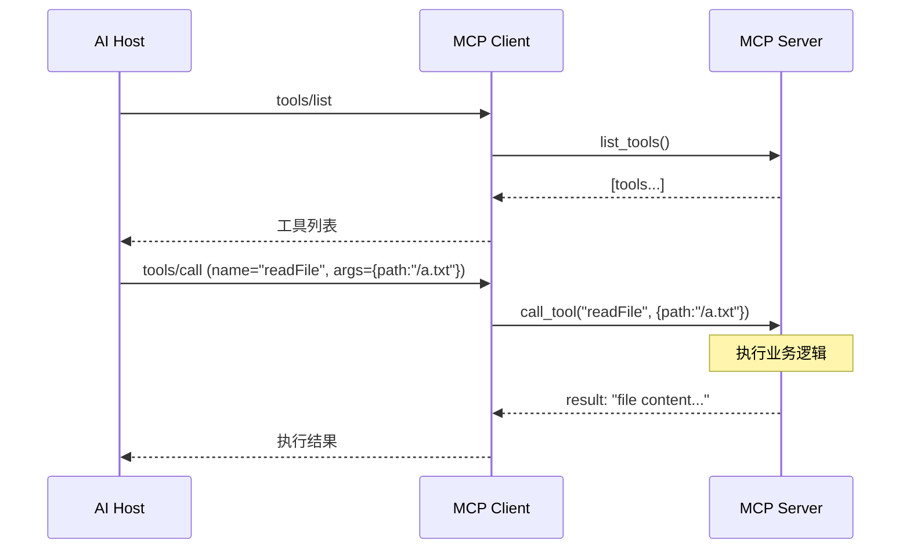

---

## 六、最佳实践与设计模式

### 6.1 服务器设计原则

| 原则 | 说明 |
|------|------|
| **单一职责** | 每个服务器专注于一类工具 |
| **幂等性** | 相同请求产生相同结果 |
| **错误处理** | 返回有意义的错误信息 |
| **超时控制** | 设置合理的操作超时 |

### 6.2 安全考虑

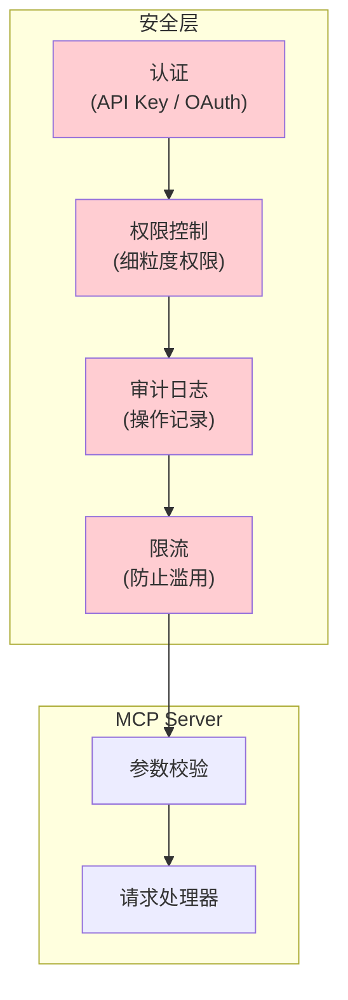

### 6.3 性能优化

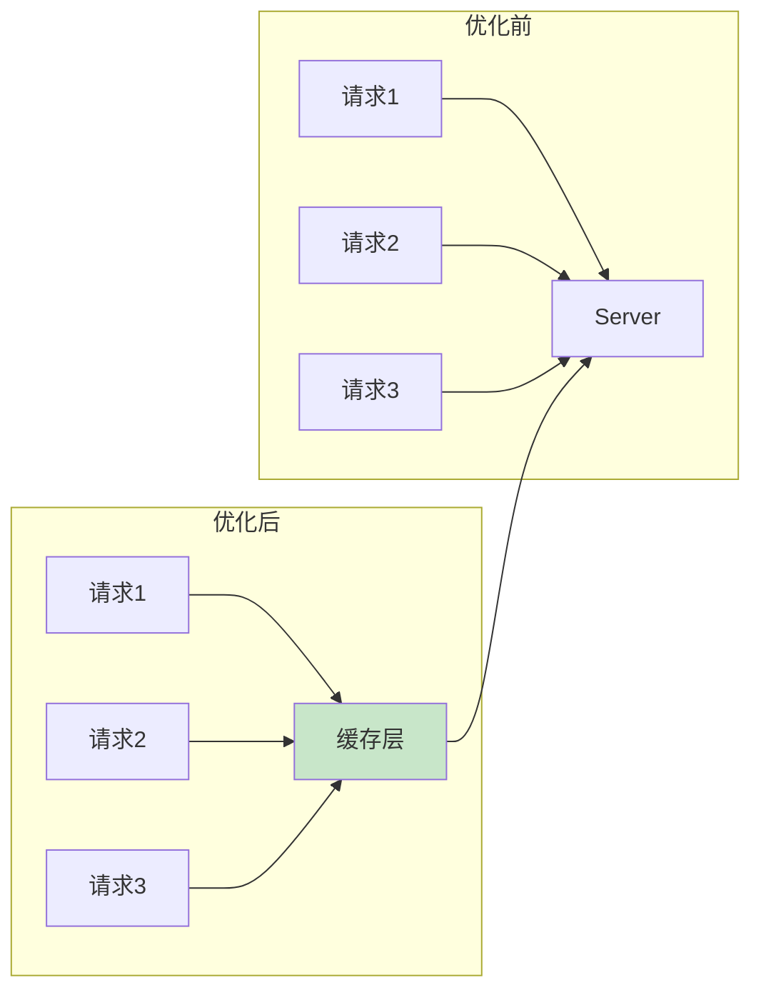

**优化策略**：
- 结果缓存：避免重复计算
- 连接池：复用数据库连接
- 异步处理：非阻塞 I/O
- 批量操作：减少网络往返

---

## 七、主流 MCP 服务生态

### 7.1 官方推荐服务器

| 服务器 | 用途 |
|--------|------|
| Filesystem | 本地文件读写 |
| Git | Git 操作 |
| GitHub | GitHub API 操作 |
| Slack | Slack 消息发送 |
| Sentry | 错误追踪 |

### 7.2 社区生态

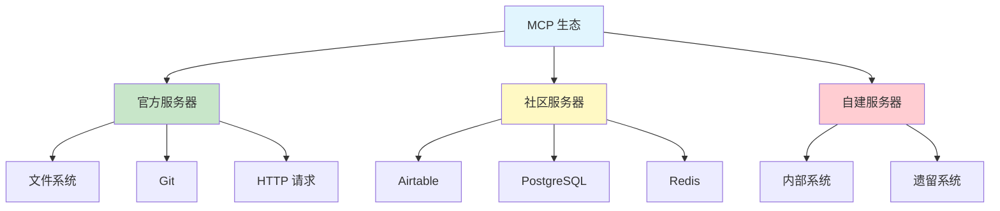

---

## 八、总结

### 8.1 MCP 核心价值

```markdown
## MCP 带来的变革

1. **标准化**：统一 AI 与工具的通信协议
2. **可复用**：一次开发，多处使用
3. **安全性**：细粒度权限控制
4. **可扩展**：轻松添加新工具
```

### 8.2 选型建议

| 场景 | 推荐方案 |
|------|----------|
| 个人开发 | 使用官方文件系统 + Git 服务器 |
| 企业内部 | 自建 MCP 服务器，连接内部系统 |
| 数据分析 | SQL + Python + 可视化服务器组合 |
| 多 Agent 系统 | 每个 Agent 配备专用 MCP 服务器 |

---

## 参考资源

- [MCP 官方文档](https://modelcontextprotocol.io/)
- [MCP GitHub 仓库](https://github.com/modelcontextprotocol)
- [MCP Python SDK](https://github.com/modelcontextprotocol/python-sdk)
- [MCP TypeScript SDK](https://github.com/modelcontextprotocol/typescript-sdk)

---

*最后更新：2026/4/8*
