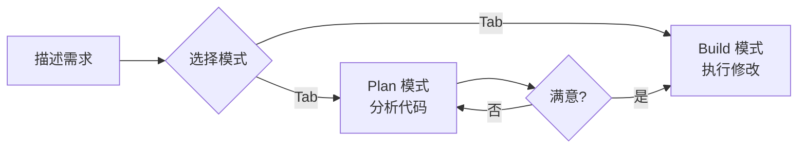
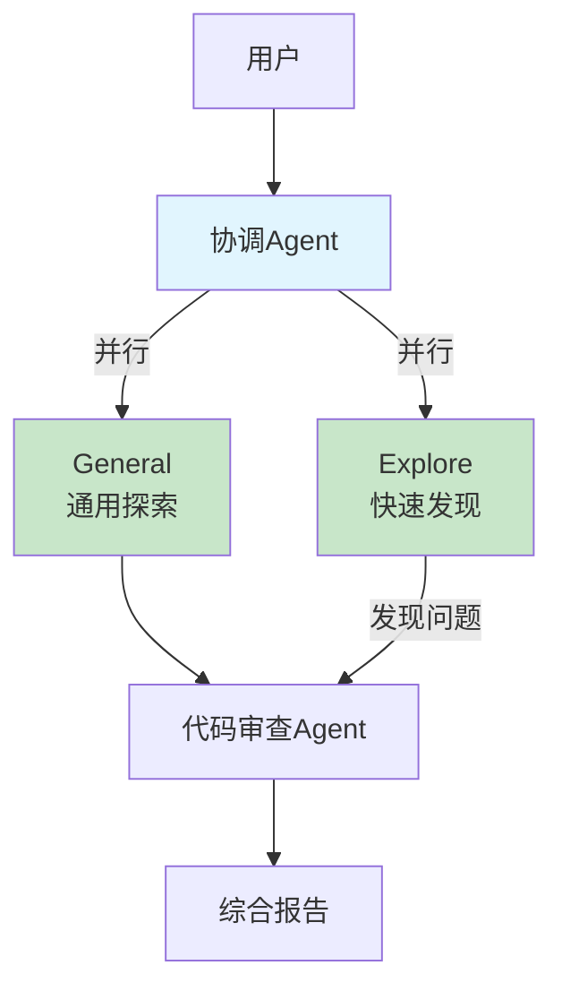
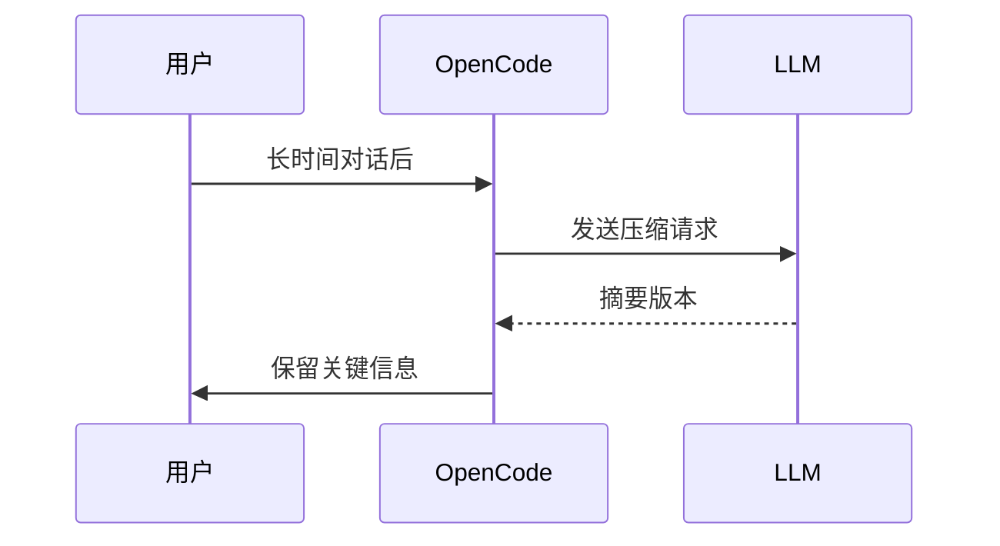
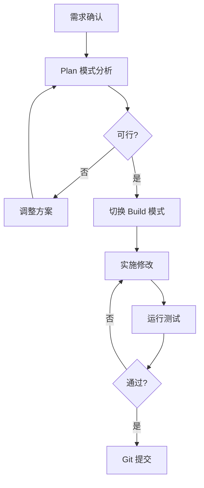

# 2026/4/8 OpenCode 常用技巧与最佳实践

## 前言

OpenCode 是一款开源的 AI 编程助手（GitHub 140K+ stars），支持终端、桌面客户端和 IDE 插件三种形态。它能连接 75+ LLM 提供商，包括 Claude、GPT、Gemini 以及通过 Ollama 支持的本地模型。

本文系统总结 OpenCode 的使用技巧与最佳实践，涵盖初级到进阶内容，帮助开发者充分发挥这款工具的潜力。

---

## 一、核心概念与基础交互

### 1.1 文件引用机制（@）

使用 `@` 符号可以模糊搜索并引用项目文件：

```
如何理解 @src/auth/middleware.ts 中的认证逻辑？
参考 @packages/utils/format.ts 实现日期格式化
```

### 1.2 Bash 命令执行（!）

在命令前加 `!` 即可执行 Shell 命令：

```
!ls -la
!git status
!npm run build
```

### 1.3 智能体切换（Tab）

| 按键 | 功能 |
|------|------|
| `Tab` | 在 Build/Plan 模式间切换 |
| `@` 召唤子智能体 | `@general 帮助搜索代码库 |

---

## 二、必学命令速查表

| 命令 | 用途 | 快捷键 |
|------|------|--------|
| `/help` | 显示帮助对话框 | `Ctrl+X H` |
| `/init` | 生成/更新 AGENTS.md | `Ctrl+X I` |
| `/new` | 开启新会话 | `Ctrl+X N` |
| `/undo` | 撤销上次修改 | `Ctrl+X U` |
| `/redo` | 重做 | `Ctrl+X R` |
| `/share` | 分享当前会话 | `Ctrl+X S` |
| `/sessions` | 列出/切换会话 | `Ctrl+X L` |
| `/models` | 列出可用模型 | `Ctrl+X M` |
| `/compact` | 压缩会话上下文 | `Ctrl+X C` |
| `/export` | 导出为 Markdown | `Ctrl+X X` |

---

## 三、初级技巧：日常高效使用

### 3.1 Plan 模式：安全探索代码

当你需要理解复杂代码或分析需求时，按 `Tab` 切换到 **Plan 模式**——这是一个只读分析模式，不会执行任何修改。



**使用场景**：
- 分析不熟悉的代码库结构
- 设计新功能的技术方案
- 评估代码修改的影响范围

### 3.2 善用上下文引用

提问时引用具体文件，AI 能给出更准确的回答：

```
# ❌ 低效提问
这个模块怎么工作？

# ✅ 高效提问
解释 @src/services/PaymentService.ts 的核心逻辑，
参考 @src/models/Order.ts 的订单模型
```

### 3.3 迭代式需求澄清

```
# 第一轮：提出需求
实现用户注册功能

# 第二轮：补充约束
需要支持邮箱和手机号两种方式

# 第三轮：明确验收标准
参考 @tests/user.test.ts 的测试风格编写单元测试
```

### 3.4 使用 AGENTS.md 固化项目规范

在项目根目录创建 `AGENTS.md`，让 AI 理解项目约定：

```markdown
# 项目结构
- `packages/core/` - 核心业务逻辑
- `packages/api/` - REST API
- `apps/web/` - 前端应用

# 代码规范
- 使用 TypeScript 严格模式
- 遵循 SOLID 原则
- 公共代码放在 packages/core/

# 构建命令
- 开发：npm run dev
- 测试：npm run test
- 构建：npm run build
```

运行 `/init` 可自动扫描项目生成规范文件。

---

## 四、中级技巧：深度集成与配置

### 4.1 MCP 服务器集成

MCP（Model Context Protocol）允许 AI 连接外部工具和服务：

```json
// opencode.json 配置示例
{
  "mcp": {
    "sentry": {
      "type": "remote",
      "url": "https://mcp.sentry.dev/mcp"
    },
    "context7": {
      "type": "remote",
      "url": "https://mcp.context7.com/mcp"
    }
  }
}
```

**常用 MCP 服务**：

| MCP 服务 | 用途 |
|----------|------|
| Sentry | 错误追踪与问题管理 |
| Context7 | 文档检索增强 |
| GitHub MCP | 仓库管理操作 |

### 4.2 自定义命令

创建 `.opencode/commands/<name>.md` 实现自定义命令：

```yaml
---
description: 运行测试并生成覆盖率报告
agent: build
model: anthropic/claude-3-5-sonnet
---
执行完整的测试套件，生成覆盖率报告。
```

使用参数支持：

```yaml
---
description: 代码审查
agent: build
---
审查 @$1 的代码，重点关注：
1. 安全性
2. 性能问题
3. 代码可读性
```

### 4.3 精细化权限控制

```json
{
  "permission": {
    "bash": {
      "*": "ask",
      "git *": "allow",
      "git push *": "deny",
      "rm *": "deny"
    },
    "read": {
      "*": "allow",
      "*.env": "deny"
    }
  }
}
```

**规则匹配优先级**：最后一个匹配的规则生效。

### 4.4 多智能体协作



自定义子智能体配置：

```json
{
  "agent": {
    "code-reviewer": {
      "mode": "subagent",
      "tools": {
        "read": true,
        "grep": true,
        "edit": false,
        "bash": false
      }
    }
  }
}
```

---

## 五、高级技巧：工程化与优化

### 5.1 会话管理与分享


**会话分享配置**：

```json
{
  "share": "manual"  // manual(默认) / auto / disabled
}
```

### 5.2 模型选择策略

| 场景 | 推荐模型 | 特点 |
|------|----------|------|
| 代码探索 | Claude Haiku | 快速、便宜 |
| 复杂实现 | Claude Sonnet 4 | 能力均衡 |
| 深度分析 | Claude Opus 4 | 能力最强 |

按智能体配置模型：

```json
{
  "agent": {
    "plan": {
      "model": "anthropic/claude-haiku-4-20250514"
    },
    "build": {
      "model": "anthropic/claude-sonnet-4-20250514"
    }
  }
}
```

### 5.3 上下文压缩策略

当会话过长时，使用 `/compact` 压缩上下文：



### 5.4 LSP 集成与代码理解

OpenCode 内置 LSP 支持以下语言：

- TypeScript/JavaScript (ESLint)
- Python (pyright)
- Rust (rust-analyzer)
- Go (gopls)
- Java (jdtls)

启用实验性 LSP 工具：

```bash
OPENCODE_EXPERIMENTAL_LSP_TOOL=true
```

---

## 六、常见陷阱与规避

### 6.1 意外修改文件

**问题**：AI 误改了不想修改的文件。

**解决方案**：
- 使用 Plan 模式先分析
- 设置 `edit: "ask"` 权限
- 频繁提交 Git 版本

### 6.2 上下文溢出

**问题**：启用过多 MCP 服务导致上下文耗尽。

**解决方案**：
- 按需启用 MCP 服务
- 使用 glob 模式选择性启用
- 定期 `/compact` 压缩会话

### 6.3 敏感信息泄露

**问题**：分享会话时暴露敏感代码。

**解决方案**：
- 分享前检查会话内容
- `.env` 文件默认禁止读取
- 使用 `/unshare` 及时关闭

### 6.4 需求描述模糊

**问题**：AI 理解偏差导致结果不符预期。

**解决方案**：
- 引用具体文件
- 提供示例代码
- 明确验收标准

---

## 七、最佳实践清单

### 7.1 新项目初始化

```bash
# 1. 进入项目目录
cd /path/to/project

# 2. 启动 OpenCode
opencode

# 3. 初始化项目规范
/init

# 4. 配置必要的 MCP 服务
/connect
```

### 7.2 日常开发流程



### 7.3 团队协作规范

```markdown
## 团队 OpenCode 使用规范

1. **项目 AGENTS.md 必须提交到 Git**
   - 确保所有成员获得一致的项目上下文

2. **敏感操作使用 ask 权限**
   - rm、git push -f 等操作需要确认

3. **定期清理无用会话**
   - 保留有价值的会话供后续参考

4. **分享会话前检查内容**
   - 确认无敏感信息泄露
```

---

## 八、进阶资源

| 资源 | 链接 |
|------|------|
| 官方文档 | https://opencode.ai/docs/ |
| GitHub | https://github.com/anomalyco/opencode |
| Discord | https://opencode.ai/discord |

---

*最后更新：2026/4/8*
