# 2026/4/10 AI模型上下文：核心机制、挑战与最佳实践

## 前言

上下文（Context）是大型语言模型（LLM）最为核心却又最易被误解的概念之一。它直接决定了模型能否"理解"当前任务、能否"记住"关键信息、能否"连贯"地完成多轮对话。本文从上下文的基础定义出发，系统梳理其技术机制、业界实践、面临的核心挑战，并总结业界公认的最佳实践，帮助开发者构建更高效、更可靠的AI应用。

---

## 一、什么是 AI 模型上下文

### 1.1 形式化定义

**上下文（Context）**是指模型在生成响应时能够访问和利用的所有信息。在技术实现上，上下文表现为一个连续的 token 序列，被送入模型的 Transformer 架构进行处理。

```
┌─────────────────────────────────────────────────────────────────┐
│                        模型上下文                                │
├─────────────┬─────────────┬─────────────┬─────────────┬─────────┤
│ 系统提示    │ 对话历史    │ 用户输入    │ 工具结果    │ 知识库  │
│ (System)    │ (History)   │ (Query)    │ (Tool)     │ (RAG)   │
└─────────────┴─────────────┴─────────────┴─────────────┴─────────┘
```

**数学表达**：给定一个语言模型 `M`，其输出 `Y` 可以表示为：

```
Y = M(output | Context)
```

其中 `Context = [System Prompt, Conversation History, User Query, Tool Results, External Knowledge, ...]`

### 1.2 上下文的组成要素

| 组成部分 | 作用 | 典型大小占比 |
|----------|------|--------------|
| **系统提示 (System Prompt)** | 定义模型角色、行为约束、输出格式 | 5-15% |
| **对话历史 (History)** | 维持多轮对话的连贯性 | 视对话长度而定 |
| **用户输入 (Query)** | 当前任务描述 | 10-30% |
| **工具结果 (Tool Results)** | 外部API、数据库查询返回 | 可达50%+ |
| **知识检索 (RAG Context)** | 从向量数据库检索的相关文档 | 可达60%+ |
| **少样本示例 (Few-shot)** | 提供任务示例 | 通常3-5个 |

### 1.3 上下文的工作原理

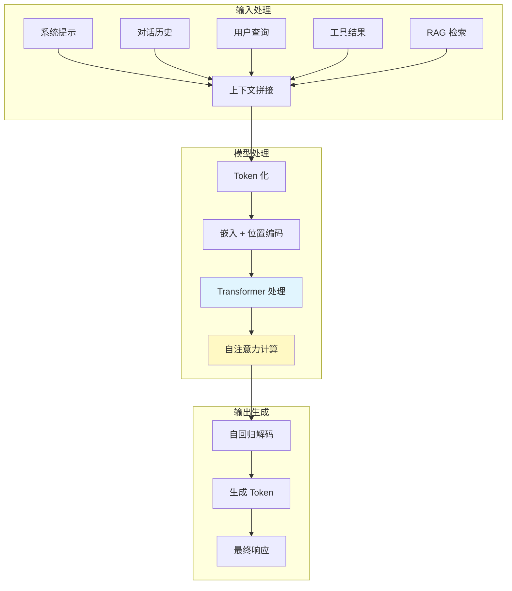

**核心机制**：
- **自注意力（Self-Attention）**：上下文中的每个 token 都与所有其他 token 计算关联度
- **位置编码（Positional Encoding）**：赋予 token 顺序信息
- **KV 缓存（Key-Value Cache）**：加速多轮对话中的重复计算

---

## 二、上下文窗口：模型的"工作记忆"

### 2.1 上下文窗口的定义

**上下文窗口（Context Window）**是指模型能够处理的最大 token 数量，通常以"k"为单位（如 8k、32k、128k）。这个限制源于 Transformer 架构的计算复杂度（O(n²)）和硬件内存限制。

| 模型 | 上下文窗口 | 备注 |
|------|-----------|------|
| GPT-3.5 | 4k / 16k | 早期版本 |
| GPT-4 | 8k / 32k / 128k | 支持长上下文版本 |
| Claude 3 | 200k | 目前最长之一 |
| Gemini 1.5 | 1M | 突破百万token |
| Llama 3 | 8k | 开源模型代表 |
| Llama 3.1 | 128k | 开源长上下文 |

### 2.2 Token 的计量

```python
# 粗略估算规则
def estimate_tokens(text: str) -> int:
    """中英文 token 估算"""
    # 英文：约 4 字符 = 1 token
    # 中文：约 1-2 字符 = 1 token（取决于模型）
    chinese_chars = sum(1 for c in text if '\u4e00' <= c <= '\u9fff')
    other_chars = len(text) - chinese_chars
    return int(chinese_chars * 1.5 + other_chars * 0.25)
```

**实际影响**：
- 一本《论语》≈ 15,000 tokens
- 一篇技术论文 ≈ 4,000-8,000 tokens
- 一年代码库 ≈ 500,000+ tokens

### 2.3 上下文窗口与模型能力的关系

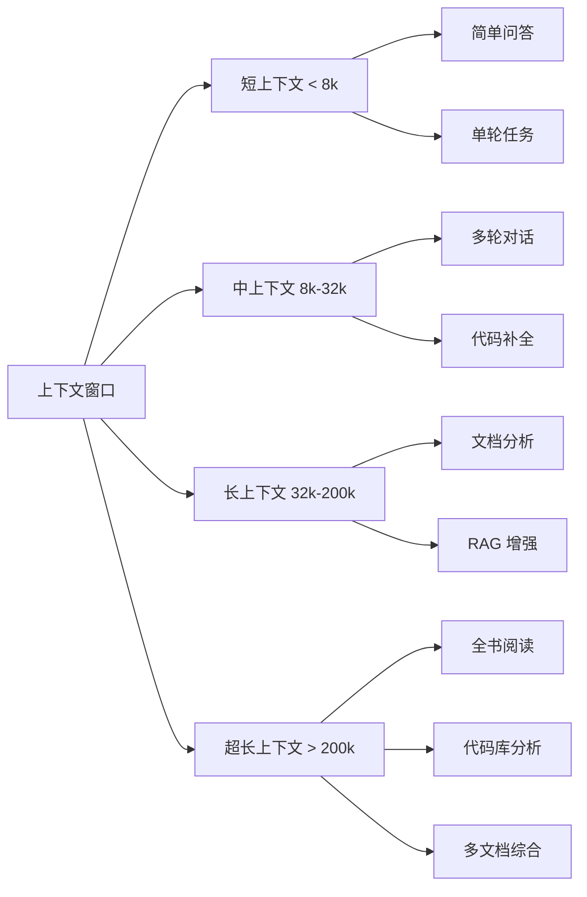

---

## 三、业界实践：上下文处理的四大范式

### 3.1 范式一：原生上下文扩展

**代表模型**：Claude 3、Gemini 1.5、GPT-4 Turbo

**核心技术**：
- **稀疏注意力（Sparse Attention）**：如 Longformer，只计算局部和特定 token 的注意力
- **滑动窗口（Sliding Window）**：将长序列分块处理
- **话题聚合（Topic Summarization）**：自动压缩重复内容

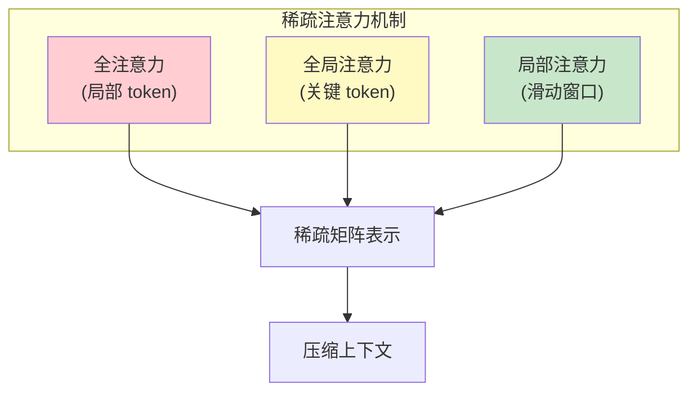

**优势**：无需额外工程，对长文本任务天然友好
**局限**：超出窗口仍需截断，计算成本较高

### 3.2 范式二：RAG（检索增强生成）

**代表应用**：企业知识库问答、实时信息查询

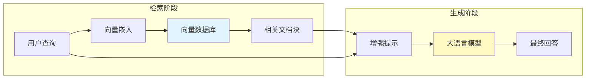

**关键技术**：
- **嵌入模型（Embedding Model）**：将文本转为向量（如 OpenAI text-embedding-3、BGE）
- **向量检索**：近似最近邻搜索（ANN）
- **重排序（Re-ranking）**：优化检索结果相关性

```python
# 典型的 RAG 流程
class SimpleRAG:
    def __init__(self, vector_db, llm):
        self.vector_db = vector_db
        self.llm = llm
    
    def query(self, user_query: str, top_k: int = 5) -> str:
        # 1. 检索相关文档
        query_vector = self.embed(user_query)
        relevant_chunks = self.vector_db.search(query_vector, top_k)
        
        # 2. 构建增强上下文
        context = "\n\n".join([c.content for c in relevant_chunks])
        prompt = f"基于以下上下文回答问题：\n\n{context}\n\n问题：{user_query}"
        
        # 3. 生成回答
        return self.llm.generate(prompt)
```

### 3.3 范式三：MCP（模型上下文协议）

MCP 由 Anthropic 提出，旨在标准化 AI 应用与外部工具/数据的连接，已在《MCP 协议详解与最佳应用架构》中详细阐述。

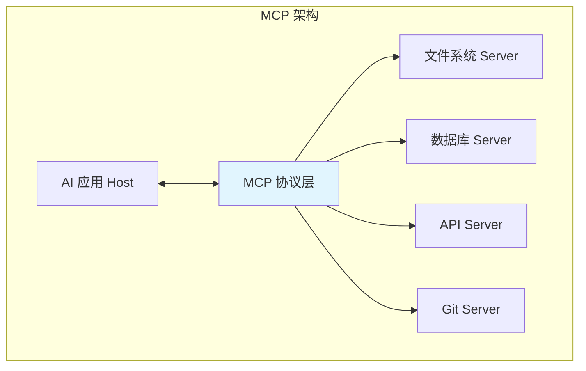

### 3.4 范式四：对话历史压缩

**代表技术**：对话摘要、关键信息提取

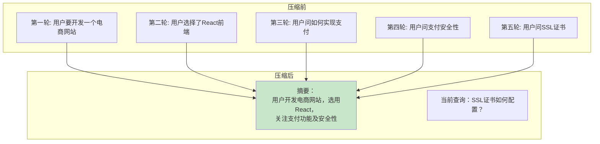

**实现方式**：

```python
class ConversationalCompressor:
    def compress_history(self, messages: list, summary_model) -> str:
        # 定期触发摘要
        if len(messages) % 10 == 0:
            summary_prompt = "请简要总结以下对话的关键信息：\n"
            summary_prompt += "\n".join([f"{m['role']}: {m['content']}" for m in messages])
            return summary_model.generate(summary_prompt)
        
        # 否则保留最近 N 轮
        return messages[-5:]  # 保留最近5轮
```

---

## 四、上下文的核心问题与挑战

### 4.1 挑战一：上下文长度限制

**问题描述**：当上下文超过模型窗口上限时，后续内容被截断，导致信息丢失。

```
┌──────────────────────────────────────────────────────────────┐
│                    上下文窗口: 32k tokens                     │
├──────────────────────────────────────────────────────────────┤
│ [系统提示 4k] [对话历史 20k] [用户查询 8k]                    │
│                                          ↓                   │
│                                     超过窗口的内容被截断       │
└──────────────────────────────────────────────────────────────┘
```

**后果**：
- 长文档分析：只关注开头，忽略结尾（"Lost in the Middle"问题）
- 代码库理解：只看到部分文件，缺乏全局视图
- 多轮对话：早期对话信息逐渐丢失

**"Lost in the Middle"问题**：

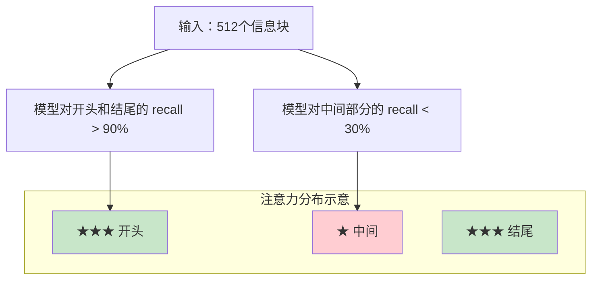

### 4.2 挑战二：注意力分散与干扰

**问题描述**：当上下文中存在与当前任务无关的噪声时，模型容易受到干扰，生成质量下降。

```
┌────────────────────────────────────────────────────────────┐
│  用户真正关心的内容 (20%)                                   │
│  ████████████████████████████████████                      │
├────────────────────────────────────────────────────────────┤
│  干扰信息 (80%)                                             │
│  ░░░░░░░░░░░░░░░░░░░░░░░░░░░░░░░░░░░░░░░░░░░░░░░░░░░░░░░░░░ │
└────────────────────────────────────────────────────────────┘
```

**真实案例**：
- RAG 检索出的文档块中有大量无关内容
- 对话历史中包含早期不相关的讨论
- 系统提示中的过多约束导致模型过度谨慎

### 4.3 挑战三：上下文相关的幻觉

**问题描述**：模型倾向于将上下文中出现的信息（包括错误信息）当作事实来回应。

```
用户: 基于以下文章回答：
      "2024年，人类成功登陆火星。"

用户: 谁在2024年登陆了火星？
      
模型: 在2024年，人类成功登陆火星。
      （错误地将上下文中的虚假信息当作事实）
```

**缓解策略**：
- 在系统提示中明确要求区分"上下文信息"与"事实"
- 使用"置信度提示"让模型对不确定内容保持谨慎
- 添加"如上下文未提及，请明确说明"

### 4.4 挑战四：隐私与安全风险

**问题描述**：敏感信息（密码、密钥、个人身份信息）可能通过上下文泄露或被模型记忆。

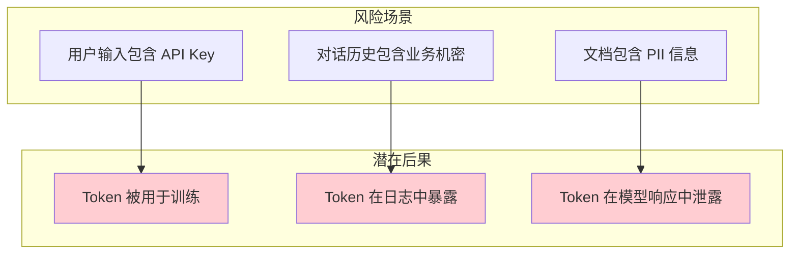

**防护措施**：
- 输入过滤：自动检测并标记敏感信息
- 差分隐私：在训练和应用中引入噪声
- 数据隔离：敏感上下文与模型交互分离处理

### 4.5 挑战五：成本与延迟

**问题描述**：上下文越长，Token 消耗越多，推理延迟越高。

```
成本估算（以 GPT-4 Turbo 128k 为例）:
├── 4k 上下文: ~$0.01/次
├── 32k 上下文: ~$0.08/次
├── 128k 上下文: ~$0.32/次
└── 延迟: 每增加 1k tokens，延迟约增加 50-100ms
```

**优化方向**：
- 上下文压缩：减少 token 数量的同时保留语义
- 智能截断：优先保留关键信息
- 分层处理：先用小上下文筛选，再扩展

---

## 五、最佳实践：上下文工程的十八般武艺

### 5.1 提示工程（Prompt Engineering）

**原则一：结构化组织**

```
┌─────────────────────────────────────────────────────────────┐
│  # 角色                                                       │
│  你是一名资深后端工程师，擅长 Java、Spring、数据库优化        │
│                                                              │
│  # 任务                                                       │
│  分析以下代码并找出性能问题                                    │
│                                                              │
│  # 约束                                                       │
│  - 只返回问题，不返回修复代码                                  │
│  - 按严重程度排序                                             │
│  - 每个问题给出具体代码位置                                    │
│                                                              │
│  # 代码                                                       │
│  [代码内容...]                                                │
└─────────────────────────────────────────────────────────────┘
```

**原则二：明确指令，避免歧义**

| ❌ 不推荐 | ✅ 推荐 |
|----------|--------|
| "分析一下这个代码" | "分析这个 Java 类的性能瓶颈，用 O(n) 标注时间复杂度" |
| "写得简洁点" | "限制在 100 字以内，使用技术术语" |
| "帮我写" | "请用 Java 17 编写一个线程安全的单例模式，包含 double-checked locking" |

**原则三：善用 Few-shot Learning**

```python
# 少样本示例
prompt = """
任务：将中文翻译成英文

示例：
输入：我爱编程
输出：I love programming

输入：这是一个测试
输出：This is a test

现在请翻译：
输入：人工智能正在改变世界
输出：
"""
```

### 5.2 上下文压缩技术

**技术一：语义压缩**

```python
class SemanticCompressor:
    """基于语义的上下文压缩"""
    
    def compress(self, text: str, target_tokens: int) -> str:
        # 1. 句子分割
        sentences = self.split_sentences(text)
        
        # 2. 计算每句重要性（与当前任务相关性）
        scores = [self.relevance_score(s, self.task) for s in sentences]
        
        # 3. 贪心选择最重要的句子
        selected = []
        current_tokens = 0
        for s, score in sorted(zip(sentences, scores), key=lambda x: -x[1]):
            tokens = self.count_tokens(s)
            if current_tokens + tokens <= target_tokens:
                selected.append(s)
                current_tokens += tokens
        
        return " ".join(selected)
```

**技术二：RAG 检索优化**

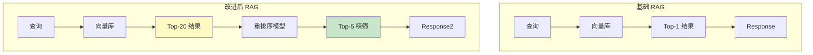

**关键技术指标**：

| 指标 | 说明 | 优化方向 |
|------|------|----------|
| **Precision@K** | 检索结果中相关文档的比例 | 优化嵌入模型 |
| **Recall@K** | 召回的相关文档占总相关文档的比例 | 增加检索数量 |
| **MRR** | 首个相关文档的排名倒数均值 | 重排序优化 |
| **Context Precision** | 上下文窗口内相关内容的密度 | 压缩优化 |

### 5.3 对话历史管理

```python
class ConversationManager:
    """智能对话历史管理"""
    
    MAX_TURNS = 20
    SUMMARY_TRIGGER = 10
    
    def __init__(self, llm):
        self.llm = llm
        self.messages = []
        self.summary = ""
    
    def add_message(self, role: str, content: str):
        self.messages.append({"role": role, "content": content})
        
        # 定期摘要
        if len(self.messages) % self.SUMMARY_TRIGGER == 0:
            self.summary = self._generate_summary()
    
    def get_context(self, query: str) -> list:
        # 策略：摘要 + 最近对话 + 当前查询
        if self.summary:
            system_msg = {
                "role": "system", 
                "content": f"对话摘要：{self.summary}"
            }
        else:
            system_msg = {"role": "system", "content": ""}
        
        # 保留最近 N 轮
        recent = self.messages[-self.MAX_TURNS:]
        
        return [system_msg] + recent + [{"role": "user", "content": query}]
    
    def _generate_summary(self) -> str:
        prompt = f"总结以下对话的核心内容，保留关键细节：\n{self.messages}"
        return self.llm.generate(prompt)
```

### 5.4 MCP 与工具集成最佳实践

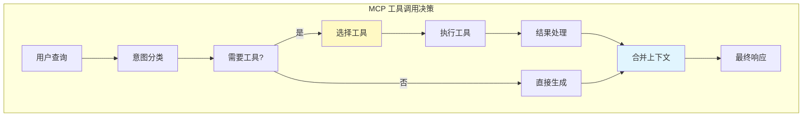

**最佳实践**：
1. **精确描述工具结果**：避免将原始输出直接放入上下文
2. **限制工具结果长度**：只传递与任务相关的结果
3. **链式调用控制**：避免无限循环调用工具

```python
# 工具结果的智能处理
def process_tool_result(tool_name: str, raw_result: dict, task: str) -> str:
    """只提取与任务相关的信息"""
    
    # 方案一：让 LLM 自我过滤
    filter_prompt = f"""
    原始工具结果：{raw_result}
    当前任务：{task}
    请提取与任务最相关的3个信息点，用简洁语言描述。
    """
    
    # 方案二：结构化提取
    if tool_name == "database_query":
        # 只返回查询结果的摘要，而非全部数据
        return f"查询返回 {len(raw_result['rows'])} 条记录，前3条: {raw_result['rows'][:3]}"
    
    return str(raw_result)[:500]  # 硬截断
```

### 5.5 企业级上下文架构

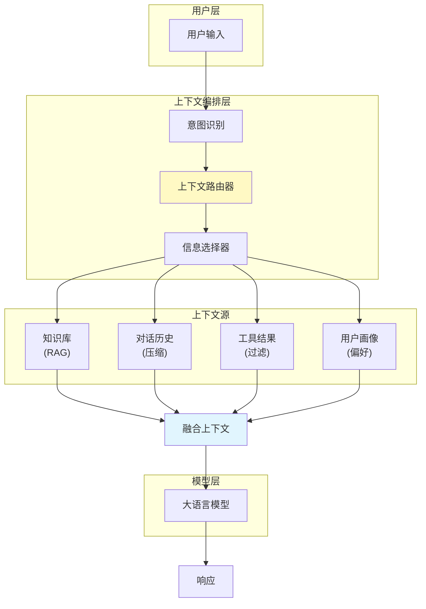

**核心组件职责**：

| 组件 | 职责 | 技术选型 |
|------|------|----------|
| 意图识别 | 判断用户真正想要什么 | 小模型 / 规则 / Embedding |
| 上下文路由器 | 决定使用哪些上下文源 | 规则引擎 / LLM |
| 信息选择器 | 从各源提取相关信息 | 向量检索 / LLM 过滤 |
| 上下文融合 | 合并多源信息，处理冲突 | LLM / 规则 |

---

## 六、性能优化与监控

### 6.1 上下文 Token 消耗监控

```python
class ContextMonitor:
    """上下文消耗监控"""
    
    def __init__(self):
        self.token_counts = defaultdict(list)
    
    def record(self, request_id: str, components: dict):
        total = sum(components.values())
        self.token_counts[request_id] = components
        
        # 告警阈值
        if total > 100000:
            logger.warning(f"高Token消耗请求: {request_id}, 总计: {total}")
    
    def get_report(self) -> dict:
        all_tokens = [sum(v) for v in self.token_counts.values()]
        return {
            "avg_tokens": np.mean(all_tokens),
            "p95_tokens": np.percentile(all_tokens, 95),
            "p99_tokens": np.percentile(all_tokens, 99),
            "total_requests": len(all_tokens)
        }
```

### 6.2 上下文有效性评估

```python
def evaluate_context_effectiveness(
    query: str,
    context: str,
    response: str,
    ground_truth: str = None
) -> dict:
    """
    评估上下文对响应质量的贡献
    """
    
    # 1. 引用准确率：响应中引用了上下文内容的比例
    citations = extract_citations(response)
    citation_accuracy = len([c for c in citations if c in context]) / max(len(citations), 1)
    
    # 2. 上下文利用率：使用了多少上下文信息
    context_utilization = len(citations) / estimate_context_chunks(context)
    
    # 3. 响应质量（如果有标准答案）
    if ground_truth:
        quality_score = semantic_similarity(response, ground_truth)
    else:
        quality_score = None
    
    return {
        "citation_accuracy": citation_accuracy,
        "context_utilization": context_utilization,
        "quality_score": quality_score
    }
```

---

## 七、总结与展望

### 7.1 核心要点回顾

```
┌────────────────────────────────────────────────────────────────┐
│                     AI 上下文工程核心                          │
├────────────────────────────────────────────────────────────────┤
│                                                                │
│  1. 理解上下文本质：有限的 token 序列，决定了模型的能力边界      │
│                                                                │
│  2. 认识核心挑战：长度限制、注意力分散、幻觉、隐私、成本        │
│                                                                │
│  3. 掌握关键技术：提示工程、RAG、对话压缩、MCP、工具集成         │
│                                                                │
│  4. 遵循最佳实践：结构化组织、精确过滤、智能压缩、持续监控      │
│                                                                │
│  5. 架构思维：从单点优化走向端到端上下文治理                    │
│                                                                │
└────────────────────────────────────────────────────────────────┘
```

### 7.2 未来趋势

| 趋势 | 预期影响 |
|------|----------|
| **超长上下文** | 1M+ token 窗口将普及，大部分场景无需压缩 |
| **原生多模态** | 上下文将包含文本、图像、音频、视频混合 |
| **动态上下文** | 根据任务需求自动调整上下文组成 |
| **上下文缓存** | 减少重复计算，降低成本 |
| **隐私计算融合** | 联邦学习 + 上下文的结合，保护隐私 |

### 7.3 行动建议

```
对于个人开发者：
□ 深入理解自己使用模型的上下文限制
□ 建立上下文工程的最佳实践习惯
□ 关注 MCP 等协议的发展

对于企业架构师：
□ 构建统一的上下文管理平台
□ 建立上下文质量的评估体系
□ 制定数据安全与隐私保护规范
□ 投资上下文压缩与优化技术
```

---

## 参考资源

- [Attention Is All You Need](https://arxiv.org/abs/1706.03762) - Transformer 原始论文
- [Lost in the Middle](https://arxiv.org/abs/2404.02060) - 长上下文问题研究
- [MCP 官方文档](https://modelcontextprotocol.io/)
- [RAG 最佳实践指南](https://arxiv.org/abs/2401.05856)
- [Prompt Engineering Guide](https://www.promptingguide.ai/)

---

*最后更新：2026/4/10*
