# 2026/4/10 RAG 检索增强生成：技术原理、场景实践与架构设计

## 前言

RAG（Retrieval-Augmented Generation，检索增强生成）自 2020 年由 Meta 提出以来，已发展成为企业级 LLM 应用的核心技术架构。在大模型落地实践中，RAG 解决了"知识时效性"、"企业私有知识"、"幻觉控制"等关键挑战。

本文从 RAG 的基础原理出发，深入剖析其技术栈的每个环节，结合业界最佳实践，详细阐述如何构建生产级别的 RAG 系统。

---

## 一、RAG 是什么

### 1.1 问题背景：LLM 的知识局限性

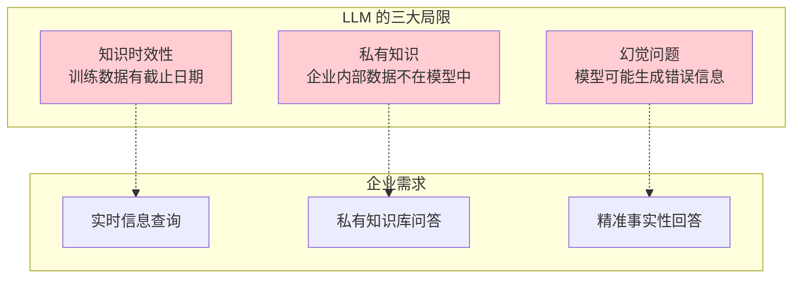

### 1.2 RAG 的核心思想

**RAG = Retrieval（检索）+ Generation（生成）**

```
┌─────────────────────────────────────────────────────────────────┐
│                        RAG 工作流程                              │
├─────────────────────────────────────────────────────────────────┤
│                                                                  │
│  用户问题 ──▶ 检索 ──▶ 上下文增强 ──▶ LLM 生成 ──▶ 最终回答       │
│                  │                                            │
│                  ▼                                            │
│           ┌─────────────┐                                      │
│           │  知识库     │                                      │
│           │ (向量库)    │                                      │
│           └─────────────┘                                      │
│                                                                  │
└─────────────────────────────────────────────────────────────────┘
```

**核心价值**：

| 价值 | 说明 |
|------|------|
| **知识时效性** | 实时检索最新信息，避免训练数据过时 |
| **私有知识** | 将企业文档作为上下文，无需微调 |
| **可解释性** | 答案来源于检索内容，可追溯 |
| **成本可控** | 相比微调，维护成本更低 |
| **幻觉控制** | 强制模型基于上下文回答 |

### 1.3 RAG vs 其他方案

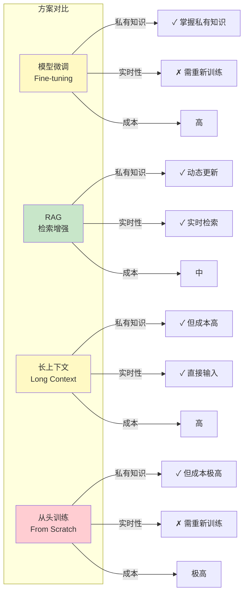

---

## 二、RAG 技术架构详解

### 2.1 完整技术栈

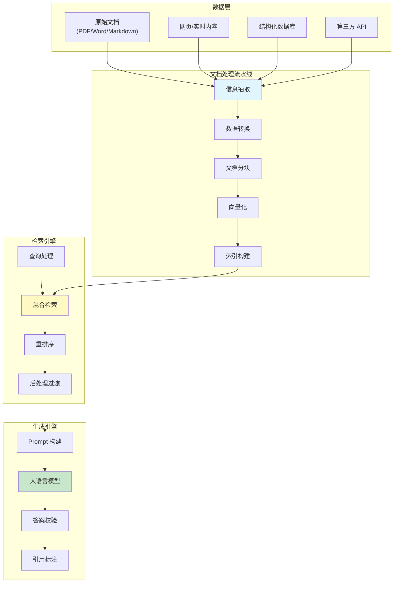

### 2.2 文档处理流水线

#### 2.2.1 文档解析

```python
class DocumentParser:
    """多格式文档解析"""
    
    def parse(self, file_path: str) -> Document:
        suffix = Path(file_path).suffix.lower()
        
        if suffix == ".pdf":
            return self._parse_pdf(file_path)
        elif suffix == ".docx":
            return self._parse_docx(file_path)
        elif suffix == ".md":
            return self._parse_markdown(file_path)
        elif suffix == ".html":
            return self._parse_html(file_path)
        else:
            raise UnsupportedFormatError(f"不支持的格式: {suffix}")
    
    def _parse_pdf(self, path: str) -> Document:
        # 使用 PyMuPDF 提取文本和布局信息
        import fitz  # PyMuPDF
        doc = fitz.open(path)
        text_blocks = []
        
        for page in doc:
            # 提取文本块，保留位置信息
            blocks = page.get_text("blocks")
            for block in blocks:
                text_blocks.append({
                    "text": block[4],
                    "bbox": block[:4],  # 位置坐标
                    "page": page.number
                })
        
        return Document(content=text_blocks, metadata={"pages": len(doc)})
```

#### 2.2.2 文档分块（Chunking）

**分块策略的选择**：

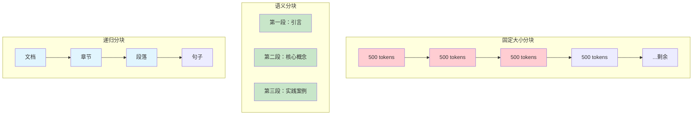

**分块策略对比**：

| 策略 | 优点 | 缺点 | 适用场景 |
|------|------|------|----------|
| **固定大小** | 简单、均匀 | 可能切断语义 | 通用场景 |
| **语义分块** | 保留完整语义 | 实现复杂 | 论文、文档 |
| **递归分块** | 灵活适应 | 计算开销大 | 层次化文档 |
| **特殊分隔符** | 保持结构 | 依赖文档格式 | 结构化文档 |

```python
class ChunkingStrategy:
    """智能分块策略"""
    
    def chunk_by_semantics(
        self, 
        text: str, 
        max_tokens: int = 500,
        overlap: int = 50
    ) -> list[Chunk]:
        """
        基于语义的智能分块
        """
        chunks = []
        
        # 1. 先按段落分割
        paragraphs = self.split_paragraphs(text)
        
        # 2. 合并小段落，避免过于碎片化
        merged = self.merge_small_paragraphs(paragraphs, min_size=100)
        
        # 3. 按 token 限制切分大段落
        current_chunk = []
        current_tokens = 0
        
        for para in merged:
            para_tokens = self.count_tokens(para)
            
            if current_tokens + para_tokens <= max_tokens:
                current_chunk.append(para)
                current_tokens += para_tokens
            else:
                # 保存当前 chunk
                if current_chunk:
                    chunks.append(Chunk(
                        content="\n\n".join(current_chunk),
                        tokens=current_tokens
                    ))
                
                # 开始新 chunk，保留 overlap
                if overlap > 0 and current_chunk:
                    overlap_text = current_chunk[-1]
                    current_chunk = [overlap_text] + [para]
                    current_tokens = self.count_tokens(overlap_text) + para_tokens
                else:
                    current_chunk = [para]
                    current_tokens = para_tokens
        
        # 处理最后一个 chunk
        if current_chunk:
            chunks.append(Chunk(
                content="\n\n".join(current_chunk),
                tokens=current_tokens
            ))
        
        return chunks
```

### 2.3 向量化与索引

#### 2.3.1  Embedding 模型选择

```mermaid
flowchart TD
    subgraph "Embedding 模型"
        M1["OpenAI\ntext-embedding-3"]
        M2["BGE\n(BAAI/bge-*]"]
        M3["Cohere\n(cohere-embed-*)]
        M4["Jina\n(jina-embed-*)]
        M5["专用领域模型\n(e5, bce-*)]
    end
    
    subgraph "选择维度"
        D1["维度"]
        D2["语义理解能力"]
        D3["多语言支持"]
        D4["推理延迟"]
        D5["成本"]
    end
    
    M1 --> D1
    M2 --> D2
    M3 --> D3
    M4 --> D4
    M5 --> D5
    
    style M1 fill:#e1f5fe
    style M2 fill:#c8e6c9
    style M3 fill:#c8e6c9
```

| 模型 | 维度 | 特点 | 推荐场景 |
|------|------|------|----------|
| text-embedding-3-large | 3072 | 效果最好，成本高 | 高质量需求 |
| text-embedding-3-small | 1536 | 性价比高 | 通用场景 |
| BGE-large-zh | 1024 | 中文优化，开源 | 中文场景 |
| bge-m3 | 1024 | 多语言，轻量 | 多语言需求 |

#### 2.3.2 向量索引类型

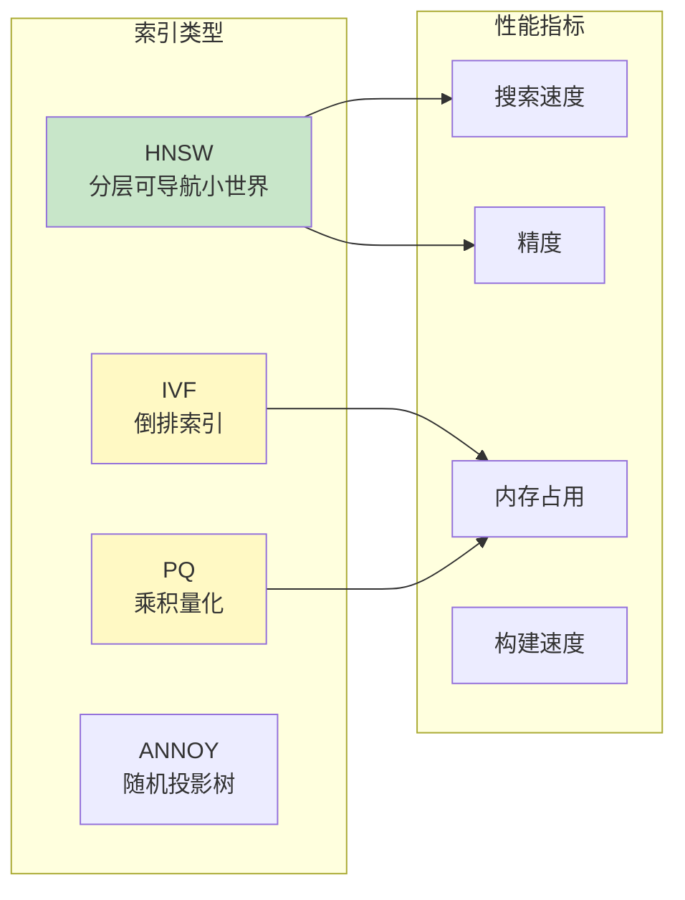

### 2.4 检索机制

#### 2.4.1 混合检索架构

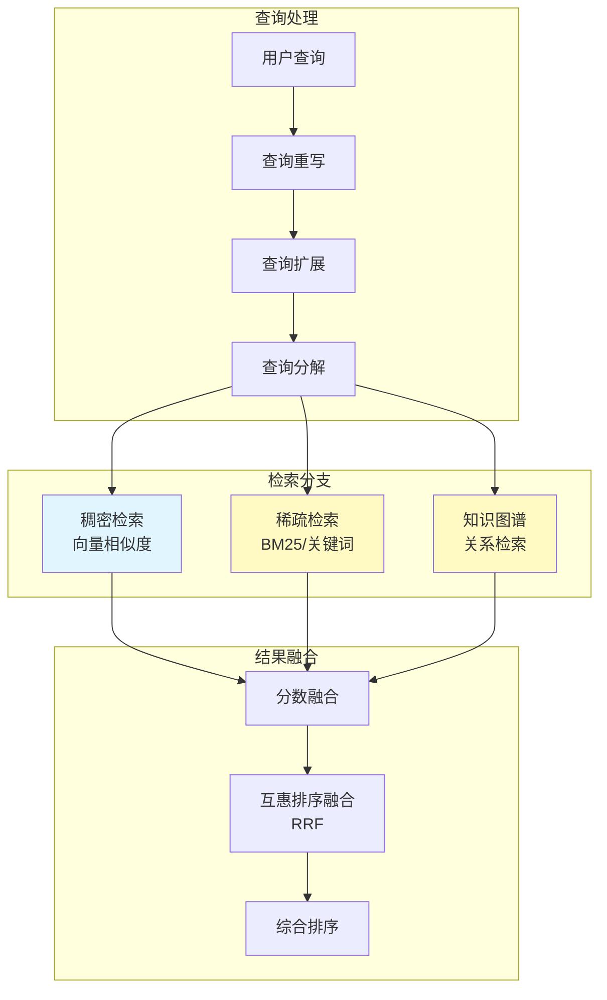

#### 2.4.2 混合检索实现

```python
class HybridRetriever:
    """混合检索器"""
    
    def __init__(
        self,
        vector_store: VectorStore,
        keyword_index: KeywordIndex,
        kg_store: KnowledgeGraphStore,
        fusion_method: str = "rrf"
    ):
        self.vector_store = vector_store
        self.keyword_index = keyword_index
        self.kg_store = kg_store
        self.fusion_method = fusion_method
    
    def retrieve(
        self, 
        query: str, 
        top_k: int = 20,
        alpha: float = 0.7  # 向量检索权重
    ) -> list[SearchResult]:
        
        # 1. 并行执行多种检索
        dense_results = self.vector_store.search(query, top_k * 2)
        sparse_results = self.keyword_index.search(query, top_k * 2)
        
        # 2. 知识图谱检索（如果查询涉及实体）
        entities = self.extract_entities(query)
        kg_results = []
        if entities:
            kg_results = self.kg_store.search_by_entities(entities)
        
        # 3. 分数融合
        fused_results = self._fuse_results(
            dense_results,
            sparse_results,
            kg_results,
            alpha=alpha
        )
        
        # 4. 返回 top_k
        return fused_results[:top_k]
    
    def _fuse_results(
        self,
        dense: list,
        sparse: list,
        kg: list,
        alpha: float
    ) -> list:
        """Reciprocal Rank Fusion (RRF)"""
        
        # 为每个结果分配分数
        all_results = {}
        
        # 稠密检索分数（归一化）
        for i, r in enumerate(dense):
            all_results[r.id] = {
                "content": r.content,
                "score": (1 - alpha) * (1 / (60 + i))  # RRF
            }
        
        # 稀疏检索分数
        for i, r in enumerate(sparse):
            if r.id in all_results:
                all_results[r.id]["score"] += alpha * (1 / (60 + i))
            else:
                all_results[r.id] = {
                    "content": r.content,
                    "score": alpha * (1 / (60 + i))
                }
        
        # KG 结果加权
        for r in kg:
            if r.id in all_results:
                all_results[r.id]["score"] += 0.2  # KG 加权
        
        # 排序
        sorted_results = sorted(
            all_results.values(), 
            key=lambda x: x["score"], 
            reverse=True
        )
        
        return sorted_results
```

#### 2.4.3 重排序（Reranking）

```python
class Reranker:
    """Cross-Encoder 重排序"""
    
    def __init__(self, model_name: str = "cross-encoder/ms-marco-MiniLM-L-6-v2"):
        from sentence_transformers import CrossEncoder
        self.model = CrossEncoder(model_name)
    
    def rerank(
        self,
        query: str,
        candidates: list[str],
        top_k: int = 5
    ) -> list[tuple[str, float]]:
        """
        对候选文档进行精排
        
        Returns:
            [(doc, score), ...] 按相关性分数排序
        """
        # 构建 query-document 对
        pairs = [(query, doc) for doc in candidates]
        
        # 批量计算相关性分数
        scores = self.model.predict(pairs)
        
        # 排序并返回
        doc_scores = list(zip(candidates, scores))
        doc_scores.sort(key=lambda x: x[1], reverse=True)
        
        return doc_scores[:top_k]
```

### 2.5 生成增强

#### 2.5.1 Prompt 构建策略

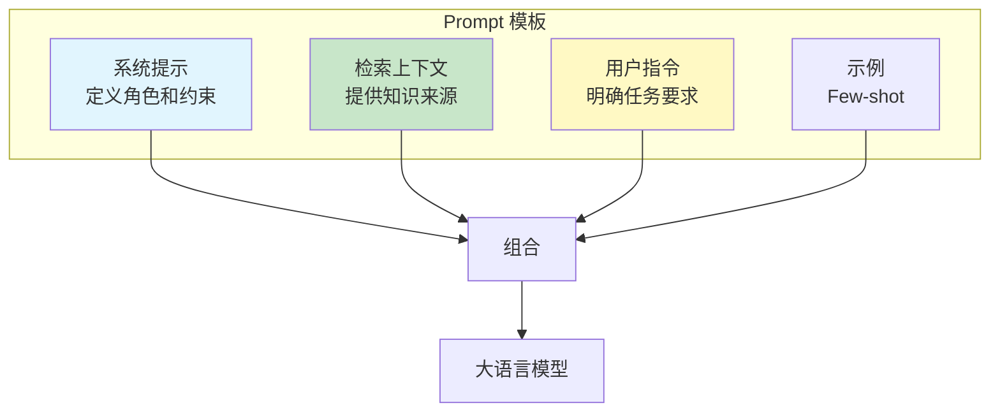

**经典 Prompt 模板**：

```
你是一个专业的技术文档问答助手。请基于以下检索到的文档内容，
回答用户的问题。如果文档中没有相关信息，请明确说明"根据提供
的信息无法回答这个问题"，不要编造答案。

=== 检索到的文档 ===
{context}

=== 用户问题 ===
{question}

=== 回答要求 ===
1. 答案必须基于上述文档
2. 如果涉及具体数据或术语，标注来源
3. 回答简洁明了，控制在 200 字以内
```

#### 2.5.2 流式输出处理

```python
class StreamingRAG:
    """流式 RAG 响应"""
    
    async def query_stream(
        self, 
        query: str
    ) -> AsyncIterator[str]:
        # 1. 检索相关文档
        results = await self.retriever.retrieve(query, top_k=5)
        context = self.format_context(results)
        
        # 2. 构建 prompt
        prompt = self.prompt_template.format(
            context=context,
            question=query
        )
        
        # 3. 流式生成
        async for token in self.llm.stream_generate(prompt):
            yield token  # 实时返回每个 token
```

---

## 三、业界使用场景深度分析

### 3.1 企业内部知识库问答

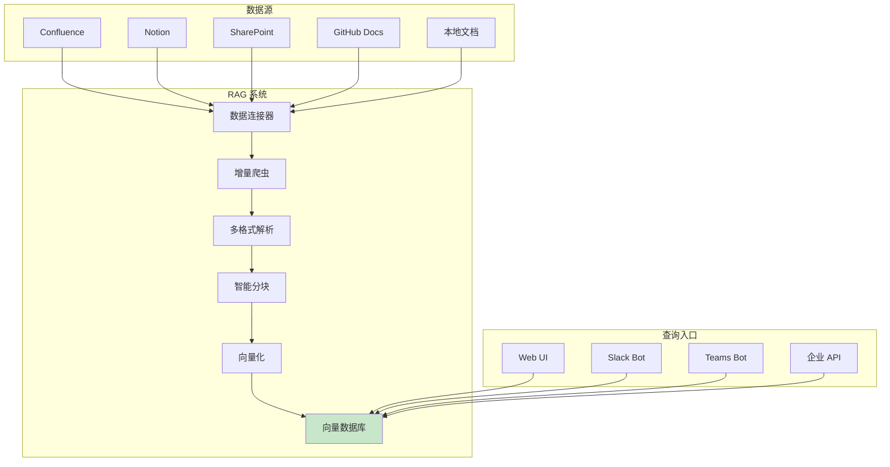

**典型案例**：

| 企业 | 场景 | 数据规模 | 效果 |
|------|------|----------|------|
| 微软 | GitHub Copilot | 数亿行代码 | 代码补全准确率提升 40% |
| Notion | Notion AI | 用户文档 | 问答准确率 > 85% |
| Atlassian | Atlassian Intelligence | Confluence + Jira | 团队效率提升 30% |

### 3.2 客服系统与智能问答

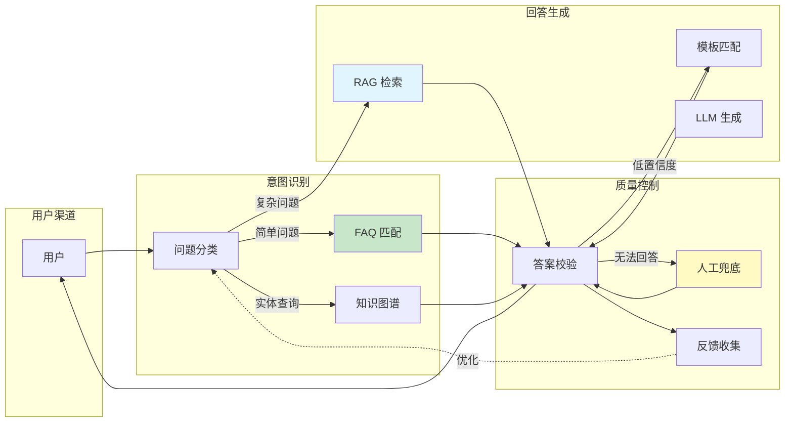

**核心设计要点**：

```python
class CustomerServiceRAG:
    """
    客服 RAG 系统
    特点：
    1. 多级兜底机制
    2. 实时知识库更新
    3. 个性化回复
    """
    
    def __init__(self):
        self.intent_classifier = IntentClassifier()
        self.faq_cache = FAQCaching()
        self.kg_query = KnowledgeGraphQuery()
        self.rag_engine = RAGEngine()
        self.fallback_templates = FallbackTemplates()
        self.escalation = HumanEscalation()
    
    async def answer(self, user_query: str, user_id: str) -> Answer:
        # Step 1: 意图分类
        intent = await self.intent_classifier.classify(user_query)
        
        # Step 2: 分支处理
        if intent.type == "faq":
            # FAQ 直接匹配
            answer = await self.faq_cache.match(intent.entities)
        elif intent.type == "entity_query":
            # 实体查询走知识图谱
            answer = await self.kg_query.query(intent.entities)
        elif intent.type == "complex":
            # 复杂问题走 RAG
            answer = await self.rag_engine.answer(user_query, user_id)
        else:
            # 兜底
            answer = await self.fallback_templates.get(intent.type)
        
        # Step 3: 置信度检查
        if answer.confidence < self.confidence_threshold:
            answer = await self.escalation.escalate(user_query, user_id)
        
        # Step 4: 个性化调整
        answer = self.personalize(answer, user_id)
        
        return answer
```

### 3.3 金融文档分析与研报生成

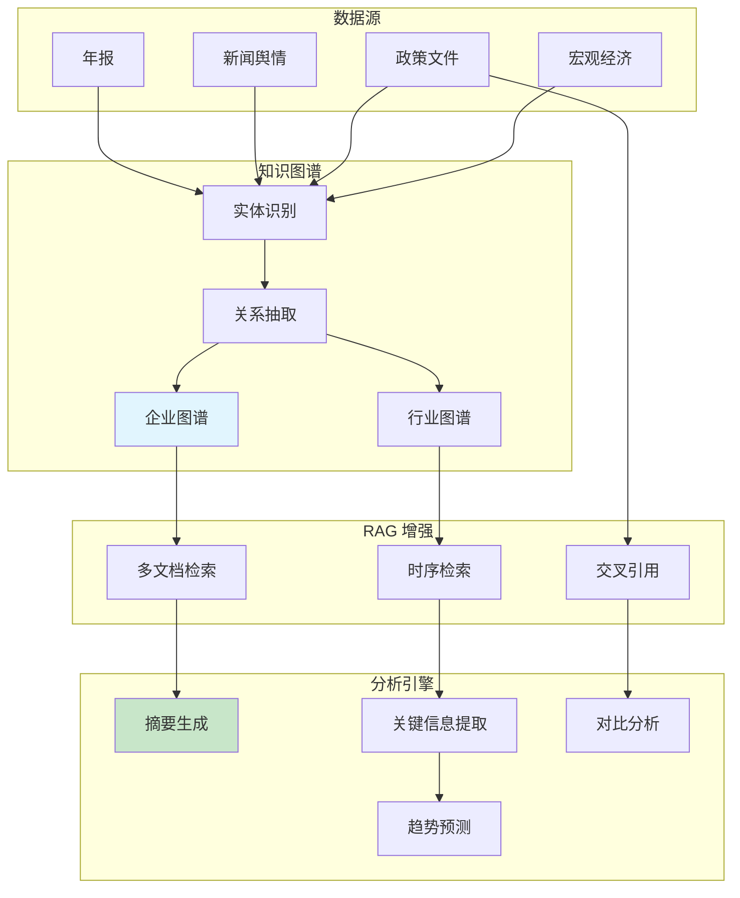

**关键技术**：

| 技术 | 作用 |
|------|------|
| 命名实体识别（NER） | 提取公司、人名、金额、时间 |
| 关系抽取 | 建立企业、股东、竞争对手关系 |
| 时序检索 | 支持"对比 2023 vs 2024 财务数据" |
| 多文档摘要 | 跨文档信息融合 |

### 3.4 代码库智能问答

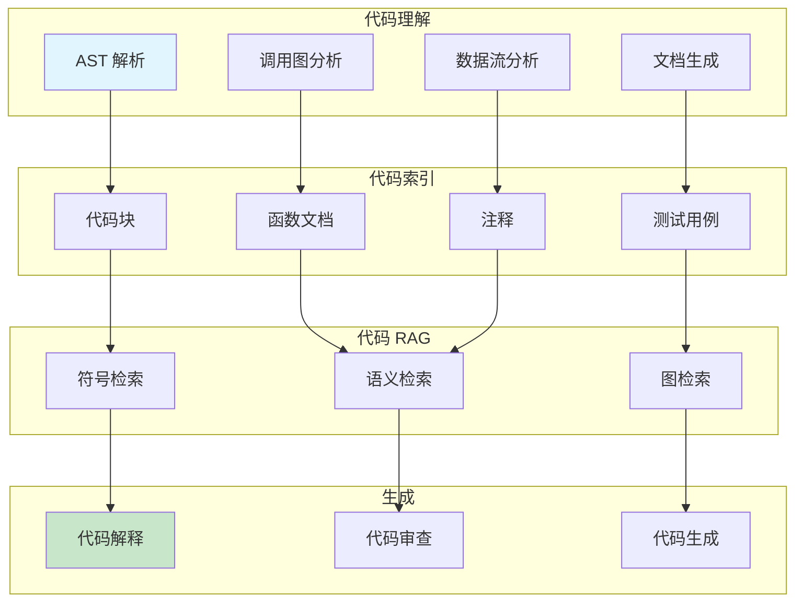

**代码 RAG 的特殊处理**：

```python
class CodeRAG:
    """代码专用 RAG"""
    
    def __init__(self):
        self.lang_tools = {
            "python": PythonASTParser(),
            "java": JavaASTParser(),
            "javascript": JSASTParser()
        }
        self.embedding_model = CodeEmbeddingModel()
    
    def chunk_code(self, code_file: str, language: str) -> list[CodeChunk]:
        """基于代码结构的智能分块"""
        
        parser = self.lang_tools[language]
        ast = parser.parse(code_file)
        
        chunks = []
        for node in ast.walk():
            if isinstance(node, (FunctionDef, ClassDef)):
                # 按函数/类分块，保留完整上下文
                chunk = CodeChunk(
                    content=parser.get_node_source(node),
                    node_type=type(node).__name__,
                    name=node.name,
                    imports=node.get_imports(),
                    dependencies=node.get_dependencies(),
                    docstring=node.get_docstring()
                )
                chunks.append(chunk)
        
        return chunks
    
    def build_code_context(
        self, 
        retrieved_chunks: list[CodeChunk],
        query: str
    ) -> str:
        """构建代码专用上下文"""
        
        context_parts = []
        
        for chunk in retrieved_chunks:
            # 添加文件头
            part = f"// File: {chunk.file_path}\n"
            # 添加函数定义
            part += f"// {chunk.node_type}: {chunk.name}\n"
            # 添加函数文档
            if chunk.docstring:
                part += f'"""{chunk.docstring}"""\n'
            # 添加代码
            part += chunk.content
            
            context_parts.append(part)
        
        return "\n\n".join(context_parts)
```

### 3.5 多模态 RAG

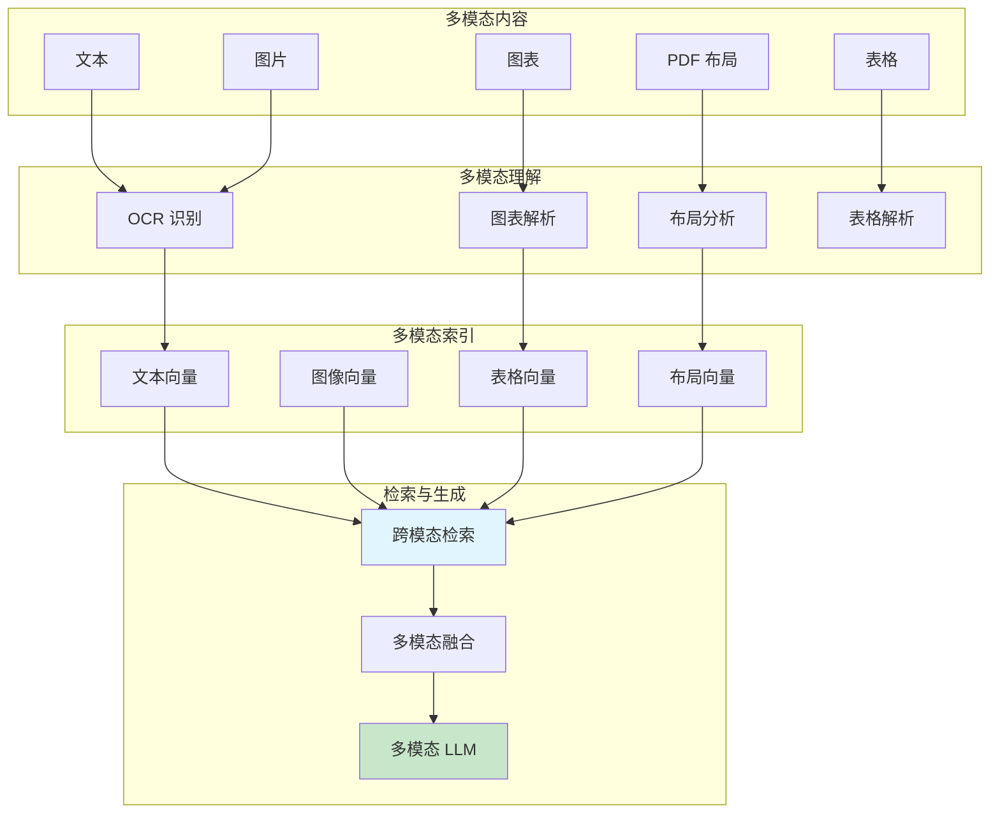

---

## 四、最佳实践与工程优化

### 4.1 数据质量优化

#### 4.1.1 文档预处理最佳实践

```python
class DocumentPreprocessor:
    """企业级文档预处理器"""
    
    def __init__(self):
        self.cleaners = [
            self.remove_special_chars,
            self.normalize_whitespace,
            self.fix_encoding,
            self.remove_pii,  # 去隐私
        ]
        
        self.enrichers = [
            self.add_document_metadata,
            self.add_section_headers,
            self.add_cross_references,
        ]
    
    def process(self, document: Document) -> EnhancedDocument:
        # 1. 清洗
        cleaned = document
        for cleaner in self.cleaners:
            cleaned = cleaner(cleaned)
        
        # 2. 增值
        enriched = cleaned
        for enricher in self.enrichers:
            enriched = enricher(enriched)
        
        # 3. 分块
        chunks = self.chunker.chunk(enriched)
        
        # 4. 质量检查
        quality_chunks = self.filter_low_quality(chunks)
        
        return EnhancedDocument(chunks=quality_chunks, metadata=enriched.metadata)
    
    def filter_low_quality(self, chunks: list[Chunk]) -> list[Chunk]:
        """过滤低质量 chunk"""
        
        filtered = []
        for chunk in chunks:
            # 检查长度
            if len(chunk.text) < 50:
                continue
            
            # 检查重复率
            if self.calculate_repetition(chunk.text) > 0.7:
                continue
            
            # 检查信息密度
            if self.calculate_information_density(chunk.text) < 0.1:
                continue
            
            filtered.append(chunk)
        
        return filtered
```

#### 4.1.2 增量更新策略

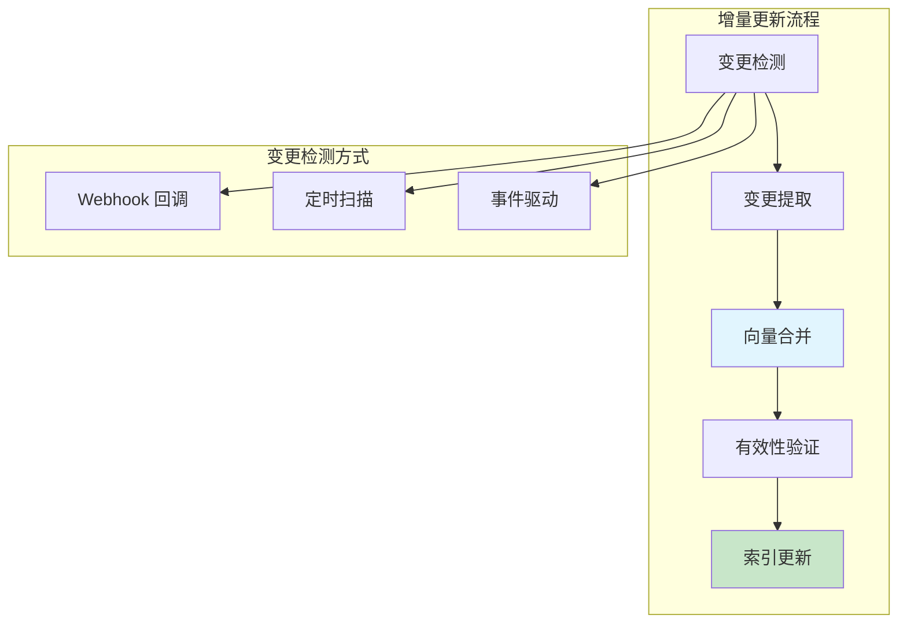

### 4.2 检索质量优化

#### 4.2.1 查询优化策略

```python
class QueryOptimizer:
    """查询优化"""
    
    def optimize(self, query: str) -> str:
        # 1. 拼写纠错
        query = self.spell_correction(query)
        
        # 2. 同义词扩展
        query = self.expand_synonyms(query)
        
        # 3. 查询分解
        sub_queries = self.decompose(query)
        
        # 4. 返回优化后的查询
        return self.reconstruct(sub_queries)
    
    def decompose(self, query: str) -> list[str]:
        """将复杂查询分解为简单子查询"""
        
        # 识别查询中的多个意图
        # 例如："张三和李四是什么关系？他们的公司叫什么？"
        # 分解为：["张三和李四的关系", "他们的公司"]
        
        patterns = [
            r'([^?]+)？(.+)',  # 中文问句分解
            r'(\w+)\s+和\s+(\w+)\s+(.+)',  # "A 和 B xxx"
        ]
        
        decomposed = []
        for pattern in patterns:
            match = re.match(pattern, query)
            if match:
                decomposed = [g.strip() for g in match.groups()]
                break
        
        return decomposed if decomposed else [query]
```

#### 4.2.2 自适应检索策略

```python
class AdaptiveRetriever:
    """自适应检索策略"""
    
    def __init__(self):
        self.strategies = {
            "factual": FactQueryStrategy(),      # 事实型查询
            "conceptual": ConceptQueryStrategy(), # 概念型查询
            "procedural": ProcedureQueryStrategy(), # 步骤型查询
            "comparative": CompareQueryStrategy(),  # 比较型查询
        }
    
    def retrieve(self, query: str, **kwargs) -> list[Result]:
        # 1. 判断查询类型
        query_type = self.classify_query(query)
        
        # 2. 选择对应策略
        strategy = self.strategies.get(query_type, DefaultStrategy())
        
        # 3. 执行检索
        return strategy.execute(query, **kwargs)


class CompareQueryStrategy:
    """比较型查询策略"""
    
    def execute(self, query: str, **kwargs) -> list[Result]:
        # 1. 提取比较对象
        entities = self.extract_compare_entities(query)
        
        # 2. 针对每个实体检索
        results = []
        for entity in entities:
            entity_results = self.base_retriever.retrieve(
                f"{entity} {query}", top_k=10
            )
            results.extend(entity_results)
        
        # 3. 按实体分组
        grouped = self.group_by_entity(results, entities)
        
        # 4. 交叉对比，提取差异信息
        return self.extract_comparative_insights(grouped)
```

### 4.3 生成质量优化

#### 4.3.1 答案校验与修复

```python
class AnswerValidator:
    """答案质量校验"""
    
    def __init__(self):
        self.llm = LLM()
    
    async def validate(
        self, 
        question: str, 
        context: list[Chunk], 
        answer: str
    ) -> ValidationResult:
        
        checks = {
            "groundedness": await self.check_groundedness(answer, context),
            "relevance": await self.check_relevance(question, answer),
            "completeness": await self.check_completeness(question, answer),
            "conciseness": await self.check_conciseness(answer),
        }
        
        # 计算总体分数
        overall_score = sum(checks.values()) / len(checks)
        
        return ValidationResult(
            score=overall_score,
            checks=checks,
            needs_regeneration=overall_score < 0.7
        )
    
    async def check_groundedness(
        self, 
        answer: str, 
        context: list[Chunk]
    ) -> float:
        """
        检查答案是否基于上下文
        """
        prompt = f"""
        给定以下上下文：
        {context}
        
        检查答案是否完全基于上述上下文，不包含外部知识。
        如果答案中的每个陈述都能在上下文中找到支持，返回 1.0。
        如果答案包含上下文之外的信息，返回 0.5 或更低。
        
        答案：{answer}
        """
        
        result = await self.llm.generate(prompt)
        return float(result.score)
```

#### 4.3.2 引用生成与溯源

```python
class CitationGenerator:
    """答案引用生成"""
    
    def generate_citations(
        self,
        answer: str,
        source_chunks: list[Chunk]
    ) -> str:
        """
        在答案中标注引用来源
        """
        
        # 1. 找出答案中涉及的具体事实
        facts = self.extract_facts(answer)
        
        # 2. 将每个事实映射到源文档
        fact_sources = {}
        for fact in facts:
            source = self.find_best_source(fact, source_chunks)
            fact_sources[fact] = source
        
        # 3. 在答案中插入引用标注
        annotated = answer
        for fact, source in fact_sources.items():
            citation = f"[来源: {source.metadata.get('doc_title', '文档')} 第{source.metadata.get('page', 'N')}页]"
            # 简单替换，实际需更复杂的 NLP 处理
            annotated = annotated.replace(fact, f"{fact} {citation}", 1)
        
        return annotated
```

### 4.4 性能优化

#### 4.4.1 缓存策略

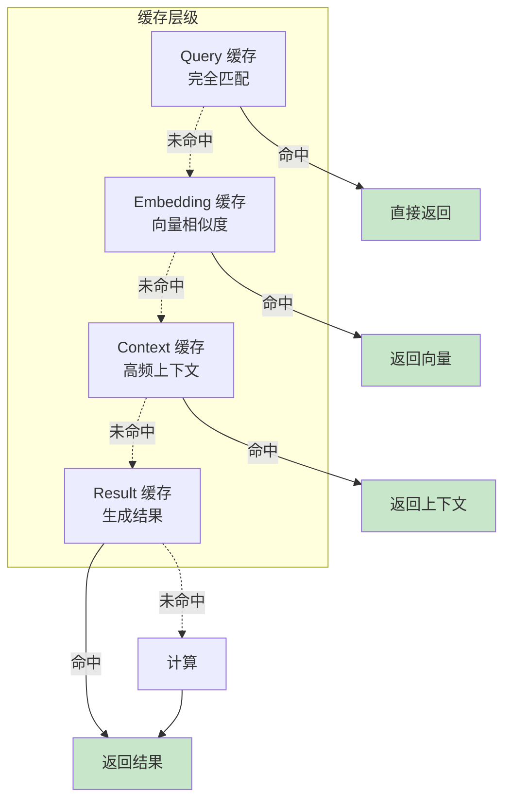

```python
class RAGCache:
    """RAG 多级缓存"""
    
    def __init__(self):
        # L1: 精确 Query 缓存
        self.query_cache = RedisCache(ttl=3600)
        
        # L2: Embedding 缓存
        self.embedding_cache = RedisCache(ttl=86400)
        
        # L3: 检索结果缓存
        self.retrieval_cache = TTLCache(maxsize=10000, ttl=3600)
        
        # L4: 生成结果缓存
        self.generation_cache = TTLCache(maxsize=5000, ttl=1800)
    
    async def get_cached_response(self, query: str) -> Optional[str]:
        # L1 查询缓存
        cached = await self.query_cache.get(query)
        if cached:
            return cached
        
        # L2 Embedding 缓存
        query_hash = hash(query)
        embedding = await self.embedding_cache.get(query_hash)
        
        if not embedding:
            embedding = await self.embedding_model.embed(query)
            await self.embedding_cache.set(query_hash, embedding)
        
        # L3 检索缓存
        retrieval_key = self.build_retrieval_key(embedding)
        retrieval_results = await self.retrieval_cache.get(retrieval_key)
        
        if retrieval_results:
            # L4 生成缓存
            generation_key = self.build_generation_key(query, retrieval_results)
            return await self.generation_cache.get(generation_key)
        
        return None
```

#### 4.4.2 异步并行处理

```python
class AsyncRAGPipeline:
    """异步 RAG 处理流水线"""
    
    async def process(self, query: str) -> Answer:
        # 1. Query 处理和 Embedding 并行
        query_task = self.process_query(query)
        embed_task = self.embed_query(query)
        
        processed_query, query_embedding = await asyncio.gather(
            query_task, embed_task
        )
        
        # 2. 多路检索并行
        retrieval_tasks = [
            self.vector_search(query_embedding, top_k=20),
            self.keyword_search(processed_query, top_k=20),
            self.knowledge_graph_search(processed_query),
        ]
        
        retrieval_results = await asyncio.gather(*retrieval_tasks)
        
        # 3. 结果融合
        fused_results = self.fuse_results(*retrieval_results)
        
        # 4. Rerank
        reranked = await self.reranker.rerank(query, fused_results, top_k=5)
        
        # 5. 生成
        answer = await self.generator.generate(query, reranked)
        
        return answer
```

---

## 五、生产级 RAG 架构设计

### 5.1 整体架构图

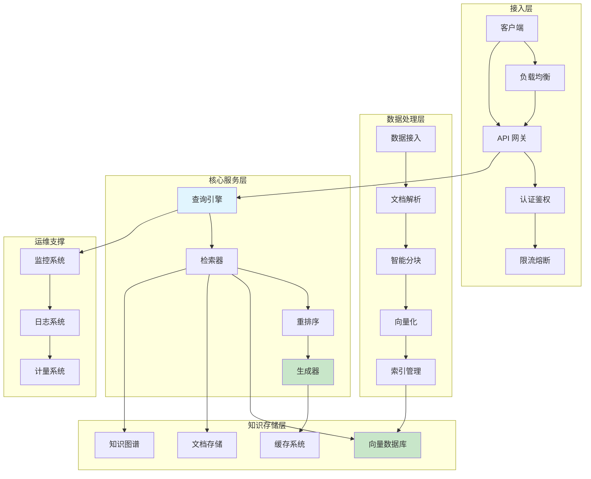

### 5.2 关键组件选型

| 组件 | 推荐选型 | 备选 |
|------|----------|------|
| **向量数据库** | Milvus / Qdrant | Pinecone / Weaviate |
| **文档数据库** | PostgreSQL / MongoDB | Elasticsearch |
| **知识图谱** | Neo4j / NebulaGraph | Neptune |
| **缓存** | Redis Cluster | Dragonfly |
| **消息队列** | Kafka / RabbitMQ | Pulsar |
| **嵌入模型** | BGE / OpenAI Embedding | Cohere |
| **LLM** | GPT-4 / Claude 3 | Llama 3 / Qwen |

### 5.3 高可用设计

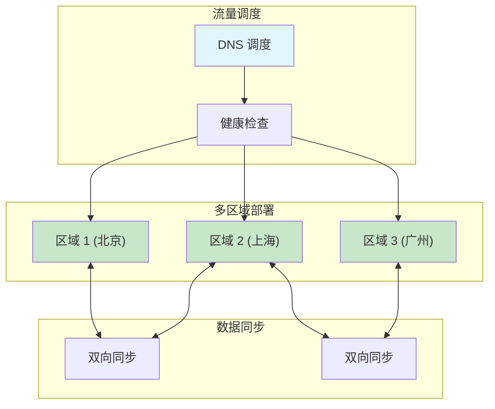

---

## 六、常见问题与解决方案

### 6.1 检索质量问题

| 问题 | 原因 | 解决方案 |
|------|------|----------|
| 召回率低 | 分块太小/太大 | 优化分块策略，使用层级检索 |
| 相关性差 | Embedding 不匹配 | 微调领域嵌入模型 |
| 检索超时 | 数据量太大 | 增量索引，预计算 |
| 多语言问题 | 跨语言检索 | 使用多语言模型 |

### 6.2 生成质量问题

| 问题 | 原因 | 解决方案 |
|------|------|----------|
| 幻觉 | 上下文不相关 | 加强检索过滤，提高引用准确率 |
| 回答不完整 | 上下文分散 | 多跳检索，结果融合 |
| 回答过长 | 缺乏约束 | 明确 Prompt 限制 |
| 风格不一致 | 无统一约束 | 风格模板化 |

### 6.3 性能问题

| 问题 | 原因 | 解决方案 |
|------|------|----------|
| 延迟高 | 检索+生成串行 | 异步并行，多级缓存 |
| 吞吐量低 | 单点瓶颈 | 水平扩展，负载均衡 |
| 资源占用高 | 向量维度大 | 维度压缩，量化 |
| 成本高 | 频繁调用 LLM | 缓存，蒸馏小模型 |

---

## 七、总结

### 7.1 RAG 核心要素

```
┌─────────────────────────────────────────────────────────────────┐
│                      RAG 系统核心要素                            │
├─────────────────────────────────────────────────────────────────┤
│                                                                  │
│  📚 数据质量：高质量输入 → 高质量输出                             │
│                                                                  │
│  🔍 检索能力：精准召回 + 相关性排序                              │
│                                                                  │
│  ✍️  生成质量：上下文融合 + 答案校验                             │
│                                                                  │
│  ⚡ 性能优化：多级缓存 + 异步并行                                 │
│                                                                  │
│  🔧 工程实践：监控告警 + 持续迭代                                │
│                                                                  │
└─────────────────────────────────────────────────────────────────┘
```

### 7.2 选型建议

| 场景 | 建议方案 |
|------|----------|
| **快速原型** | 使用 OpenAI + Pinecone + LangChain |
| **中文企业知识库** | BGE + Milvus + 千问/智谱 |
| **代码智能** | 代码专用嵌入 + 语法感知分块 |
| **多模态** | 多模态嵌入 + GPT-4V/Gemini |
| **超大规模** | Qdrant + Kubernetes + 水平扩展 |

---

## 参考资源

- [RAG 原始论文](https://arxiv.org/abs/2005.11401) - Facebook AI, 2020
- [LangChain RAG 文档](https://python.langchain.com/docs/tutorials/rag/)
- [LlamaIndex 教程](https://docs.llamaindex.ai/en/stable/)
- [MCP 协议与 RAG 结合](https://modelcontextprotocol.io/)
- [向量数据库对比](https://benchmark.vectorinit.io/)

---

*最后更新：2026/4/10*
