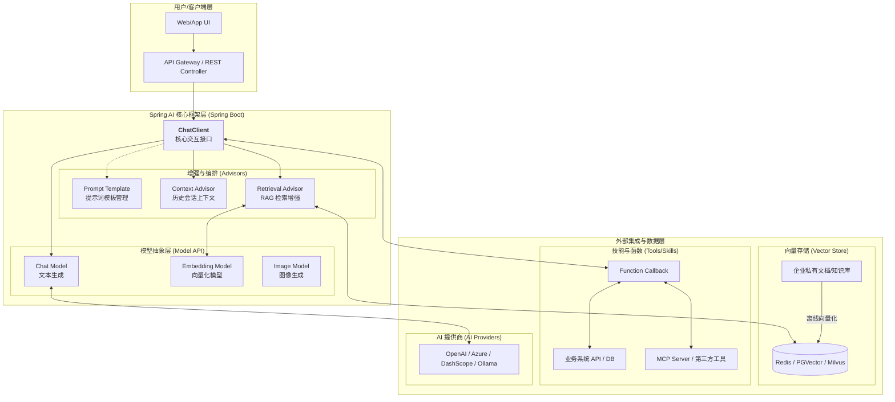
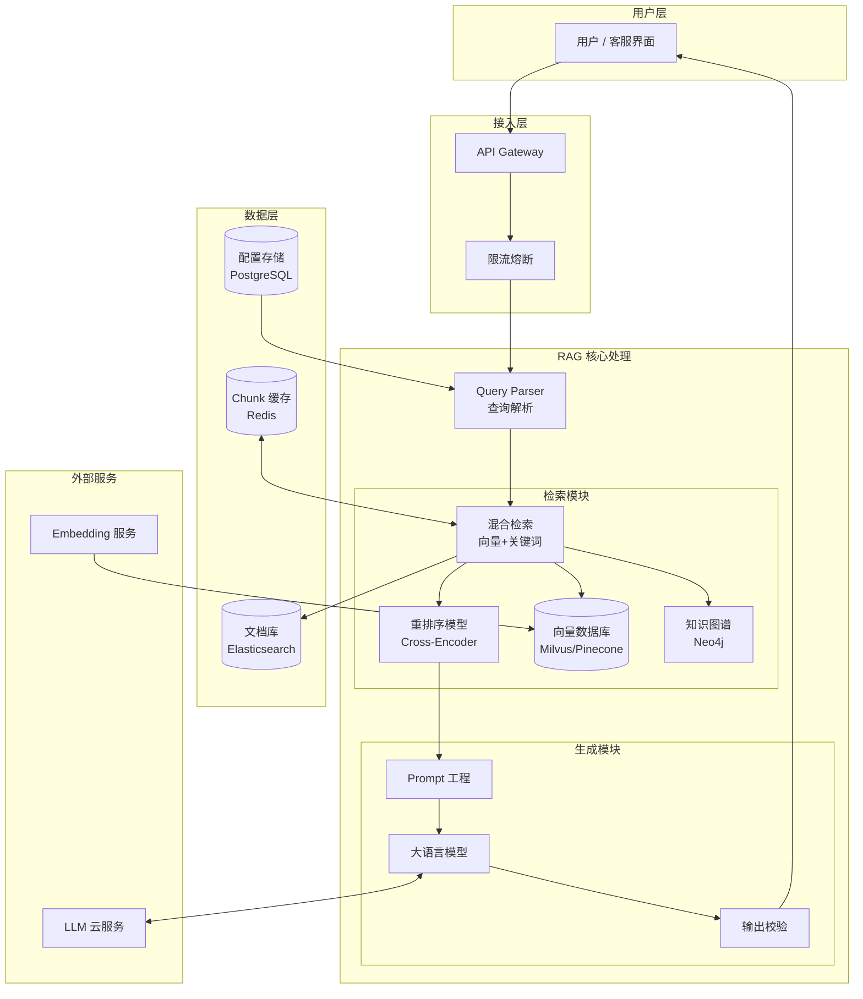

```mermaid
graph TD
    subgraph "用户/客户端层"
        UI[Web/App UI]
        API_G[API Gateway / REST Controller]
    end

    subgraph "Spring AI 核心框架层 (Spring Boot)"
        CC[<b>ChatClient</b><br/>核心交互接口]
        
        subgraph "增强与编排 (Advisors)"
            PromptTemplate[Prompt Template<br/>提示词模板管理]
            ContextAdvisor[Context Advisor<br/>历史会话上下文]
            RetrievalAdvisor[Retrieval Advisor<br/>RAG 检索增强]
        end

        subgraph "模型抽象层 (Model API)"
            ChatModel[Chat Model<br/>文本生成]
            EmbedModel[Embedding Model<br/>向量化模型]
            ImageModel[Image Model<br/>图像生成]
        end
    end

    subgraph "外部集成与数据层"
        subgraph "向量存储 (Vector Store)"
            VS[(Redis / PGVector / Milvus)]
            Docs[企业私有文档/知识库]
        end

        subgraph "技能与函数 (Tools/Skills)"
            FC[Function Callback]
            BizAPI[业务系统 API / DB]
            MCP[MCP Server / 第三方工具]
        end

        subgraph "AI 提供商 (AI Providers)"
            LLM_Provider[OpenAI / Azure / DashScope / Ollama]
        end
    end

    %% 数据流向
    UI --> API_G
    API_G --> CC
    CC -.-> PromptTemplate
    CC --> ContextAdvisor
    CC --> RetrievalAdvisor
    
    %% RAG 流程
    RetrievalAdvisor <--> EmbedModel
    RetrievalAdvisor <--> VS
    Docs -- 离线向量化 --> VS

    %% 函数调用流程
    CC <--> FC
    FC <--> BizAPI
    FC <--> MCP

    %% 最终模型调用
    CC --> ChatModel
    ChatModel <--> LLM_Provider

```

123

```mermaid
graph TD
    subgraph "用户层"
        User[用户 / 客服界面]
    end

    subgraph "接入层"
        API_GW[API Gateway]
        RateLimiter[限流熔断]
    end

    subgraph "RAG 核心处理"
        QueryParser[Query Parser<br/>查询解析]
        
        subgraph "检索模块"
            HybridSearch[混合检索<br/>向量+关键词]
            Reranker[重排序模型<br/>Cross-Encoder]
            VecDB[(向量数据库<br/>Milvus/Pinecone)]
            KG[知识图谱<br/>Neo4j]
        end
        
        subgraph "生成模块"
            PromptEngine[Prompt 工程]
            LLM[大语言模型]
            OutputValidator[输出校验]
        end
    end

    subgraph "数据层"
        DocStore[(文档库<br/>Elasticsearch)]
        ChunkCache[(Chunk 缓存<br/>Redis)]
        ConfigStore[(配置存储<br/>PostgreSQL)]
    end

    subgraph "外部服务"
        Embedding[Embedding 服务]
        LLM_Provider[LLM 云服务]
    end

    User --> API_GW
    API_GW --> RateLimiter
    RateLimiter --> QueryParser
    QueryParser --> HybridSearch
    HybridSearch --> Reranker
    Reranker --> PromptEngine
    PromptEngine --> LLM
    LLM --> OutputValidator
    OutputValidator --> User
    
    HybridSearch --> VecDB
    HybridSearch --> KG
    HybridSearch --> DocStore
    ChunkCache <--> HybridSearch
    ConfigStore --> QueryParser
    
    Embedding --> VecDB
    LLM <--> LLM_Provider

```

