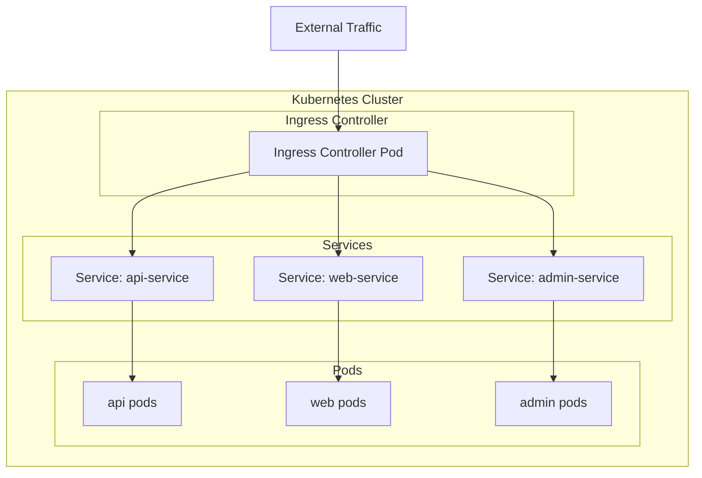
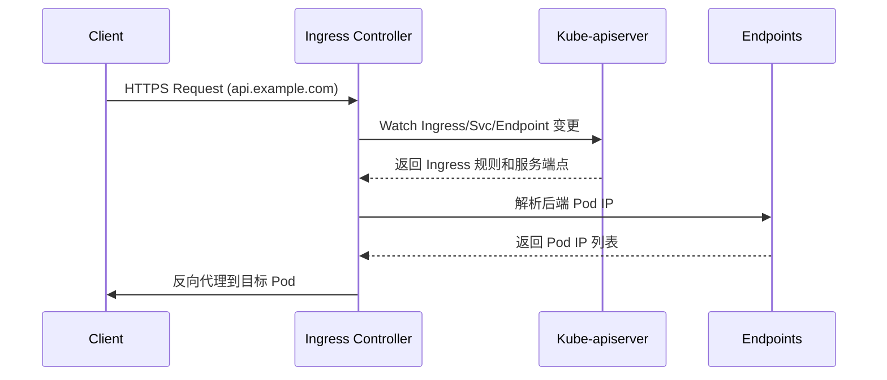
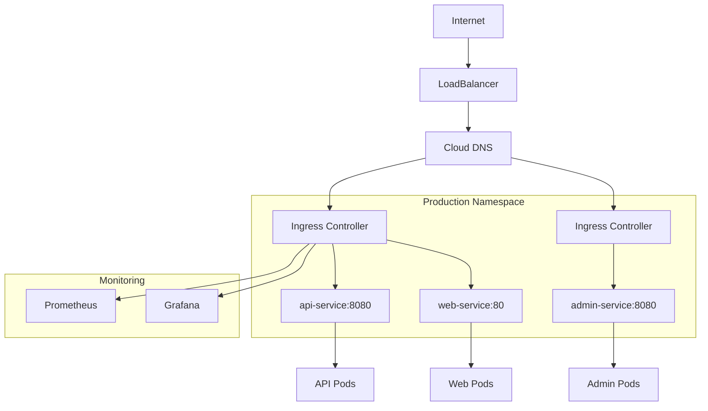

# 2026/4/12 Kubernetes Ingress 实战：从入门到精通

## 前言

Ingress 是 Kubernetes 集群中管理外部 HTTP/HTTPS 访问的核心资源，它基于七层负载均衡实现请求路由、SSL 终止、域名治理等功能。本文将从实战角度深入剖析 Ingress 的架构原理、配置方法与企业级最佳实践。

## 什么是 Ingress

Ingress 是 Kubernetes 的一种 API 资源，它定义了集群内服务对外暴露的 HTTP/HTTPS 路由规则。通过 Ingress Controller 实现具体的流量转发逻辑。



## Ingress 架构解析

### 核心组件

| 组件 | 职责 |
|------|------|
| Ingress Resource | 定义路由规则的 API 资源 |
| Ingress Controller | 读取 Ingress 规则并实现流量转发的守护进程 |
| Service |  ClusterIP 类型的内部服务发现 |
| Endpoints | Pod IP 列表，流量转发的实际目标 |

### 工作流程



## Ingress Controller 选型

| Controller | 特点 | 适用场景 |
|------------|------|----------|
| nginx-ingress | 功能全面、性能稳定 | 生产环境首选 |
| Traefik | 支持自动 HTTPS、配置简洁 | 中小型集群 |
| Kong | API Gateway 能力强 | 微服务网关需求 |
| Ambassador | 基于 Envoy、开发者友好 | 混合云环境 |

> **提示**：Docker Desktop 内置的 Kubernetes 默认使用 `docker-desktop` 内部的 ingress-controller。本文示例基于 Nginx Ingress Controller。

## 快速部署 Nginx Ingress Controller

### 方式一：Helm 部署（推荐）

```bash
# 添加 Helm 仓库
helm repo add ingress-nginx https://kubernetes.github.io/ingress-nginx
helm repo update

# 安装 Ingress Controller
helm install ingress-nginx ingress-nginx/ingress-nginx \
  --namespace ingress-nginx \
  --create-namespace \
  --set controller.ingressClassResource.name=nginx \
  --set controller.ingressClassResource.enabled=true
```

### 方式二：原生 YAML 部署

```bash
kubectl apply -f https://raw.githubusercontent.com/kubernetes/ingress-nginx/controller-v1.9.4/deploy/static/provider/cloud/deploy.yaml
```

### 验证部署

```bash
# 检查 Pod 运行状态
kubectl get pods -n ingress-nginx

# 查看 Ingress Class
kubectl get ingressclass
```

## Ingress 资源实战

### 基础路由配置

```yaml
apiVersion: networking.k8s.io/v1
kind: Ingress
metadata:
  name: basic-routing
  annotations:
    nginx.ingress.kubernetes.io/rewrite-target: /
spec:
  ingressClassName: nginx
  rules:
  - host: example.com
    http:
      paths:
      - path: /api
        pathType: Prefix
        backend:
          service:
            name: api-service
            port:
              number: 8080
      - path: /web
        pathType: Prefix
        backend:
          service:
            name: web-service
            port:
              number: 80
```

### 基于路径的路由

```yaml
apiVersion: networking.k8s.io/v1
kind: Ingress
metadata:
  name: path-based-routing
spec:
  ingressClassName: nginx
  rules:
  - host: shop.example.com
    http:
      paths:
      - path: /products
        pathType: Prefix
        backend:
          service:
            name: product-service
            port:
              number: 8080
      - path: /orders
        pathType: Prefix
        backend:
          service:
            name: order-service
            port:
              number: 8080
      - path: /cart
        pathType: Prefix
        backend:
          service:
            name: cart-service
            port:
              number: 8080
```

### 基于域名的路由

```yaml
apiVersion: networking.k8s.io/v1
kind: Ingress
metadata:
  name: hostname-based-routing
spec:
  ingressClassName: nginx
  rules:
  - host: api.example.com
    http:
      paths:
      - path: /
        pathType: Prefix
        backend:
          service:
            name: api-service
            port:
              number: 8080
  - host: web.example.com
    http:
      paths:
      - path: /
        pathType: Prefix
        backend:
          service:
            name: web-service
            port:
              number: 80
  - host: admin.example.com
    http:
      paths:
      - path: /
        pathType: Prefix
        backend:
          service:
            name: admin-service
            port:
              number: 8080
```

## SSL/TLS 实战配置

### 方式一：手动配置 TLS 证书

```yaml
apiVersion: networking.k8s.io/v1
kind: Ingress
metadata:
  name: tls-ingress
spec:
  ingressClassName: nginx
  tls:
  - hosts:
    - example.com
    - www.example.com
    secretName: example-tls
  rules:
  - host: example.com
    http:
      paths:
      - path: /
        pathType: Prefix
        backend:
          service:
            name: web-service
            port:
              number: 80
```

### 创建 TLS Secret

```bash
# 使用证书和私钥创建 Secret
kubectl create secret tls example-tls \
  --cert=path/to/cert.pem \
  --key=path/to/key.pem

# 查看 Secret
kubectl get secrets example-tls
```

### 方式二：自动 HTTPS（Let's Encrypt）

使用 cert-manager 实现自动证书管理：

```yaml
apiVersion: cert-manager.io/v1
kind: ClusterIssuer
metadata:
  name: letsencrypt-prod
spec:
  acme:
    server: https://acme-v02.api.letsencrypt.org/directory
    email: admin@example.com
    privateKeySecretRef:
      name: letsencrypt-prod
    solvers:
    - http01:
        ingress:
          class: nginx
---
apiVersion: networking.k8s.io/v1
kind: Ingress
metadata:
  name: auto-tls-ingress
  annotations:
    cert-manager.io/cluster-issuer: letsencrypt-prod
spec:
  ingressClassName: nginx
  tls:
  - hosts:
    - example.com
    secretName: example-tls
  rules:
  - host: example.com
    http:
      paths:
      - path: /
        pathType: Prefix
        backend:
          service:
            name: web-service
            port:
              number: 80
```

## 高级配置

### 灰度发布（Canary Deployment）

```yaml
apiVersion: networking.k8s.io/v1
kind: Ingress
metadata:
  name: canary-ingress
  annotations:
    nginx.ingress.kubernetes.io/canary: "true"
    nginx.ingress.kubernetes.io/canary-weight: "30"
spec:
  ingressClassName: nginx
  rules:
  - host: example.com
    http:
      paths:
      - path: /
        pathType: Prefix
        backend:
          service:
            name: new-version-service
            port:
              number: 80
```

### 基于 Header 的流量分流

```yaml
apiVersion: networking.k8s.io/v1
kind: Ingress
metadata:
  name: header-based-ingress
  annotations:
    nginx.ingress.kubernetes.io/canary: "true"
    nginx.ingress.kubernetes.io/canary-by-header: "X-Canary"
    nginx.ingress.kubernetes.io/canary-by-header-value: "always"
spec:
  ingressClassName: nginx
  rules:
  - host: example.com
    http:
      paths:
      - path: /
        pathType: Prefix
        backend:
          service:
            name: canary-service
            port:
              number: 80
```

### 请求重写与重定向

```yaml
apiVersion: networking.k8s.io/v1
kind: Ingress
metadata:
  name: rewrite-ingress
  annotations:
    nginx.ingress.kubernetes.io/rewrite-target: /api/v2$2
spec:
  ingressClassName: nginx
  rules:
  - host: example.com
    http:
      paths:
      - path: /v1(/|$)(.*)
        pathType: Regular
        backend:
          service:
            name: backend-service
            port:
              number: 8080
```

### 限流配置

```yaml
apiVersion: networking.k8s.io/v1
kind: Ingress
metadata:
  name: rate-limit-ingress
  annotations:
    nginx.ingress.kubernetes.io/limit-rps: "100"
    nginx.ingress.kubernetes.io/limit-connections: "50"
spec:
  ingressClassName: nginx
  rules:
  - host: api.example.com
    http:
      paths:
      - path: /
        pathType: Prefix
        backend:
          service:
            name: api-service
            port:
              number: 8080
```

## 完整实战案例

### 架构设计



### 部署清单

```yaml
# namespace.yaml
apiVersion: v1
kind: Namespace
metadata:
  name: production
---
# api-deployment.yaml
apiVersion: apps/v1
kind: Deployment
metadata:
  name: api-deployment
  namespace: production
spec:
  replicas: 3
  selector:
    matchLabels:
      app: api
  template:
    metadata:
      labels:
        app: api
    spec:
      containers:
      - name: api
        image: myregistry/api:v1.0.0
        ports:
        - containerPort: 8080
        resources:
          requests:
            memory: "128Mi"
            cpu: "100m"
          limits:
            memory: "256Mi"
            cpu: "500m"
---
# api-service.yaml
apiVersion: v1
kind: Service
metadata:
  name: api-service
  namespace: production
spec:
  selector:
    app: api
  ports:
  - port: 8080
    targetPort: 8080
  type: ClusterIP
---
# web-deployment.yaml
apiVersion: apps/v1
kind: Deployment
metadata:
  name: web-deployment
  namespace: production
spec:
  replicas: 3
  selector:
    matchLabels:
      app: web
  template:
    metadata:
      labels:
        app: web
    spec:
      containers:
      - name: web
        image: myregistry/web:v1.0.0
        ports:
        - containerPort: 80
---
# web-service.yaml
apiVersion: v1
kind: Service
metadata:
  name: web-service
  namespace: production
spec:
  selector:
    app: web
  ports:
  - port: 80
    targetPort: 80
  type: ClusterIP
---
# ingress.yaml
apiVersion: networking.k8s.io/v1
kind: Ingress
metadata:
  name: production-ingress
  namespace: production
  annotations:
    nginx.ingress.kubernetes.io/ssl-redirect: "true"
    nginx.ingress.kubernetes.io/proxy-body-size: "50m"
    nginx.ingress.kubernetes.io/proxy-connect-timeout: "30"
    nginx.ingress.kubernetes.io/proxy-read-timeout: "60"
    cert-manager.io/cluster-issuer: letsencrypt-prod
spec:
  ingressClassName: nginx
  tls:
  - hosts:
    - api.example.com
    - web.example.com
    secretName: production-tls
  rules:
  - host: api.example.com
    http:
      paths:
      - path: /
        pathType: Prefix
        backend:
          service:
            name: api-service
            port:
              number: 8080
  - host: web.example.com
    http:
      paths:
      - path: /
        pathType: Prefix
        backend:
          service:
            name: web-service
            port:
              number: 80
```

### 一键部署脚本

```bash
#!/bin/bash
set -e

NAMESPACE="production"
MANIFEST="deploy.yaml"

echo "Creating namespace..."
kubectl create namespace $NAMESPACE --dry-run=client -o yaml | kubectl apply -f -

echo "Deploying applications..."
kubectl apply -f $MANIFEST -n $NAMESPACE

echo "Waiting for pods to be ready..."
kubectl wait --for=condition=ready pod -l app=api -n $NAMESPACE --timeout=120s
kubectl wait --for=condition=ready pod -l app=web -n $NAMESPACE --timeout=120s

echo "Checking Ingress status..."
kubectl get ingress -n $NAMESPACE

echo "Deployment completed!"
```

## 运维与调试

### 常用调试命令

```bash
# 查看 Ingress 列表
kubectl get ingress -n production

# 查看 Ingress 详细信息
kubectl describe ingress production-ingress -n production

# 查看 Ingress Controller 日志
kubectl logs -n ingress-nginx -l app.kubernetes.io/name=ingress-nginx

# 测试域名解析
nslookup api.example.com

# 本地端口转发测试
kubectl port-forward -n ingress-nginx svc/ingress-nginx-controller 8080:80
```

### 健康检查配置

```yaml
apiVersion: networking.k8s.io/v1
kind: Ingress
metadata:
  name: health-check-ingress
  annotations:
    nginx.ingress.kubernetes.io/healthz-status: /healthz
spec:
  ingressClassName: nginx
  rules:
  - host: api.example.com
    http:
      paths:
      - path: /healthz
        pathType: Exact
        backend:
          service:
            name: api-service
            port:
              number: 8080
```

### 监控指标

Nginx Ingress Controller 暴露以下关键指标：

| 指标 | 说明 |
|------|------|
| nginx_ingress_controller_requests | 请求总数 |
| nginx_ingress_controller_ connections | 当前连接数 |
| request_duration_seconds | 请求延迟分布 |
| response_duration_seconds | 响应时间分布 |

## 常见问题排查

| 问题 | 可能原因 | 解决方案 |
|------|----------|----------|
| 404 Not Found | 路径匹配失败或 Service 无 Endpoints | 检查 pathType 和后端 Service 端点 |
| 503 Service Unavailable | 所有后端 Pod 不可用 | 检查 Pod 状态和健康探针 |
| SSL 证书错误 | 证书过期或域名不匹配 | 更新证书或检查域名配置 |
| 504 Gateway Timeout | 后端响应超时 | 调整 proxy-connect-timeout |

## 性能优化建议

1. **启用连接池复用**：减少后端连接开销
2. **配置缓存**：对静态资源启用缓存
3. **压缩传输**：启用 gzip 压缩
4. **限制并发**：防止后端过载
5. **使用 Session Affinity**：有状态服务启用会话保持

```yaml
apiVersion: networking.k8s.io/v1
kind: Ingress
metadata:
  name: optimized-ingress
  annotations:
    nginx.ingress.kubernetes.io/proxy-buffering: "on"
    nginx.ingress.kubernetes.io/gzip: "on"
    nginx.ingress.kubernetes.io/server-snippet: |
      keepalive_timeout 65;
      keepalive_requests 100;
spec:
  ingressClassName: nginx
  rules:
  - host: api.example.com
    http:
      paths:
      - path: /
        pathType: Prefix
        backend:
          service:
            name: api-service
            port:
              number: 8080
```

## 总结

Ingress 是 Kubernetes 对外暴露服务的核心方式，掌握其配置与调优对于云原生工程师至关重要。本文从基础概念到企业实战，涵盖了路由配置、SSL/TLS、灰度发布、限流等核心场景。

---

> 如果本文对你有帮助，欢迎在评论区交流学习心得！
